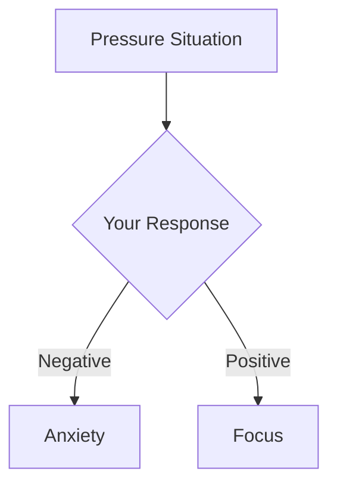

# Example: How to Add Ads to Your Pages

This is an example showing how to add Google Ads to your markdown pages.

## Example 1: Simple Page with Top and Bottom Ads

```markdown
# Ambition

<AdBanner />

Our mission is to help elite players take the next step in their development.

::: tip Our Vision
**Transform elite players from technically proficient to mentally unstoppable.**
:::

## Moving Beyond Technique

Traditional training focuses heavily on technical aspects...

[... rest of content ...]

<AdBanner />
```

## Example 2: Long Article with In-Article Ads

```markdown
# SMART Goals for Pétanque

<AdBanner />

The SMART framework transforms vague aspirations into concrete action plans...

## What is SMART?

SMART stands for Specific, Measurable, Achievable, Relevant, and Time-bound...

<AdInArticle />

## Specific

Your goal should be crystal clear...

## Measurable

You need concrete metrics...

<AdInArticle />

## Achievable

Set challenging but realistic goals...

## Relevant

Align with your overall development...

## Time-bound

Set clear deadlines...

<AdBanner />
```

## Example 3: Education Page with Multiple Ads

```markdown
# Mental Strength

<AdBanner />

Mental strength is the foundation of consistent performance...

## Understanding Pressure

Pressure is a natural part of competition...



<AdInArticle />

## Techniques for Handling Pressure

### 1. Breathing Exercises

Deep breathing activates your parasympathetic nervous system...

### 2. Pre-Shot Routine

A consistent routine creates mental stability...

<AdInArticle />

### 3. Visualization

Mental rehearsal prepares your mind...

## Practice Drills

Here are some drills to build mental strength...

<AdBanner />
```

## Best Practices

### ✅ DO:
- Place ads naturally between content sections
- Use 2-3 ads per page maximum
- Space ads at least 2-3 paragraphs apart
- Place banner ads at top and bottom
- Use in-article ads in the middle of long content

### ❌ DON'T:
- Place more than 3 ads on a single page
- Put ads right next to each other
- Place ads in navigation or headers
- Put ads near buttons or interactive elements
- Use ads on very short pages (less than 500 words)

## Quick Reference

| Ad Type | Component | Best For |
|---------|-----------|----------|
| Banner | `<AdBanner />` | Top/bottom of pages |
| In-Article | `<AdInArticle />` | Middle of long content |
| Sidebar | `<AdSidebar />` | Custom layouts only |

## Testing Your Ads

After adding ads to your pages:

1. **Build the site**: `npm run docs:build`
2. **Preview locally**: `npm run docs:preview`
3. **Check browser console** for any errors
4. **Deploy to production**
5. **Wait 10-20 minutes** for ads to appear
6. **Check AdSense dashboard** for impressions

Remember: Ads won't show in development mode (`npm run docs:dev`) - you need to build and preview or deploy to production to see them.

