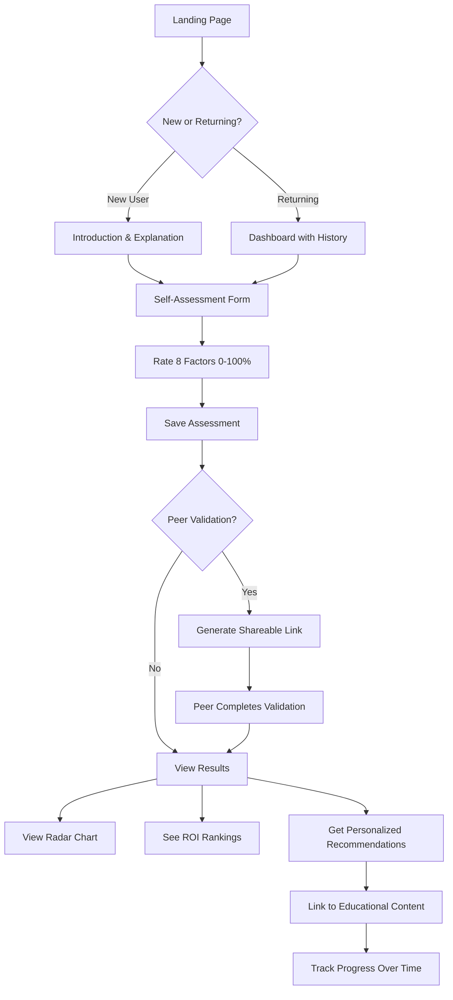

# Player Development Assessment System - Development Specification

## Executive Summary

This specification outlines the development of a personalized player assessment and recommendation system for Pétanque Academy. The system allows players to self-evaluate across 8 key performance factors, optionally receive peer validation, and get AI-driven recommendations for optimal improvement paths based on ROI calculations.

---

## 1. The 8 Performance Factors

| Factor | Swedish | Weight | Description |
|--------|---------|--------|-------------|
| Mental Game | Tankar | 600 | Thought patterns, focus, confidence, self-talk |
| Motivation | Motivation | 500 | Drive, purpose, goal orientation, persistence |
| Sleep | Sömn | 400 | Quality, duration, recovery, pre-competition rest |
| Self-Awareness | Självinsikt | 400 | Accurate self-perception, blind spot recognition |
| Nutrition | Kost | 300 | Blood sugar stability, hydration, competition fuel |
| Team Dynamics | Team | 300 | Communication, trust, role clarity, support |
| Tension Management | Anspänning | 300 | Physical tension, pre-shot relaxation, breath control |
| Technique | Teknik | 100 | Physical mechanics, throw repertoire, consistency |

**Total Weight: 2,900 points**

---

## 2. Content Gap Analysis

*Updated after comprehensive audit of all educational content (2026-03-12)*

### Existing Educational Content

| Factor | Existing Modules | Content Status |
|--------|-----------------|----------------|
| **Mental Game (600)** | ✅ The Zone (3 pages), ✅ Mental Strength (3 pages), ✅ Mindfulness (3 pages), ✅ 4+ blog articles (inner-critic, flow-state-science, mental-resilience, pressure-management) | **STRONG** |
| **Motivation (500)** | ✅ Goals (3 pages), ⚠️ 1 blog post (elite-goal-setting) | **ADEQUATE** |
| **Sleep (400)** | ❌ Only brief mentions (~5 sentences across 4 files: mental-strength, mindfulness, training, competition-prep) | **WEAK** |
| **Self-Awareness (400)** | ⚠️ Implicit in mindfulness only, no dedicated module | **WEAK** |
| **Nutrition (300)** | ✅ Nutrition module (1 extensive page, 386 lines), ✅ Food page (147 lines) | **STRONG** |
| **Team Dynamics (300)** | ✅ Team Player (2 pages), ✅ 3 blog articles (team-chemistry, team-communication, team-leadership) | **STRONG** |
| **Tension Management (300)** | ⚠️ Scattered across handling-pressure, entering-the-zone, mindfulness/techniques, pre-shot-routine | **MODERATE** |
| **Technique (100)** | ✅ Technical section (2 pages), ✅ Training drills (256 lines), ✅ Tactics (2 pages) | **ADEQUATE** |

### Content Gaps to Fill

**Priority 1 - Critical (No/minimal content exists):**
1. **Sleep & Recovery Module** - New education section needed
   - Sleep science for precision athletes
   - Pre-competition sleep protocols
   - Recovery strategies between games/tournaments
   - Travel and sleep disruption management
   - *Estimated: 3 new pages*

2. **Self-Awareness Module** - New education section needed
   - The Johari Window for athletes
   - Blind spot identification techniques
   - Getting and using objective feedback
   - Video analysis as self-awareness tool
   - The self-awareness paradox (Dunning-Kruger)
   - *Estimated: 3 new pages*

**Priority 2 - High (Consolidation and expansion needed):**
3. **Tension Management Module** - Consolidate scattered content + add new
   - Progressive muscle relaxation (PMR) — **MISSING**
   - Pre-throw tension release drills — **MISSING**
   - Optimal arousal zone theory — **MISSING**
   - Competition-day tension protocols — **MISSING**
   - *(Existing: breath control 4-7-8, physical grounding, body scan)*
   - *Estimated: 2-3 new pages, may consolidate existing*

**Priority 3 - Moderate (Enhancement only):**
4. **Motivation Deep-Dive** - Expand existing goals section
   - Intrinsic vs extrinsic motivation
   - Maintaining motivation during slumps
   - Purpose and identity as performance drivers
   - *Estimated: 1-2 additional pages*

### Summary: Total New Content Needed

| Action | Priority | Estimated Effort |
|--------|----------|------------------|
| Create Sleep & Recovery module | Critical | 3 pages |
| Create Self-Awareness module | Critical | 3 pages |
| Create/Consolidate Tension Management module | High | 2-3 pages |
| Expand Motivation content | Moderate | 1-2 pages |
| **Total** | | **9-11 pages** |

---

## 3. Technical Architecture

### 3.1 VitePress Static Site Constraints

VitePress is a static site generator - there is no server-side processing. The assessment system must work entirely client-side.

### 3.2 Proposed Architecture

```
┌─────────────────────────────────────────────────────────────┐
│                    VitePress Static Site                     │
├─────────────────────────────────────────────────────────────┤
│  ┌─────────────────┐  ┌─────────────────┐  ┌─────────────┐ │
│  │  Assessment UI   │  │  Calculation    │  │  Results &  │ │
│  │  (Vue Component) │  │  Engine (JS)    │  │  Recommend  │ │
│  └────────┬────────┘  └────────┬────────┘  └──────┬──────┘ │
│           │                    │                   │        │
│           └────────────────────┼───────────────────┘        │
│                                │                            │
│  ┌─────────────────────────────┴─────────────────────────┐  │
│  │              Local Storage (Browser)                   │  │
│  │  - User assessments (self + peer)                     │  │
│  │  - Historical data                                     │  │
│  │  - Progress tracking                                   │  │
│  └───────────────────────────────────────────────────────┘  │
├─────────────────────────────────────────────────────────────┤
│                    Optional: External                        │
│  ┌─────────────────┐  ┌─────────────────────────────────┐   │
│  │  Share via URL   │  │  Export/Import JSON             │   │
│  │  (encoded params)│  │  (Backup/Restore)               │   │
│  └─────────────────┘  └─────────────────────────────────┘   │
└─────────────────────────────────────────────────────────────┘
```

### 3.3 File Structure

```
docs/
├── en/
│   ├── assessment/
│   │   ├── index.md          # Assessment landing page
│   │   ├── evaluate.md       # Self-evaluation interface
│   │   ├── peer-review.md    # Peer validation interface
│   │   ├── results.md        # Results & recommendations
│   │   └── history.md        # Progress over time
│   ├── education/
│   │   ├── sleep/            # NEW: Sleep & Recovery module
│   │   │   ├── index.md
│   │   │   ├── science.md
│   │   │   └── protocols.md
│   │   ├── self-awareness/   # NEW: Self-Awareness module
│   │   │   ├── index.md
│   │   │   ├── johari.md
│   │   │   └── feedback.md
│   │   ├── tension/          # NEW: Tension Management module
│   │   │   ├── index.md
│   │   │   ├── relaxation.md
│   │   │   └── breathing.md
└── .vitepress/
    ├── components/
    │   ├── AssessmentForm.vue
    │   ├── RadarChart.vue
    │   ├── RecommendationCard.vue
    │   └── ProgressTracker.vue
    └── theme/
        └── assessment.ts     # Calculation logic
```

---

## 4. User Flow

### 4.1 Complete User Journey



### 4.2 Self-Assessment Interface

**For each of the 8 factors, users rate themselves 0-100% where:**
- 0% = Complete beginner / No awareness
- 25% = Developing / Basic understanding
- 50% = Competent / Regular player level
- 75% = Advanced / Competitive player level
- 100% = World-class / Elite mastery

**Each factor includes:**
1. Clear definition of what the factor means
2. Behavioral anchors for each level (what does 25%, 50%, 75% look like?)
3. Self-reflection questions to guide accurate rating
4. Warning about the self-awareness catch-22 (blind spots)

### 4.3 Peer Validation Flow

1. **User generates a shareable link** containing their self-assessment (URL-encoded)
2. **Peer opens link** and sees the same 8 factors
3. **Peer rates the user** based on their observation
4. **Results comparison** shows:
   - Self-assessment vs peer assessment
   - Gap analysis (where blind spots may exist)
   - Weighted average for recommendations

---

## 5. Calculation Logic

### 5.1 The ROI Formula

The system calculates which factor offers the best "return on investment" for improvement effort.

**Core Principle:** Diminishing returns as skill increases (logarithmic curve)

```javascript
/**
 * Calculate ROI for improving a factor
 *
 * @param currentLevel - Current skill level (0-100)
 * @param weight - Factor importance weight (100-600)
 * @returns ROI score for prioritization
 */
function calculateROI(currentLevel: number, weight: number): number {
  // Normalize current level to 0-1 scale
  const level = currentLevel / 100;

  // Calculate potential improvement (diminishing returns)
  // Using logarithmic curve: more room to grow at lower levels
  const potentialGain = Math.log(1 + (1 - level) * 10) / Math.log(11);

  // Calculate effort required (increases with current level)
  // Higher levels require more effort for same improvement
  const effortMultiplier = 1 + Math.pow(level, 2);

  // ROI = (Potential Gain × Weight) / Effort
  const roi = (potentialGain * weight) / effortMultiplier;

  return roi;
}
```

### 5.2 Example Calculations

| Factor | Weight | Current | Potential Gain | Effort | ROI Score |
|--------|--------|---------|----------------|--------|-----------|
| Sleep | 400 | 30% | 0.85 | 1.09 | 312 |
| Mental Game | 600 | 70% | 0.42 | 1.49 | 169 |
| Technique | 100 | 80% | 0.30 | 1.64 | 18 |

**Interpretation:** Despite Mental Game having the highest weight, improving Sleep from 30% offers 1.8x better ROI because:
- More room for improvement (low current level)
- Less effort required (not fighting against plateau)

### 5.3 The Recommendation Algorithm

```javascript
interface Assessment {
  mentalGame: number;      // 0-100
  motivation: number;      // 0-100
  sleep: number;           // 0-100
  selfAwareness: number;   // 0-100
  nutrition: number;       // 0-100
  teamDynamics: number;    // 0-100
  tensionManagement: number; // 0-100
  technique: number;       // 0-100
}

interface Recommendation {
  factor: string;
  roiScore: number;
  currentLevel: number;
  improvementPotential: string;
  suggestedResources: string[];
  estimatedImpact: string;
}

function generateRecommendations(
  selfAssessment: Assessment,
  peerAssessment?: Assessment
): Recommendation[] {
  const weights = {
    mentalGame: 600,
    motivation: 500,
    sleep: 400,
    selfAwareness: 400,
    nutrition: 300,
    teamDynamics: 300,
    tensionManagement: 300,
    technique: 100
  };

  // If peer assessment exists, calculate weighted average
  // Self-assessment: 50%, Peer: 50%
  const effectiveAssessment = peerAssessment
    ? averageAssessments(selfAssessment, peerAssessment)
    : selfAssessment;

  // Calculate ROI for each factor
  const roiScores = Object.entries(weights).map(([factor, weight]) => ({
    factor,
    roiScore: calculateROI(effectiveAssessment[factor], weight),
    currentLevel: effectiveAssessment[factor],
    weight
  }));

  // Sort by ROI (highest first)
  return roiScores
    .sort((a, b) => b.roiScore - a.roiScore)
    .map(item => enrichWithResources(item));
}
```

### 5.4 Self-Awareness Paradox Handling

The specification acknowledges that low self-awareness affects the accuracy of all other assessments.

**Solution:**
1. **Flag high discrepancy:** If self vs peer differs by >20% on any factor, highlight this
2. **Weight peer higher for low self-awareness:** If self-awareness score is <50%, weight peer assessment at 70%
3. **Prompt for peer validation:** Strong encouragement to get peer feedback, especially if self-awareness score is low
4. **Educational callout:** Explain the Dunning-Kruger effect and blind spots

---

## 6. Multi-Language Support

### 6.1 Translation Strategy

Following the existing AGENTS.md guidelines:
- English (`docs/en/`) is the source of truth
- All content automatically translated to 9 other languages
- Assessment interface text stored in i18n JSON files

### 6.2 Translatable Elements

| Element | Example | Notes |
|---------|---------|-------|
| Factor names | "Mental Game" → "Jeu Mental" | Keep consistent with existing translations |
| Level descriptions | "World-class" → "Classe mondiale" | Professional tone |
| Recommendation text | Dynamic strings | Use template literals |
| UI labels | "Your Results" → "Vos Résultats" | Standard VitePress i18n |

### 6.3 Implementation

```javascript
// .vitepress/i18n/assessment.ts
export const assessmentI18n = {
  en: {
    factors: {
      mentalGame: "Mental Game",
      motivation: "Motivation",
      sleep: "Sleep & Recovery",
      selfAwareness: "Self-Awareness",
      nutrition: "Nutrition",
      teamDynamics: "Team Dynamics",
      tensionManagement: "Tension Management",
      technique: "Technique"
    },
    levels: {
      0: "No experience",
      25: "Developing",
      50: "Competent",
      75: "Advanced",
      100: "World-class"
    },
    // ... more strings
  },
  fr: { /* French translations */ },
  sv: { /* Swedish translations */ },
  // ... 7 more languages
};
```

---

## 7. Data Storage Strategy

### 7.1 Primary: Browser Local Storage

```javascript
// Storage structure
interface StoredData {
  version: "1.0";
  userId: string;  // Generated UUID, stored locally
  assessments: {
    id: string;
    date: string;
    selfAssessment: Assessment;
    peerAssessments?: {
      peerId: string;
      assessment: Assessment;
      date: string;
    }[];
  }[];
  preferences: {
    language: string;
    showTutorial: boolean;
  };
}
```

**Pros:**
- No backend required
- GDPR-compliant (data stays on user's device)
- Works offline
- Instant performance

**Cons:**
- Data lost if browser data cleared
- No cross-device sync
- No aggregate analytics

### 7.2 Optional: URL-Based Sharing

For peer validation, encode assessment in URL:

```javascript
// Generate shareable link
function generateShareLink(assessment: Assessment): string {
  const encoded = btoa(JSON.stringify(assessment));
  return `https://carreau.app/en/assessment/peer-review?data=${encoded}`;
}

// Parse incoming peer review link
function parseShareLink(url: string): Assessment {
  const params = new URLSearchParams(url.search);
  const data = params.get('data');
  return JSON.parse(atob(data));
}
```

### 7.3 Optional: Export/Import

Allow users to backup and restore their data:

```javascript
// Export all data as JSON file
function exportData(): void {
  const data = localStorage.getItem('petanque-assessment');
  const blob = new Blob([data], { type: 'application/json' });
  const url = URL.createObjectURL(blob);
  // Trigger download
}

// Import from JSON file
function importData(file: File): Promise<void> {
  return new Promise((resolve, reject) => {
    const reader = new FileReader();
    reader.onload = (e) => {
      const data = JSON.parse(e.target.result as string);
      if (validateData(data)) {
        localStorage.setItem('petanque-assessment', JSON.stringify(data));
        resolve();
      } else {
        reject(new Error('Invalid data format'));
      }
    };
    reader.readAsText(file);
  });
}
```

---

## 8. Development Roadmap

### Phase 1: Content Foundation (Weeks 1-3)
**Goal:** Fill critical content gaps before building the assessment system

| Week | Task | Deliverable |
|------|------|-------------|
| 1 | Create Sleep & Recovery module | 3 new pages in `/education/sleep/` |
| 2 | Create Tension Management module | 3 new pages in `/education/tension/` |
| 3 | Create Self-Awareness module | 3 new pages in `/education/self-awareness/` |

**All content translated to 10 languages using GCP translation script**

### Phase 2: Assessment MVP (Weeks 4-6)
**Goal:** Basic self-assessment with recommendations

| Week | Task | Deliverable |
|------|------|-------------|
| 4 | Assessment form Vue component | Working self-evaluation UI |
| 5 | Calculation engine + Results display | ROI calculation, radar chart |
| 6 | Resource linking + Local storage | Complete self-assessment flow |

### Phase 3: Peer Validation (Weeks 7-8)
**Goal:** Add peer assessment capability

| Week | Task | Deliverable |
|------|------|-------------|
| 7 | Shareable link generation + Peer form | URL-based peer validation |
| 8 | Comparison view + Gap analysis | Side-by-side assessment comparison |

### Phase 4: History & Polish (Weeks 9-10)
**Goal:** Progress tracking and UX refinement

| Week | Task | Deliverable |
|------|------|-------------|
| 9 | Progress over time view | Historical chart, trend analysis |
| 10 | Export/Import + Final polish | Complete feature, all languages |

---

## 9. Success Metrics

### User Engagement
- Assessment completion rate (target: >70% of starts)
- Peer validation usage (target: >30% of assessments)
- Return visits to check progress (target: 2+ per user)

### Educational Impact
- Click-through to recommended content (target: >50%)
- Time spent on recommended modules (target: +20% vs average)

### Technical Performance
- Page load time (target: <2s)
- Assessment calculation time (target: <100ms)
- Local storage usage (target: <500KB)

---

## 10. Risk Mitigation

| Risk | Impact | Mitigation |
|------|--------|------------|
| Users overrate themselves | Inaccurate recommendations | Encourage peer validation, provide calibration guidance |
| Local storage cleared | Data loss | Offer export/backup feature, prompt users to save |
| Complex calculation confuses users | Low engagement | Clear explanations, progressive disclosure |
| Content gaps in some factors | Incomplete recommendations | Phase 1 fills gaps before assessment launches |
| Translation quality | Poor UX in non-English | Use GCP Translation API + human review for key strings |

---

## 11. Future Enhancements (Post-MVP)

1. **Team Assessment Mode** - Assess your entire team, identify collective gaps
2. **Coach Dashboard** - Aggregated view for coaches managing multiple players
3. **Periodic Reminders** - Email/push notifications for re-assessment
4. **Integration with Diary** - Link assessment to diary template for tracking
5. **Gamification** - Badges for improvements, streaks for regular assessment
6. **AI-Generated Action Plans** - Detailed week-by-week improvement plans

---

## Appendix A: Factor Definitions & Behavioral Anchors

### Mental Game (Weight: 600)

**Definition:** Your ability to manage thoughts, maintain focus, and access flow states during competition.

| Level | Behavioral Anchor |
|-------|-------------------|
| 0-25% | Thoughts frequently spiral negative during games. No awareness of mental patterns. |
| 25-50% | Aware of mental patterns but struggle to control them. Occasional flow moments. |
| 50-75% | Regular use of mental techniques. Can recover from bad throws. Some flow consistency. |
| 75-100% | Reliable flow state access. Strong pre-shot routines. Mental resilience under pressure. |

**Self-Reflection Questions:**
- How quickly do you recover mentally after a bad throw?
- Do you have a consistent pre-shot routine?
- How often do you experience flow states in competition?

### Motivation (Weight: 500)

**Definition:** Your drive to improve, persist through challenges, and maintain long-term commitment.

| Level | Behavioral Anchor |
|-------|-------------------|
| 0-25% | Play casually, no specific goals. Training inconsistent. |
| 25-50% | Some goals but inconsistent follow-through. Motivation varies with results. |
| 50-75% | Clear goals, regular training. Can push through slumps. Connected to purpose. |
| 75-100% | Deep intrinsic motivation. Consistent over years. Growth mindset. |

### Sleep (Weight: 400)

**Definition:** Quality and consistency of sleep, recovery practices, and energy management.

| Level | Behavioral Anchor |
|-------|-------------------|
| 0-25% | Irregular sleep schedule. Poor sleep quality. No pre-competition protocols. |
| 25-50% | Somewhat regular sleep. Aware of impact but inconsistent practices. |
| 50-75% | Consistent sleep schedule. Good sleep hygiene. Adjusts for competitions. |
| 75-100% | Optimized sleep environment. Tracks sleep quality. Travel sleep strategies. |

### Self-Awareness (Weight: 400)

**Definition:** Accuracy of self-perception, recognition of blind spots, and openness to feedback.

| Level | Behavioral Anchor |
|-------|-------------------|
| 0-25% | Unaware of weaknesses. Defensive to feedback. Blame external factors. |
| 25-50% | Some awareness of patterns. Open to feedback but struggle to act on it. |
| 50-75% | Regularly seek feedback. Can identify own patterns. Act on insights. |
| 75-100% | Accurate self-perception validated by peers. Actively seek blind spots. |

**Note:** This factor has a catch-22: low self-awareness makes it hard to accurately assess self-awareness. Peer validation is especially important here.

### Nutrition (Weight: 300)

**Definition:** Blood sugar stability, hydration, and competition-day fueling strategies.

| Level | Behavioral Anchor |
|-------|-------------------|
| 0-25% | No attention to competition nutrition. Eat whatever is available. |
| 25-50% | Aware of basics. Inconsistent application. Sometimes energy crashes. |
| 50-75% | Consistent pre-competition eating. Bring own snacks. Stable energy. |
| 75-100% | Optimized nutrition protocol. Practiced in training. Never energy issues. |

### Team Dynamics (Weight: 300)

**Definition:** Communication, trust, role clarity, and contribution to team culture.

| Level | Behavioral Anchor |
|-------|-------------------|
| 0-25% | Poor communication. Visibly frustrated with teammates. Unclear roles. |
| 25-50% | Basic communication. Some trust issues. Occasional role confusion. |
| 50-75% | Good communication. Support teammates after mistakes. Clear roles. |
| 75-100% | Excellent communication. High trust. Elevate team performance. |

### Tension Management (Weight: 300)

**Definition:** Physical tension awareness, relaxation techniques, and breath control.

| Level | Behavioral Anchor |
|-------|-------------------|
| 0-25% | Unaware of tension. Grip too tight. No breathing techniques. |
| 25-50% | Notice tension after the fact. Some awareness but can't control. |
| 50-75% | Can notice and release tension. Use breathing techniques. Pre-throw relaxation. |
| 75-100% | Automatic tension management. Optimal arousal state. Complete body awareness. |

### Technique (Weight: 100)

**Definition:** Physical mechanics, throw repertoire, and execution consistency.

| Level | Behavioral Anchor |
|-------|-------------------|
| 0-25% | Learning basic throws. Inconsistent release. Limited repertoire. |
| 25-50% | Solid basics. Improving consistency. 1-2 throw types mastered. |
| 50-75% | Good technique across situations. 3-4 throw types. Consistent execution. |
| 75-100% | Complete palette of throws. Highly consistent. Can execute under pressure. |

---

## Appendix B: UI Wireframes

### Assessment Form (Mobile-First)

```
┌─────────────────────────────────┐
│  🎯 Your Development Assessment  │
├─────────────────────────────────┤
│                                 │
│  1. Mental Game (Most Important)│
│  ─────────────────────────────  │
│  Your ability to manage thoughts│
│  and access flow states         │
│                                 │
│  Where are you now?             │
│  ┌───┬───┬───┬───┬───┐         │
│  │0% │25%│50%│75%│100│ ← Slider│
│  └───┴───┴───┴───┴───┘         │
│  [Currently: 65%]               │
│                                 │
│  ℹ️ What does 65% look like?    │
│  "Regular use of mental tech... │
│                                 │
│  ─────────────────────────────  │
│  2. Motivation                  │
│  ...                            │
│                                 │
│  [Continue →]                   │
└─────────────────────────────────┘
```

### Results Dashboard

```
┌─────────────────────────────────┐
│  📊 Your Results                │
├─────────────────────────────────┤
│                                 │
│  ┌─────────────────────────┐   │
│  │    [RADAR CHART]        │   │
│  │    8 factors displayed  │   │
│  └─────────────────────────┘   │
│                                 │
│  🎯 Your #1 Improvement Focus:  │
│  ┌─────────────────────────┐   │
│  │ 😴 SLEEP & RECOVERY     │   │
│  │ Current: 35% | ROI: 312 │   │
│  │ "Improving sleep from   │   │
│  │ 35% to 60% could boost  │   │
│  │ your overall performance│   │
│  │ more than any other     │   │
│  │ single factor."         │   │
│  │                         │   │
│  │ [→ Sleep Education]     │   │
│  └─────────────────────────┘   │
│                                 │
│  Other recommendations:         │
│  2. Tension Management (ROI:245)│
│  3. Self-Awareness (ROI: 198)  │
│                                 │
│  [Invite Peer to Validate →]   │
│  [Save & Track Progress →]     │
└─────────────────────────────────┘
```

---

*Document Version: 1.0*
*Created: 2026-03-12*
*Author: Pétanque Academy Development Team*
