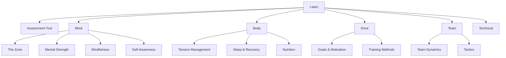
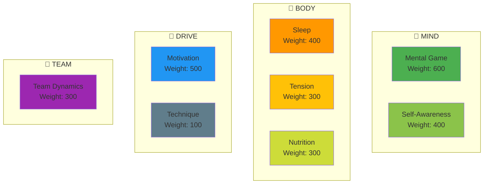
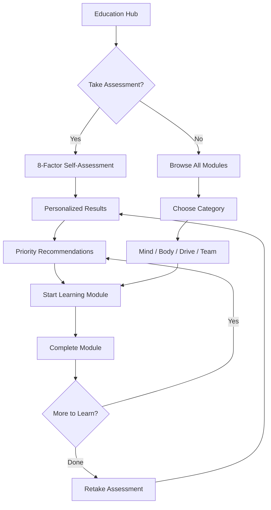

# Site Structure Redesign Specification

**Purpose:** Integrate new education modules and optimize user flow  
**Impact:** Navigation, sidebar, education hub  
**Created:** 2026-03-12

---

## Current State Analysis

### Current Navigation Structure (English)

```
Top Nav:
├── Home
├── Ambition
├── News
├── Education (dropdown)
│   ├── Overview
│   ├── The Zone
│   ├── Mindfulness
│   ├── Goal Setting
│   ├── Mental Strength
│   ├── Team Player
│   ├── Training Methods
│   ├── Nutrition
│   └── Tactics
├── Technical
├── Blog
└── About
```

### Current Education Sidebar

```
Education
├── Overview

The Zone
├── Introduction
├── Technical vs Flow Training
├── Entering the Zone

Mindfulness
├── Introduction
├── Techniques
├── Daily Practice

Goal Setting
├── Introduction
├── SMART Goals
├── Planning

... (continues for each module)
```

### Problems with Current Structure

1. **Flat hierarchy** - All modules at same level, no logical grouping
2. **No clear learning path** - Users don't know where to start
3. **8 factors not visible** - The performance framework isn't surfaced
4. **Assessment integration unclear** - Where does the future assessment tool fit?
5. **Module count growing** - Adding 4 more modules will overwhelm navigation

---

## Proposed Structure: Option A — Factor-Based Grouping

### Concept

Organize education around the 8 Performance Factors, making the framework visible and creating clear categories.

### Proposed Navigation

```
Top Nav:
├── Home
├── Ambition
├── News
├── Learn (renamed from Education)
│   ├── 🎯 Assessment Tool (NEW - future)
│   ├── Overview / Learning Paths
│   ├── ──────────────
│   ├── Mind
│   │   ├── The Zone
│   │   ├── Mental Strength
│   │   ├── Mindfulness
│   │   └── Self-Awareness (NEW)
│   ├── Body
│   │   ├── Tension Management (NEW)
│   │   ├── Sleep & Recovery (NEW)
│   │   └── Nutrition
│   ├── Drive
│   │   ├── Goals & Motivation (expanded)
│   │   └── Training Methods
│   ├── Team
│   │   ├── Team Dynamics
│   │   └── Tactics
│   └── ──────────────
│       └── Technical Skills
├── Blog
└── About
```

### Mermaid Diagram: Proposed Hierarchy



### Pros
- Clear conceptual grouping
- 8 factors become visible through categories
- Scales well as content grows
- Assessment tool has natural home

### Cons
- Requires significant restructuring
- URL changes needed (redirects required)
- More complex navigation logic
- Translation effort for new labels

---

## Proposed Structure: Option B — Learning Path Focus

### Concept

Keep flat module structure but add prominent "Learning Paths" that guide users through content based on their needs.

### Proposed Navigation

```
Top Nav:
├── Home
├── Ambition  
├── News
├── Education
│   ├── 🎯 Assessment Tool (NEW - future)
│   ├── Learning Paths (NEW)
│   │   ├── "I want to handle pressure better"
│   │   ├── "I want to improve my focus"
│   │   ├── "I want better team chemistry"
│   │   └── "Complete curriculum"
│   ├── ──────────────
│   ├── All Modules (expandable)
│   │   ├── The Zone
│   │   ├── Mindfulness
│   │   ├── Goals & Motivation
│   │   ├── Mental Strength
│   │   ├── Self-Awareness (NEW)
│   │   ├── Team Dynamics
│   │   ├── Training Methods
│   │   ├── Nutrition
│   │   ├── Sleep & Recovery (NEW)
│   │   ├── Tension Management (NEW)
│   │   └── Tactics
├── Technical
├── Blog
└── About
```

### Pros
- Minimal disruption to current structure
- User-centric (problem-based navigation)
- No URL changes needed
- Easier to implement

### Cons
- Doesn't surface the 8-factor framework
- Module list gets long
- Less conceptually organized
- Assessment → Path → Module flow less clear

---

## Recommended Approach: Hybrid (Option C)

### Concept

Combine the best of both: Keep URLs stable, add grouping labels in sidebar, create learning paths, and prepare for assessment integration.

### Implementation

#### 1. Education Hub Redesign (`/education/index.md`)

Transform the overview page into an interactive hub:

```markdown
# Education Hub

## Your Development Journey

[Assessment CTA - Coming Soon]
"Discover your biggest growth opportunities"

## Quick Paths

| I want to... | Start Here |
|--------------|------------|
| Handle pressure better | Mental Strength → Tension |
| Find my flow state | The Zone → Mindfulness |
| Improve team chemistry | Team Dynamics |
| Optimize my body | Sleep → Nutrition → Tension |
| Set better goals | Goals & Motivation |

## The 8 Performance Factors

[Visual grid showing all 8 factors with icons and links]

## All Modules

### 🧠 Mind
- The Zone
- Mental Strength  
- Mindfulness
- Self-Awareness

### 💪 Body
- Sleep & Recovery
- Tension Management
- Nutrition

### 🎯 Drive
- Goals & Motivation
- Training Methods

### 🤝 Team
- Team Dynamics
- Tactics

### 🎱 Technical
- Technical Skills
```

#### 2. Sidebar Reorganization

Group modules with visual separators (no URL changes):

```javascript
function getEducationSidebar(lang: string, labels: any) {
  return [
    {
      text: labels.education,
      items: [
        { text: labels.overview, link: `/${lang}/education/` }
      ]
    },
    // MIND GROUP
    {
      text: '🧠 ' + labels.mind,
      collapsed: false,
      items: [
        { text: labels.theZone, link: `/${lang}/education/the-zone/` },
        { text: labels.mentalStrength, link: `/${lang}/education/mental-strength/` },
        { text: labels.mindfulness, link: `/${lang}/education/mindfulness/` },
        { text: labels.selfAwareness, link: `/${lang}/education/self-awareness/` }  // NEW
      ]
    },
    // BODY GROUP
    {
      text: '💪 ' + labels.body,
      collapsed: false,
      items: [
        { text: labels.sleep, link: `/${lang}/education/sleep/` },           // NEW
        { text: labels.tension, link: `/${lang}/education/tension/` },       // NEW
        { text: labels.nutrition, link: `/${lang}/education/nutrition/` }
      ]
    },
    // DRIVE GROUP
    {
      text: '🎯 ' + labels.drive,
      collapsed: false,
      items: [
        { text: labels.goalSetting, link: `/${lang}/education/goals/` },
        { text: labels.training, link: `/${lang}/education/training/` }
      ]
    },
    // TEAM GROUP
    {
      text: '🤝 ' + labels.team,
      collapsed: false,
      items: [
        { text: labels.teamPlayer, link: `/${lang}/education/team-player/` },
        { text: labels.tactics, link: `/${lang}/education/tactics/` }
      ]
    }
  ]
}
```

#### 3. Navigation Dropdown Update

Update the Education dropdown to show categories:

```javascript
{
  text: 'Education',
  items: [
    { text: '📚 Overview', link: '/en/education/' },
    { text: '🎯 Assessment (Coming Soon)', link: '/en/assessment/' },
    { text: '─────────────', link: '' },  // Separator
    {
      text: '🧠 Mind',
      items: [
        { text: 'The Zone', link: '/en/education/the-zone/' },
        { text: 'Mental Strength', link: '/en/education/mental-strength/' },
        { text: 'Mindfulness', link: '/en/education/mindfulness/' },
        { text: 'Self-Awareness', link: '/en/education/self-awareness/' }
      ]
    },
    {
      text: '💪 Body',
      items: [
        { text: 'Sleep & Recovery', link: '/en/education/sleep/' },
        { text: 'Tension Management', link: '/en/education/tension/' },
        { text: 'Nutrition', link: '/en/education/nutrition/' }
      ]
    },
    {
      text: '🎯 Drive',
      items: [
        { text: 'Goals & Motivation', link: '/en/education/goals/' },
        { text: 'Training Methods', link: '/en/education/training/' }
      ]
    },
    {
      text: '🤝 Team',
      items: [
        { text: 'Team Dynamics', link: '/en/education/team-player/' },
        { text: 'Tactics', link: '/en/education/tactics/' }
      ]
    }
  ]
}
```

---

## The 8 Factors Visualization

### Proposed Visual for Education Hub

```
┌─────────────────────────────────────────────────────────────────┐
│                    🎯 TAKE THE ASSESSMENT                       │
│            Discover your biggest growth opportunities           │
│                      [Coming Soon Button]                       │
└─────────────────────────────────────────────────────────────────┘

┌─────────────────────────────────────────────────────────────────┐
│                     THE 8 PERFORMANCE FACTORS                    │
├─────────────────────────────────────────────────────────────────┤
│                                                                  │
│   🧠 MIND (Weight: High)              💪 BODY (Weight: Medium)  │
│   ┌─────────────────────┐             ┌─────────────────────┐   │
│   │ ⭐ Mental Game (600) │             │ ⭐ Sleep (400)       │   │
│   │ ⭐ Self-Awareness(400)│            │ ⭐ Tension (300)     │   │
│   └─────────────────────┘             │ ⭐ Nutrition (300)   │   │
│                                        └─────────────────────┘   │
│                                                                  │
│   🎯 DRIVE (Weight: High)             🤝 TEAM (Weight: Medium)  │
│   ┌─────────────────────┐             ┌─────────────────────┐   │
│   │ ⭐ Motivation (500)  │             │ ⭐ Team Dynamics(300)│   │
│   │ ⭐ Technique (100)   │             │                     │   │
│   └─────────────────────┘             └─────────────────────┘   │
│                                                                  │
└─────────────────────────────────────────────────────────────────┘
```

### Mermaid Version for Documentation



---

## User Flow: Assessment → Learning Path

### Future Integration Point

```
User Journey:
1. Land on Education Hub
2. See "Take Assessment" CTA
3. Complete self-assessment (8 factors)
4. Receive personalized priority list
5. Click recommended module
6. Complete learning
7. Retake assessment to measure progress
```

### Mermaid Diagram: Proposed User Flow



---

## Implementation Phases

### Phase 1: Education Hub Redesign (Can Do Now)
- [ ] Redesign `/education/index.md`
- [ ] Add 8-factor visualization
- [ ] Add "Quick Paths" section
- [ ] Group modules by category

### Phase 2: Sidebar Reorganization (Can Do Now)
- [ ] Update `getEducationSidebar()` function
- [ ] Add category headers with emojis
- [ ] Add new module placeholders
- [ ] Update for all 10 languages

### Phase 3: Navigation Update (Can Do Now)
- [ ] Update nav dropdown structure
- [ ] Add category grouping
- [ ] Test on all languages

### Phase 4: New Module Integration (After Content Created)
- [ ] Add Sleep module to sidebar
- [ ] Add Self-Awareness module to sidebar
- [ ] Add Tension module to sidebar
- [ ] Update Goals module (add 2 pages)

### Phase 5: Assessment Integration (Future)
- [ ] Create `/assessment/` route
- [ ] Build assessment Vue component
- [ ] Integrate with Education Hub
- [ ] Add "Recommended for You" personalization

---

## Translation Labels Required

### New Labels for All Languages

| Key | EN | SV | ... |
|-----|----|----|-----|
| `mind` | Mind | Sinne | ... |
| `body` | Body | Kropp | ... |
| `drive` | Drive | Drivkraft | ... |
| `team` | Team | Lag | ... |
| `sleep` | Sleep & Recovery | Sömn & Återhämtning | ... |
| `tension` | Tension Management | Spänningshantering | ... |
| `selfAwareness` | Self-Awareness | Självinsikt | ... |
| `assessment` | Assessment | Utvärdering | ... |
| `learningPaths` | Learning Paths | Lärstigar | ... |

---

## URL Structure (No Breaking Changes)

### Current URLs (Keep)
- `/en/education/the-zone/`
- `/en/education/mental-strength/`
- `/en/education/mindfulness/`
- `/en/education/goals/`
- `/en/education/team-player/`
- `/en/education/training/`
- `/en/education/nutrition/`
- `/en/education/tactics/`

### New URLs (Add)
- `/en/education/sleep/`
- `/en/education/self-awareness/`
- `/en/education/tension/`
- `/en/assessment/` (future)

---

## Success Metrics

| Metric | Target |
|--------|--------|
| Navigation clarity | Users can find any topic in 2 clicks |
| 8-factor visibility | Framework prominently displayed |
| Assessment integration | Clear path to/from assessment |
| Mobile usability | Works on all devices |
| Translation coverage | All 10 languages updated |

---

## Recommendation Summary

**Recommended Approach: Hybrid (Option C)**

1. **Now:** Redesign Education Hub with factor groupings
2. **Now:** Update sidebar with category headers
3. **With Content:** Add new modules to structure
4. **Future:** Integrate assessment tool

This approach:
- ✅ No breaking URL changes
- ✅ Surfaces the 8-factor framework
- ✅ Prepares for assessment integration
- ✅ Minimal disruption
- ✅ Scalable for future content

