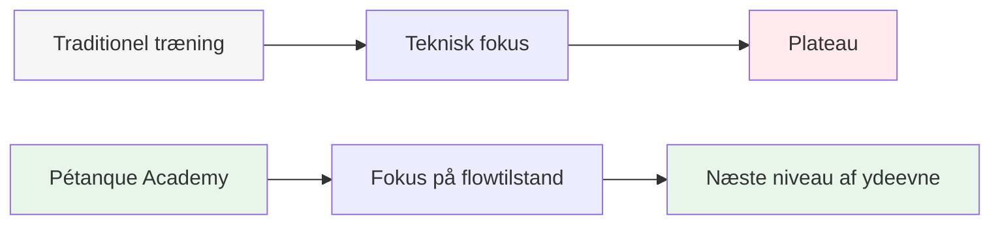
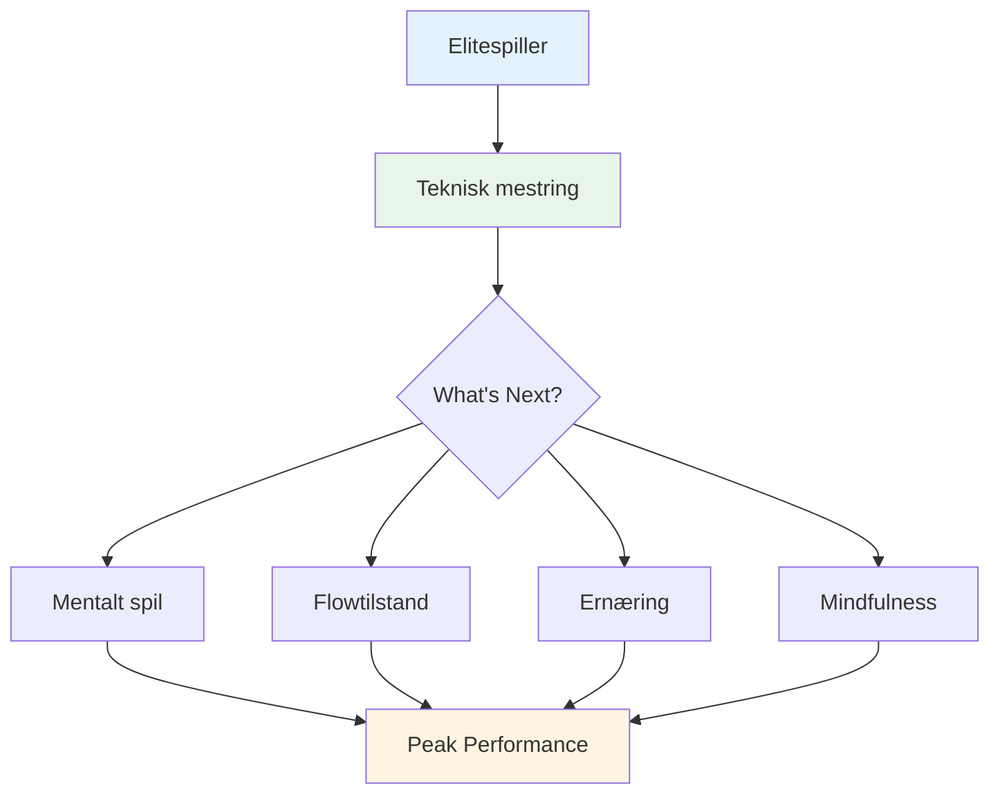

# Ambition

<AdBanner />

Vores mission er at hjælpe elitespillere med at tage det næste skridt i deres udvikling.

::: tip Vores vision
**Forvandl elitespillere fra teknisk dygtige til mentalt ustoppelige.** Vi hjælper dig med at opnå den flowtilstand, hvor perfekte boules bliver et naturligt udtryk for dit mestre.
:::

## At bevæge sig ud over teknik

Traditionel træning fokuserer i høj grad på tekniske aspekter - grebet, holdningen og frigørelsen. Selvom disse grundlæggende elementer er vigtige, har elitespillere allerede mestret dem.

::: info Gennembruddet
**Det næste niveau handler ikke om at perfektionere teknikken - det handler om at komme ind i flowtilstanden.**

Vi hjælper spillere med at gå fra et teknisk træningsperspektiv til et **flow (i zonen)**, hvor perfekte boules bliver et naturligt udtryk for deres mestring snarere end en bevidst indsats.
:::

## Rejsen

## Hvad vi tilbyder

| Tilbud | Beskrivelse | Indvirkning |
|----------|-------------|--------|
| **Workshops** | Små grupper af elitespillere (6-8) | Dyb peer-læring og støtte |
| **Undervisning** | Mentale aspekter af toppræstation | Praktiske teknikker, du kan bruge med det samme |
| **Fællesskab** | Ligesindede spillere, der flytter grænser | Ansvarlighed og fælles vækst |
| **Holistisk tilgang** | Ernæring, mindset og mental træning | Komplet ydeevneoptimering |

::: tip Hvorfor det virker
Elitespillere har allerede det tekniske fundament. Det, der adskiller god fra fremragende, er evnen til at opnå den bedste præstation under pres. Det er det, vi fokuserer på.
:::

## Vores tilgang

### 1. Træning i flowtilstand
Lær at træde ind i &quot;zonen&quot; konsekvent, ikke ved et uheld.

### 2. Mental styrke
Udvikle rutiner, mindfulness og preshåndtering.

### 3. Smart ernæring
Giv din hjerne brændstof til stabilt fokus og rolige hænder.

### 4. Peer-læring
Del oplevelser med andre elitespillere i et trygt og støttende miljø.

::: info Klar til at tage det næste skridt?
Udforsk vores [Uddannelse](/da/uddannelse/) sektion eller lær mere om vores [Workshops](/da/workshop).
:::

<AdBanner />

