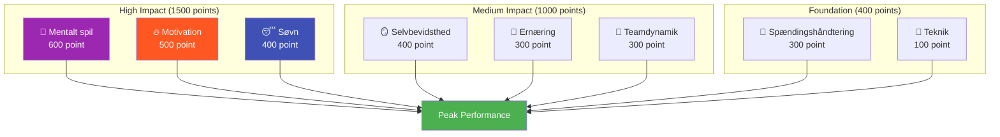

# Ambition

Vores mission er at hjælpe elitespillere med at tage det næste skridt i deres udvikling.

::: tip Vores vision
**Forvandl elitespillere fra teknisk dygtige til mentalt ustoppelige.** Vi bruger en datadrevet tilgang til at identificere dine forbedringsområder med størst effekt.
:::

## 8-faktor præstationsmodellen

Forskning og erfaring viser, at præstationer i elitepetanque afhænger af **8 sammenhængende faktorer**. De fleste spillere overinvesterer i teknik, mens de ignorerer de faktorer, der rent faktisk adskiller godt fra fremragende.

### Hvorfor teknik har den laveste vægt

::: warning Den ubehagelige sandhed
**Teknik udgør kun 100 af i alt 2.900 point** i vores model.**

Det er ikke fordi teknik ikke betyder noget – det er fordi elitespillere allerede har udviklet tilstrækkelig teknik. Den marginale forbedring ved at perfektionere din frigørelse er minimal sammenlignet med at optimere din søvn, håndtere spændinger eller styrke dit mentale spil.
:::

## ROI-princippet

Ikke alle forbedringer er lige. Vi bruger **Return on Investment (ROI)**-beregninger til at identificere, hvor din træningstid vil have den største effekt.

| Dit niveau | Faktorvægt | Potentiel investeringsafkast |
|------------|---------------|---------------|
| Lav færdighed i højvægtsområde | Høj (f.eks. 600) | **Maksimum** |
| Høj færdighed i højvægtsområde | Høj (f.eks. 600) | Lavt (aftagende afkast) |
| Lav færdighed i lavvægtsområde | Lav (f.eks. 100) | Moderat |
| Høj færdighed i lavvægtsområde | Lav (f.eks. 100) | **Minimal** |

**Eksempel:** At forbedre din søvn fra 30% til 60% (høj vægtfaktor, lav nuværende færdighed) vil sandsynligvis have større effekt end at forbedre teknikken fra 75% til 85% (lav vægtfaktor, allerede høj færdighed).

## De 8 faktorer forklaret

| Faktor | Vægt | Hvad det dækker |
|--------|--------|----------------|
| 🧠 **Mentalt spil** | 600 | Tankemønstre, fokus, selvtillid, adgang til flowtilstand |
| 🔥 **Motivation** | 500 | Drivkraft, formål, målorientering, vedholdenhed |
| 😴 **Søvn og restitution** | 400 | Kvalitetshvile, protokoller før konkurrence, energistyring |
| 🪞 **Selvbevidsthed** | 400 | Præcis selvopfattelse, blindvinkelgenkendelse, brug af feedback |
| 🥗 **Ernæring** | 300 | Blodsukkerstabilitet, hydrering, konkurrencebrændstof |
| 🤝 **Holddynamik** | 300 | Kommunikation, tillid, klarhed i roller, teambidrag |
| 💆 **Spændingshåndtering** | 300 | Fysisk afslapning, åndedrætskontrol, optimal ophidselse |
| 🎯 **Teknik** | 100 | Fysisk mekanik, kasterepertoire, konsistens |

## Opdag din vej

Vi har bygget et **gratis vurderingsværktøj**, der analyserer dine nuværende niveauer på tværs af alle 8 faktorer og beregner dine personlige forbedringsprioriteter.

::: info Tag vurderingen
**[→ Start din spillerudviklingsvurdering](/da/vurdering/)**

Om 5 minutter modtager du:
- Dit radardiagram på tværs af alle 8 faktorer
- ROI-rangerede anbefalinger til, hvad man skal arbejde på
- Links til specifikt uddannelsesindhold til dine topprioriteter
- Mulighed for at få peer feedback fra holdkammerater
:::

## Hvad vi tilbyder

| Tilbud | Beskrivelse | Forbindelse |
|----------|-------------|------|
| **Vurderingsværktøj** | Identificér dine forbedringsområder med det højeste ROI | [Tag vurdering](/da/vurdering/) |
| **Uddannelsesmoduler** | Dybdegående indhold om alle 8 faktorer | [Gennemse Uddannelse](/da/uddannelse/) |
| **Workshops** | 3-4 timers sessioner for grupper på 6-8 spillere | [Værkstedsguide](/da/guider/værksted/) |
| **Træningslejre** | Weekendintensivkursus, der blander teori og praksis | [Lejrguide](/da/guider/træningslejr/) |

## Vores tilgang

### 1. Vurder først
Start med ærlig selvevaluering. Få feedback fra kolleger for at identificere blinde vinkler.

### 2. Prioritér efter investeringsafkast
Fokuser på vægtige faktorer, hvor du har plads til at udvikle dig – ikke hvad der føles behageligt.

### 3. Lær videnskaben
Forstå *hvorfor* noget virker, ikke bare *hvad* man skal gøre.

### 4. Øv dig bevidst
Anvend teknikker i træningen før konkurrence. Opbyg vaner, ikke kun viden.

### 5. Revurder regelmæssigt
Følg dine fremskridt. Dine prioriteter vil ændre sig, efterhånden som du forbedrer dig.

::: tip Klar til at tage det næste skridt?
**[→ Start med vurderingen](/da/vurdering/)** — Det er gratis og tager 5 minutter.

Eller udforsk vores [Uddannelse](/da/uddannelse/) sektion for at dykke ned i en af de 8 faktorer.
:::

