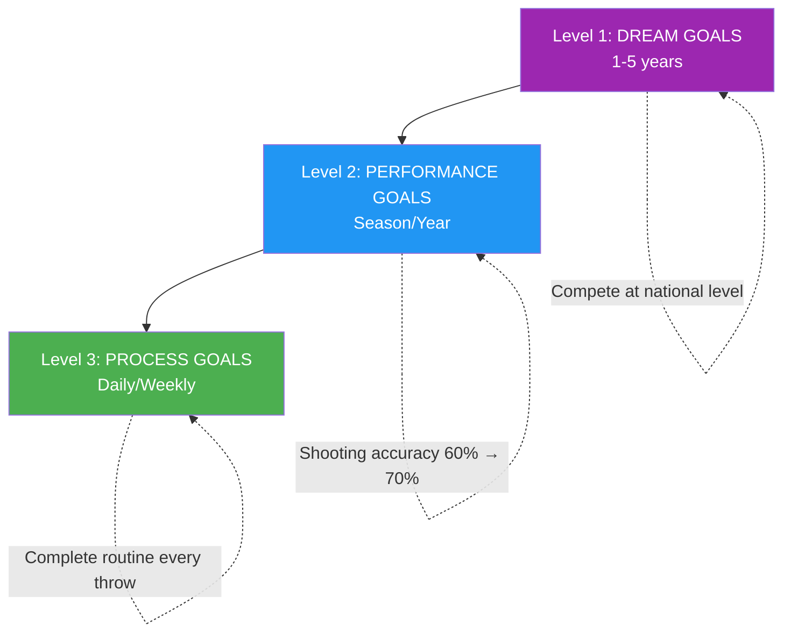

# Goal Setting for Elite Athletes

> "The right goals accelerate development; the wrong ones create frustration and stagnation."

Goal setting seems simple: decide what you want, work toward it. But elite-level goal setting is more nuanced.

::: warning Common Mistake
**Most players only set outcome goals** ("Win the championship"). You can't control outcomes — only the process that leads to them.
:::

---

## Beyond Basic Goals

| Outcome Goal Problems | Why It's a Problem |
|----------------------|-------------------|
| Can't fully control outcomes | Creates helplessness |
| Creates pressure without direction | Anxiety without action |
| Success or failure is binary | No partial wins |
| Doesn't guide daily practice | What do you actually do? |

Elite goal setting goes deeper.

---

## The Goal Hierarchy

### Level 1: Dream Goals (1-5 years)
Your ultimate aspirations:
- "Compete at national level"
- "Be recognized as an elite shooter"
- "Win a major championship"

::: info Direction, Not Action
These provide direction and motivation but aren't actionable daily.
:::

### Level 2: Performance Goals (Season/Year)
Measurable improvements in your game:
- "Increase shooting accuracy from 60% to 70%"
- "Reduce unforced errors by 25%"
- "Develop a reliable plombée"

These are within your control and measurable.

### Level 3: Process Goals (Daily/Weekly)
The actions that drive improvement:
- "Complete pre-shot routine on every throw"
- "Practice visualization for 10 minutes daily"
- "Train shooting technique 3x per week"

::: tip Full Control
**Process goals are 100% controllable.** Focus here for maximum impact.
:::

## The SMART+ Framework

Go beyond basic SMART goals:

### Specific
Not "improve my pointing" but "develop a consistent demi-portée that lands within 30cm of target from 8 meters."

### Measurable
Define how you'll track progress:
- Success rate percentages
- Consistency metrics
- Video analysis markers

### Achievable but Stretching
The goal should require growth but be realistic. A 60% shooter aiming for 65% is achievable; aiming for 90% is fantasy.

### Relevant
Goals must connect to your larger aspirations and address actual weaknesses, not just what's easy to improve.

### Time-bound
Set clear deadlines:
- "By end of season"
- "Within 3 months"
- "By the national championship"

### + Personally Meaningful
The goal must matter to YOU, not just your coach or teammates. Internal motivation sustains effort when progress is slow.

## Process vs. Outcome Focus

### The Problem with Outcome Goals

"Win the match" creates problems:
- Anxiety about things you can't control
- Distraction from execution
- All-or-nothing thinking
- Pressure without guidance

### The Power of Process Goals

"Execute my pre-shot routine perfectly" offers:
- Full control
- Clear focus
- Immediate feedback
- Builds toward outcomes naturally

### The Balance

Use outcome goals for motivation and direction. Use process goals for daily focus and execution.

## Goal Setting for Different Phases

### Off-Season
Focus on development goals:
- Technical improvements
- Physical conditioning
- Mental skill building
- Expanding your palette of throws

### Pre-Season
Transition to integration:
- Combining skills in match-like conditions
- Testing improvements in friendly competition
- Refining strategies

### Competition Season
Shift to performance and process:
- Executing what you've developed
- Process goals for each match
- Minimal technical changes

### Post-Competition
Reflection and planning:
- Analyze what worked
- Identify areas for growth
- Set goals for next cycle

## Common Goal-Setting Mistakes

### Too Many Goals
Focus is power. 2-3 key goals beat 10 scattered ones.

### Only Outcome Goals
Without process goals, you have no roadmap.

### No Flexibility
Goals should adapt to new information. Rigid adherence to outdated goals wastes effort.

### Comparison-Based Goals
"Be better than [player]" puts your success in someone else's hands.

### Neglecting Mental Goals
Technical and physical goals dominate, but mental skills often determine who wins.

## Implementation Strategies

### Write Them Down
Written goals are significantly more likely to be achieved.

### Review Regularly
Weekly review keeps goals present and allows adjustment.

### Share Selectively
Share with those who will support, not undermine.

### Visualize Achievement
Regularly imagine achieving your goals — the feeling, the moment.

### Track Progress
What gets measured gets managed. Keep records.

## When Goals Aren't Met

Unmet goals aren't failures — they're data:

1. **Analyze**: Why wasn't it achieved?
2. **Learn**: What does this teach you?
3. **Adjust**: Modify the goal or approach
4. **Continue**: Persistence beats perfection

## The Mental Game of Goals

Goals affect psychology:
- **Too easy**: Boredom, complacency
- **Too hard**: Anxiety, discouragement
- **Just right**: Engagement, flow, growth

Find the sweet spot where goals challenge without overwhelming.

---

*Related: [Goal Setting Introduction](/da/education/motivation/) | [SMART Goals](/da/education/motivation/smart-goals) | [Planning Your Development](/da/education/motivation/planning)*

