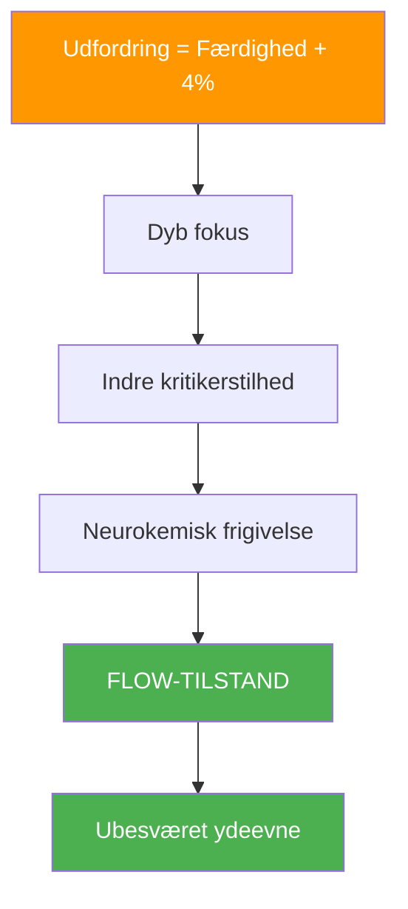
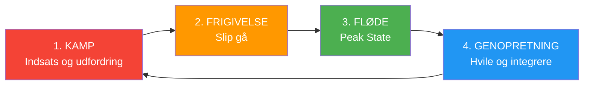

# Videnskaben bag flowtilstande

> &quot;Flowtilstand — den magiske zone, hvor alting klikker, tiden går langsommere, og præstationen føles ubesværet.&quot;

Det er ikke mystisk; det er neurologisk. At forstå videnskaben bag flow kan hjælpe dig med at få adgang til det mere konsekvent.

::: tip Vigtig indsigt
Flow er ikke noget, du kan fremtvinge – men du kan skabe de betingelser, der gør det mere sandsynligt, at det opstår.
:::

---

## Hvad er flow?

Psykologen Mihaly Csikszentmihalyi definerede flow som &quot;en tilstand af fuldstændig fordybelse i en aktivitet.&quot; I petanque har du oplevet det: kast der føles automatiske, beslutninger der kommer øjeblikkeligt, en følelse af at du og spillet er ét.

### Flowegenskaber

| Karakteristisk | Hvordan det føles |
|----------------|-------------------|
| **Fuldstændig absorption** | Spillet er alt, hvad der eksisterer |
| **Tab af selvbevidsthed** | Ingen indre kritiker |
| **Forvrænget tid** | Timer føles som minutter |
| **Intrinsisk motivation** | Spiller for glædens skyld |
| **Følelse af kontrol** | Selvtillid uden arrogance |
| **Øjeblikkelig feedback** | Øjeblikkelig justering |

## Neurovidenskaben bag flow

### Hjerneændringer under flow

Når du kommer ind i flow, gennemgår din hjerne målbare forandringer:

**Forbigående hypofrontalitet**
Den præfrontale cortex – ansvarlig for selvkritik, tvivl og overtænkning – bliver mindre aktiv. Det er derfor, flow føles ubesværet: din indre kritiker bliver stille.

**Neurokemisk cocktail**
Flow udløser en kraftfuld blanding af neurokemikalier:
- **Dopamin**: Forbedrer fokus og mønstergenkendelse
- **Noradrenalin**: Øger ophidselse og opmærksomhed
- **Endorfiner**: Skaber følelser af velvære
- **Anandamid**: Fremmer lateral tænkning
- **Serotonin**: Producerer eftergløden af blodstrømmen

**Hjernebølgeskift**
Flow korrelerer med skift fra betabølger (normal vågen bevidsthed) til alfa- og thetabølger (afslappet årvågenhed og kreativitet).

## Flow-udløserne

Forskning har identificeret forhold, der gør flow mere sandsynligt:

### 1. Balance mellem udfordring og færdigheder

Flow opstår, når udfordringen en smule overstiger dit nuværende færdighedsniveau – cirka 4% ud over din komfortzone. For let fører til kedsomhed; for svært fører til angst.

**I petanque:**
- Søger modstandere lidt bedre end dig selv
- Sæt personlige udfordringer i kampene
- Variér din praksis for at opretholde engagementet

### 2. Klare mål

Du skal vide, hvad du prøver at opnå. Vage intentioner udløser ikke flow.

**I petanque:**
- Definer din intention for hvert kast
- Hav klare matchmål
- Kend din rolle i teamet

### 3. Øjeblikkelig feedback

Flow kræver at vide, hvordan du klarer dig i realtid.

**I petanque:**
- Resultatet af hvert kast er øjeblikkeligt synligt
- Læs terrænresponsen
- Læg mærke til din krops feedback

### 4. Dyb koncentration

Flow kræver fokuseret opmærksomhed uden distraktion.

**I petanque:**
- Udvikl din rutine før indtagelse
- Øv mindfulness
- Eliminer eksterne distraktioner

### 5. Følelse af kontrol

Følelsen af, at dine handlinger betyder noget, og at du kan påvirke resultaterne.

**I petanque:**
- Stol på din træning
- Fokuser på det, du kan kontrollere
- Accepter usikkerhed i resultater

---

## Hvorfor du ikke kan tvinge flow

::: warning Flow-paradokset
**At forsøge at opnå flow forhindrer det.** Flow opstår, når du holder op med at forsøge at opnå det og blot engagerer dig fuldt ud i aktiviteten.
:::

Dette skyldes:
- At forsøge aktiverer den præfrontale cortex (det modsatte af flow)
- Selvovervågning forstyrrer fordybelse
- Målfokus erstatter procesfokus

## Skaber betingelser for flow

Selvom du ikke kan fremtvinge flow, kan du skabe betingelser, der gør det mere sandsynligt:

### Før konkurrencen
- Tilstrækkelig søvn og ernæring
- Korrekt opvarmning
- Positiv mental tilstand
- Klare intentioner

### Under konkurrencen
- Hold fokus på nuet
- Brug din rutine før indtagelse
- Giv slip på resultaterne
- Stol på din krop

### Miljøfaktorer
- Minimér distraktioner
- Komfortabel fysisk tilstand
- Passende udfordringsniveau
- Støttende teamdynamik

---

## Flowcyklussen

Strømning er ikke konstant – den følger en cyklus:

At forstå denne cyklus hjælper dig med at:
- Ikke tvungen flow under kampfasen
- Genkend hvornår du skal give slip
- Tillad korrekt genopretning mellem strømningstilstande

## Flow i holdpetanque

Flow kan være smitsomt. Når én spiller går ind i flow, kan det sprede sig til holdkammerater gennem:
- Positiv energi og kropssprog
- Mindre pres på andre
- Forhøjet kollektiv selvtillid
- Synkroniseret holdrytme

## Bygningens flowkapacitet

Som med enhver færdighed forbedres adgangen til flow med øvelse:

### Daglige praksisser
- Mindfulness-meditation (opbygger opmærksomhedskontrol)
- Visualisering (primerer neurale baner)
- Fysisk træning (bygger færdighedsgrundlaget)

### Under træning
- Øv dig på kanten af din evne
- Bevar fuldt engagement, selv under øvelser
- Bemærk hvornår flow opstår, og hvad der gik forud for det

### Langsigtet udvikling
- Øg gradvist udfordringsniveauet
- Udvikl robuste rutiner før optagelserne
- Opbyg mental modstandsdygtighed til kampfasen

---

| *Relateret: [Zonen](/da/uddannelse/mentalt-spil/zonen/) | [Indtræden i zonen](/da/uddannelse/mentalt-spil/zonen/indtræden-i-zonen) | [Mindfulness-teknikker](/da/uddannelse/mentalt-spil/mindfulness/teknikker)* |

