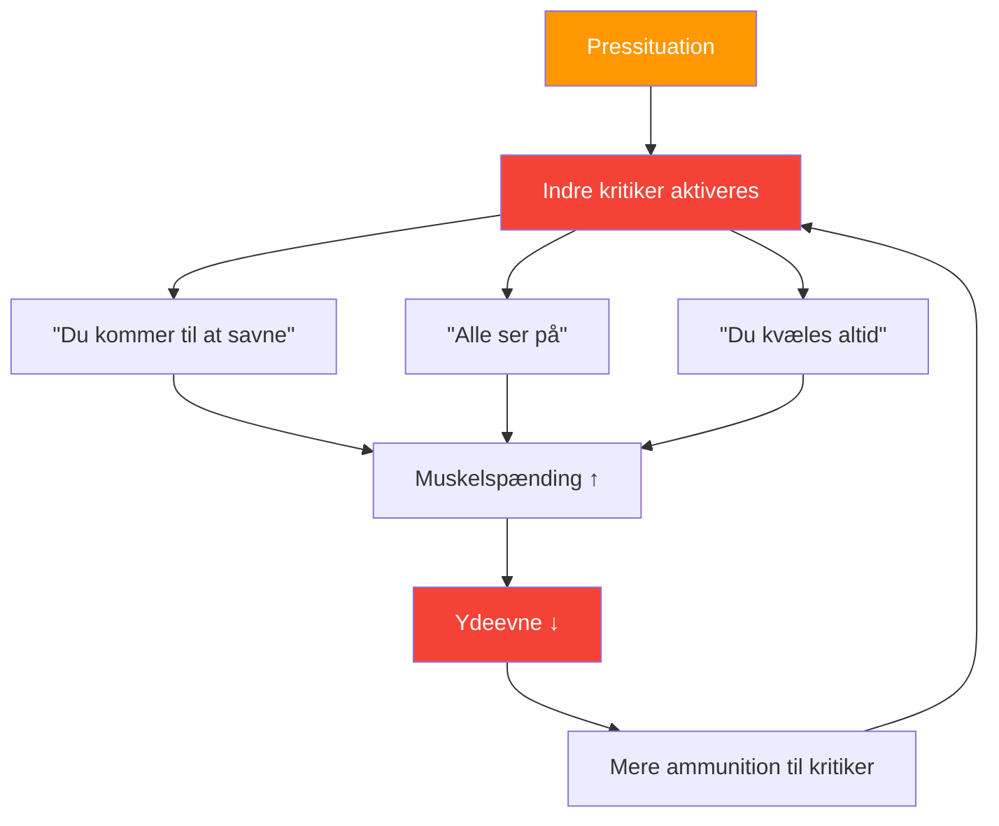

# At forstå den indre kritiker

> &quot;Enhver petanquespiller kender den stemme – den der hvisker &#39;du kommer til at misse&#39; lige når du er ved at kaste.&quot;

Dette er din indre kritiker – og det er afgørende at lære at håndtere den for at opnå toppræstationer.

::: warning Paradokset
**Din indre kritiker prøver ikke at såre dig** – det er et misforstået forsøg på beskyttelse. Men denne &quot;beskyttelse&quot; bliver til selvsabotage.
:::

---

## Hvad er den indre kritiker?

Den indre kritiker er den indre stemme, der dømmer, kritiserer og underminerer din selvtillid:

### Når det vises

| Øjeblik | Indre kritiker siger |
|--------|-------------------|
| **Før afgørende skud** | &quot;Alle ser med. Lad være med at ødelægge det her.&quot; |
| **Efter en misser** | &quot;Du kvæles altid under pres.&quot; |
| **Under taberrækken** | &quot;Du er ikke god nok til dette niveau.&quot; |

## At genkende dine mønstre

Det første skridt er bevidsthed. Begynd at lægge mærke til, hvornår din indre kritiker dukker op:

### Almindelige udløsere
- Situationer med højt pres (kampbold, vigtige turneringer)
- Efter at have begået en fejl
- Når modstanderne spiller godt
- Når holdkammerater virker frustrerede
- Fysisk træthed eller ubehag

### Almindelige beskeder
- &quot;Du kan ikke klare presset&quot;
- &quot;Du er ikke lige så god som dem&quot;
- &quot;Alle dømmer dig&quot;
- &quot;Du fejler altid, når det gælder&quot;

## Indvirkningen på præstationen

Når den indre kritiker tager over, reagerer din krop:

1. **Muskelspændingen stiger** — Dit kast bliver stift
2. **Årdrættet bliver overfladisk** — Mindre ilt, mindre fokus
3. **Synet snævres** — Du mister bevidstheden om terrænet
4. **Beslutningstagningen lider** — Du tvivler på dig selv

Dette skaber en ond cirkel: den indre kritiker forårsager dårlig præstation, hvilket giver kritikeren mere ammunition.

## Strategier til at håndtere den indre kritiker

### 1. Navngiv det for at tæmme det

Giv din indre kritiker et navn – noget lidt latterligt. &quot;Åh, der går Negative Nils igen.&quot; Dette skaber afstand mellem dig og stemmen, hvilket gør den lettere at afvise.

### 2. Udfordr beviserne

Når kritikeren siger &quot;du fejler altid under pres&quot;, så spørg dig selv: Er det virkelig sandt? Kan du komme i tanke om tidspunkter, hvor du klarede dig godt under pres? Kritikeren beskæftiger sig med absolutter, der sjældent afspejler virkeligheden.

### 3. Omformuler budskabet

Omdan kritik til coaching:
- &quot;Du kommer til at savne&quot; → &quot;Fokuser på din rutine&quot;
- &quot;Alle ser med&quot; → &quot;Dette er dit øjeblik til at skinne&quot;
- &quot;Du kvæles altid&quot; → &quot;Du har håndteret pres før&quot;

### 4. Brug din rutine før optagelse

En solid [rutine før skud](/da/uddannelse/mentalt-spil/mental-styrke/rutine-før-skud) giver dit sind noget konstruktivt at fokusere på, hvilket giver mindre plads til kritikeren.

### 5. Øv dig i selvmedfølelse

Behandl dig selv, som du ville behandle en holdkammerat. Ville du sige &quot;du er forfærdelig&quot; til en holdkammerat, der kæmper med det? Selvfølgelig ikke. Vis den samme venlighed til dig selv.

## Opbygning af en støttende indre stemme

Målet er ikke at bringe den indre kritiker fuldstændig til tavshed – det er næsten umuligt. I stedet skal du udvikle en stærkere, støttende stemme:

### Den støttende stemme siger:
- &quot;Et kast ad gangen&quot;
- &quot;Stol på din træning&quot;
- &quot;Du har gjort det her før&quot;
- &quot;Bliv i nuet&quot;
- &quot;Tag vejret og nulstil&quot;

### Daglig praksis

Brug 5 minutter hver dag:
1. Husk et øjeblik, hvor du klarede dig godt
2. Husk hvordan det føltes i din krop
3. Hør hvad din støttende stemme sagde
4. Forankre denne følelse med en fysisk gestus (at røre ved din kugle, justere din stilling)

## I konkurrence

Når den indre kritiker dukker op under en kamp:

1. **Anerkend det**: &quot;Jeg bemærker, at jeg er selvkritisk&quot;
2. **Tag en indånding**: Langsom, dyb indånding for at nulstille
3. **Brug dit anker**: Den fysiske gestus fra din praksis
4. **Tilbage til rutinen**: Fokuser på din proces før indtagelsen

## Den langsigtede rejse

At håndtere den indre kritiker er ikke en engangsløsning. Det er en løbende øvelse, der bliver lettere med tiden. Elitespillere eliminerer ikke selvtillid – de lærer at præstere på trods af den.

Den indre kritiker vil altid være en del af dig. Men med øvelse bliver dens stemme mere stille, og din støttende stemme bliver stærkere. Det er den mentale fordel, der adskiller gode spillere fra store spillere.

---

| *Relateret: [Håndtering af pres](/da/uddannelse/mentalt-spil/mental-styrke/håndtering-af-pres) | [Rutine før skud](/da/uddannelse/mentalt-spil/mental-styrke/rutine-før-skud) | [Mindfulness-teknikker](/da/uddannelse/mentalt-spil/mindfulness/teknikker)* |

