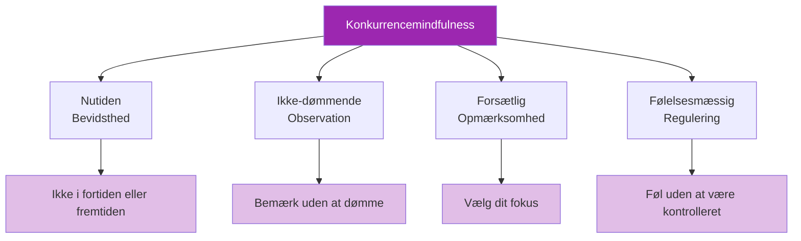

# Mindfulness i konkurrence

> &quot;Mindfulness er ikke kun for meditationspuder – det er en konkurrencefordel.&quot;

Evnen til at forblive nærværende, opmærksom og ikke-reaktiv under kampe adskiller eliteudøvere fra dem, der smuldrer under pres.

::: tip Fordelen i nuet
**Du kan kun kaste én kugle ad gangen.** Mindfulness holder dig fast i det eneste øjeblik, der betyder noget – dette.
:::

---

## Hvad mindfulness betyder i konkurrence

---

## Problemet med det vandrende sind

::: danger 47%-problemet
**Forskning viser, at den gennemsnitlige tankegang vandrer 47% af tiden.** I konkurrence er denne vandring dyr.
:::

| Hvor sindet går hen | Hvad du savner |
|-----------------|---------------|
| Sidste missede skud | Aktuel terrænaflæsning |
| Bekymret for scoren | Optimal kastevalg |
| Hvad andre synes | Fornemmelsen af boule |
| Planlægning af festligheder | Udførelse i nuet |

Hvert øjeblik brugt på mental tidsrejse er et øjeblik, der ikke bruges på kastet foran dig.

## Mindfulness-færdigheder til konkurrence

### 1. Forankring til nutiden

Brug sensoriske ankre til at vende tilbage til nuet:

**Fysiske ankre:**
- Mærk vægten af kuglen
- Læg mærke til dine fødder på jorden
- Føl grebets tekstur

**Miljømæssige ankre:**
- Se på specifikke detaljer i terrænet
- Lyt til omgivende lyde
- Mærk temperaturen og vinden

### 2. Observation uden at reagere

Når følelser opstår (frustration, angst, begejstring), øv dig:

1. **Bemærk**: &quot;Jeg føler mig frustreret&quot;
2. **Navn**: &quot;Dette er frustration&quot;
3. **Tillad**: Lad det være der uden kamp
4. **Returner**: Bring opmærksomheden tilbage til den aktuelle opgave

Følelserne forsvinder ikke, men de mister deres evne til at kontrollere dig.

### 3. Enkeltpunktsfokus

Træn din opmærksomhed til at fokusere på én ting:

**Før kastet:**
- Fokuser kun på at aflæse terrænet
- Først når man så visualiserer resultatet
- Så kun på din kropsholdning

**Under kastet:**
- Fokuser kun på målet
- Lad kroppen udføre arbejdet uden indblanding

### 4. Begynderens sind

Gå til værks, som om det var dit første:
- Ingen antagelser baseret på tidligere præstationer
- Friske øjne på terrænet
- Nysgerrighed snarere end forventning

## Praktiske anvendelser

### Mellem kast

Tiden mellem kastene er den tid, hvor tankerne vandrer mest. Brug denne tid mindfult:

- **Aktivt overvågning**: Observer medspillere og modstandere med fuld opmærksomhed
- **Forbliv kropslig**: Læg mærke til din vejrtrækning, kropsholdning og fysiske tilstand
- **Forbered dig mentalt**: Visualiser potentielle scenarier
- **Hvile opmærksomhed**: Giv dit fokus korte pauser

### Under trykmomenter

Når indsatsen er højest:

1. **Sænk farten**: Tag en ekstra indånding
2. **Grund dig selv**: Føl dine fødder, boulebanen
3. **Smalt fokus**: Kun dette kast
4. **Tillid**: Slip tilknytningen til resultater

### Efter fejl

Fejl udløser grublen. Bryd cyklussen:

1. **Anerkender**: &quot;Det gik ikke som planlagt&quot;
2. **Uddrag**: &quot;Hvad kan jeg lære?&quot;
3. **Udgivelse**: &quot;Det er færdigt, vi går videre&quot;
4. **Refokusér**: &quot;Hvad er det næste?&quot;

## Den mindful pre-shot rutine

Integrer mindfulness i din rutine:

1. **Ankomst**: Træd ind i cirklen med fuld tilstedeværelse
2. **Træk vejret**: Én bevidst åndedrag til centrering
3. **Se**: Observer terrænet opmærksomt
4. **Visualiser**: Se resultatet med klarhed
5. **Føl**: Læg mærke til kuglen, din krop
6. **Slip**: Slip fri og stol på

## Almindelige udfordringer

### &quot;Jeg kan ikke holde op med at tænke&quot;

Du behøver ikke at stoppe tanker – bare følg dem ikke. Læg mærke til tanken, lad den passere, vend tilbage til dit anker.

### &quot;Mindfulness gør mig for afslappet&quot;

Konkurrencemindfulness handler ikke om at være rolig – det handler om at være til stede. Du kan være vågen, energisk og mindful på samme tid.

### &quot;Jeg glemmer at være opmærksom&quot;

Brug triggere:
- At tage kuglen op = mindfulness-kø
- At træde ind i cirklen = påmindelse om tilstedeværelse
- At tage din holdning = opmærksomhedsanker

## Opbygning af færdigheden

### Daglig praksis

5-10 minutters formel mindfulness-praksis opbygger de neurale baner:
- Meditation til bevidsthed om åndedrættet
- Øvelse i kropsscanning
- Mindful observationsøvelser

### Træningsintegration

Øv mindfulness under hver træningssession:
- Fuld tilstedeværelse for hvert kast
- Læg mærke til, når opmærksomheden vandrer
- Øv dig i at vende tilbage til fokus

### Konkurrenceforberedelse

Før kampene:
- Kort mindfulness-øvelse
- Sæt intention for nutidsfokus
- Mind dig selv om dine ankre

## Den konkurrencemæssige fordel

Opmærksomme konkurrenter har fordele:
- **Hurtigere gendannelse** efter fejl
- **Bedre beslutningstagning** under pres
- **Mere ensartet** ydeevne
- **Større glæde** ved konkurrence
- **Reduceret udbrændthed** og angst

Den spiller, der er fuldt til stede ved hvert kast, mens andre er fordybet i tanker, har en betydelig fordel.

---

| *Relateret: [Introduktion til mindfulness](/da/uddannelse/mentalt-spil/mindfulness/) | [Mindfulness-teknikker](/da/uddannelse/mentalt-spil/mindfulness/teknikker) | [Daglig praksis](/da/uddannelse/mental-leg/mindfulness/daglig-øvelse)* |

