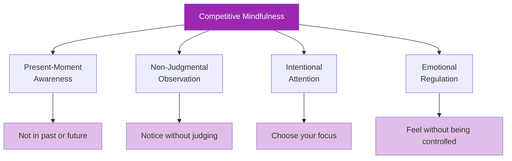

# Mindfulness in Competition

> "Mindfulness isn't just for meditation cushions — it's a competitive advantage."

The ability to stay present, aware, and non-reactive during matches separates elite performers from those who crumble under pressure.

::: tip The Present Moment Advantage
**You can only throw one boule at a time.** Mindfulness keeps you in the only moment that matters — this one.
:::

---

## What Mindfulness Means in Competition

---

## The Wandering Mind Problem

::: danger The 47% Problem
**Research shows the average mind wanders 47% of the time.** In competition, this wandering is costly.
:::

| Where Mind Goes | What You Miss |
|-----------------|---------------|
| Last missed shot | Current terrain reading |
| Worrying about score | Optimal throw selection |
| What others think | Feel of the boule |
| Planning celebrations | Present-moment execution |

Every moment spent in mental time-travel is a moment not spent on the throw in front of you.

## Mindfulness Skills for Competition

### 1. Anchoring to the Present

Use sensory anchors to return to now:

**Physical anchors:**
- Feel the weight of the boule
- Notice your feet on the ground
- Feel the texture of the grip

**Environmental anchors:**
- Look at specific details of the terrain
- Listen to ambient sounds
- Feel the temperature and wind

### 2. Observing Without Reacting

When emotions arise (frustration, anxiety, excitement), practice:

1. **Notice**: "I'm feeling frustrated"
2. **Name**: "This is frustration"
3. **Allow**: Let it be there without fighting
4. **Return**: Bring attention back to the present task

The emotion doesn't disappear, but it loses its power to control you.

### 3. Single-Pointed Focus

Train your attention to stay on one thing:

**Before the throw:**
- Focus only on reading the terrain
- Then only on visualizing the result
- Then only on your body position

**During the throw:**
- Focus only on the target
- Let the body execute without interference

### 4. Beginner's Mind

Approach each throw as if it's your first:
- No assumptions based on past performance
- Fresh eyes on the terrain
- Curiosity rather than expectation

## Practical Applications

### Between Throws

The time between throws is when minds wander most. Use this time mindfully:

- **Watch actively**: Observe teammates and opponents with full attention
- **Stay embodied**: Notice your breathing, posture, physical state
- **Prepare mentally**: Visualize potential scenarios
- **Rest attention**: Give your focus brief breaks

### During Pressure Moments

When stakes are highest:

1. **Slow down**: Take an extra breath
2. **Ground yourself**: Feel your feet, the boule
3. **Narrow focus**: This throw only
4. **Trust**: Let go of outcome attachment

### After Mistakes

Mistakes trigger rumination. Break the cycle:

1. **Acknowledge**: "That didn't go as planned"
2. **Extract**: "What can I learn?"
3. **Release**: "It's done, moving on"
4. **Refocus**: "What's next?"

## The Mindful Pre-Shot Routine

Integrate mindfulness into your routine:

1. **Arrive**: Step into the circle with full presence
2. **Breathe**: One conscious breath to center
3. **See**: Mindfully observe the terrain
4. **Visualize**: See the result with clarity
5. **Feel**: Notice the boule, your body
6. **Release**: Let go and trust

## Common Challenges

### "I can't stop thinking"

You don't need to stop thoughts — just don't follow them. Notice the thought, let it pass, return to your anchor.

### "Mindfulness makes me too relaxed"

Competitive mindfulness isn't about being calm — it's about being present. You can be alert, energized, and mindful simultaneously.

### "I forget to be mindful"

Use triggers:
- Picking up the boule = mindfulness cue
- Stepping into the circle = presence reminder
- Taking your stance = attention anchor

## Building the Skill

### Daily Practice

5-10 minutes of formal mindfulness practice builds the neural pathways:
- Breath awareness meditation
- Body scan practice
- Mindful observation exercises

### Training Integration

Practice mindfulness during every training session:
- Full presence for each throw
- Notice when attention wanders
- Practice returning to focus

### Competition Preparation

Before matches:
- Brief mindfulness practice
- Set intention for present-focus
- Remind yourself of your anchors

## The Competitive Edge

Mindful competitors have advantages:
- **Faster recovery** from mistakes
- **Better decision-making** under pressure
- **More consistent** performance
- **Greater enjoyment** of competition
- **Reduced burnout** and anxiety

The player who is fully present for each throw, while others are lost in thought, has a significant edge.

---

*Related: [Mindfulness Introduction](/da/education/mental-game/mindfulness/) | [Mindfulness Techniques](/da/education/mental-game/mindfulness/techniques) | [Daily Practice](/da/education/mental-game/mindfulness/daily-practice)*

