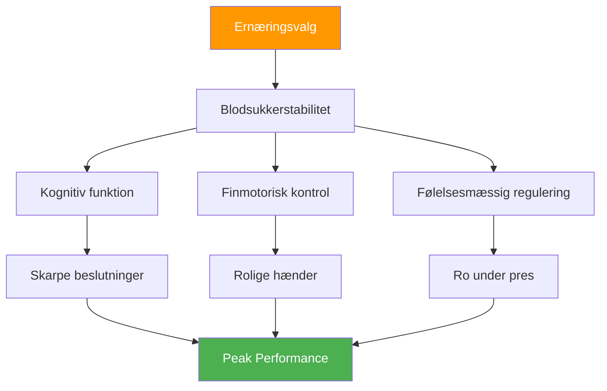

# Ernæring til konkurrence: Fremme af præcisionspræstation

> &quot;Din hjerne er dit vigtigste værktøj i petanque. Giv den stabil brændstof, ikke rutsjebaneenergi.&quot;

Petanque-konkurrencer kan vare 6-10 timer. Dine indtagelser påvirker direkte din kognitive funktion, finmotorik og evne til at holde fokus på tværs af flere kampe.

::: tip Den gyldne regel
**Stabilt blodsukker = rolige hænder.** Ethvert ernæringsvalg bør understøtte ensartet energi, ikke stigninger og kollapser.
:::

---

## Hvorfor ernæring er vigtig for petanque

I modsætning til højintensive sportsgrene kræver petanque:

Forkerte ernæringsvalg skaber præstationsproblemer, som spillerne tilskriver &quot;mental svaghed&quot; eller &quot;uheld&quot;.

---

## Blodsukkerforbindelsen

Din hjerne kører på glukose. Blodsukkerudsving påvirker direkte:

| Blodsukkertilstand | Mental effekt | Fysisk effekt |
|-------------------|---------------|-----------------|
| **Stabil** | Klar tænkning, gode beslutninger | Rolige hænder, konsekvent |
| **Spids (for høj)** | Indledende energi, derefter nedbrud | Jittery, overaktiv |
| **Crash (for lavt)** | Dårlig koncentration, irritabilitet | Rystelser, svagt greb |
| **Rutsjebane** | Uforudsigeligt humør/fokus | Inkonsekvent ydeevne |

**Mål:** Oprethold et stabilt blodsukker under hele konkurrencen.

## Ernæring på konkurrencedagen

### Før konkurrencen (3-4 timer før)

**Spis et ordentligt måltid:**
- Komplekse kulhydrater (havregryn, fuldkornsbrød, ris)
- Protein (æg, yoghurt, magert kød)
- Sunde fedtstoffer (avocado, nødder, olivenolie)
- Undgå: Simple sukkerarter, tunge/fedtende fødevarer

**Eksempelmåltider:**
- Havregrød med nødder og banan
- Æg på fuldkornsbrød med avocado
- Ris med kylling og grøntsager

### Før kampen (1-2 timer før)

**Let, velkendt snack:**
- Banan
- En lille håndfuld nødder
- En halv sandwich
- Undgå: Alt nyt eller eksperimentelt

### Under konkurrencen

**Mellem kampene:**
- Små, hyppige snacks hvert 60.-90. minut
- Nødder, frø, tørret frugt
- Fuldkornskiks
- Frisk frugt (banan, æble)

**Under kampene:**
- Vand siver mellem enderne
- Hurtige kulhydrater om nødvendigt (tørret frugt)
- Undgå at spise under aktiv leg

### Restitution (efter konkurrence)

**Inden for 30-60 minutter:**
- Protein til muskelgendannelse
- Kulhydrater til genopfyldning
- Væsker til rehydrering

## Hydreringsprotokol

### Det grundlæggende
- Start med at drikke væske (tjek farven på morgenurinen)
- Drik jævnt hele tiden, vent ikke til du er tørstig
- Mål 150-250 ml pr. time under konkurrence
- Juster for varme og fugtighed

### Advarselstegn på dehydrering
- Tørst (du er allerede dehydreret)
- Mørk urin
- Hovedpine
- Nedsat koncentration
- Træthed

### Overhydreringsfælden
For meget vand, især uden elektrolytter:
- Hyppige toiletbesøg (forstyrrer rytmen)
- Fortyndede elektrolytter (kan forårsage rysten)
- Ubehag og distraktion

**Balance:** Stabilt indtag, inkluder elektrolytter under varme forhold.

## Madvarer, der skal undgås

### På konkurrencedagen
- **Tunge måltider** — Omdirigerer blod til fordøjelsen
- **Højt sukker** — Forårsager energinedbrud
- **Alkohol (aftenen før)** — Forstyrrer søvnen, dehydrerer
- **Overdreven koffeinindtagelse** — Kan forårsage nervøsitet
- **Nye fødevarer** — Risiko for fordøjelsesproblemer
- **Fedtet/stegt mad** — Langsom fordøjelse, sløvhed

### Fødevarer, der forårsager problemer
- **Kulsyreholdige drikke** — Oppustethed, ubehag
- **Fiberrige fødevarer** — Kan forårsage ubehag
- **Mejeriprodukter (for nogle)** — Fordøjelsesfølsomhed
- **Kunstige sødestoffer** — Kan forårsage maveproblemer

## Koffeinstrategi

Koffein kan forbedre fokus og reaktionstid, men kræver omhyggelig håndtering:

### Effektiv brug
- Kend din tolerance
- Konsekvent timing (ændres ikke for konkurrence)
- Moderat dosis (100-200 mg)
- Tidligt nok til at undgå forstyrrelser i aftenkampene
- Kombinér med mad for at reducere nervøsitet

### Ineffektiv brug
- Mere end normalt (forårsager angst, rysten)
- Sent på dagen (forstyrrer søvnen)
- På tom mave (nervøsitet, styrt)
- At stole på koffein for at kompensere for dårlig søvn

## Opbygning af din konkurrence-ernæringsplan

### Trin 1: Test i praksis
Prøv din konkurrence-ernæringsplan under træning:
- Samme timing
- Samme fødevarer
- Samme hydrering
- Læg mærke til, hvordan du føler og præsterer

### Trin 2: Forbered logistik
- Vid hvilken mad der er tilgængelig på stedet
- Medbring dine egne velprøvede snacks
- Har backupmuligheder
- Pak mere, end du tror, du har brug for

### Trin 3: Opret en tidsplan
Skriv din ernæringstidspunkt ned:
- Måltid før konkurrencen (tid, mad)
- Snack før kampen (tid, mad)
- Under konkurrencen (program, mad)
- Intervaller for hydreringspåmindelse

### Trin 4: Spor og juster
Efter konkurrencerne, bemærk:
- Hvad du spiste og hvornår
- Hvordan du havde det fysisk
- Ydelseskvalitet
- Eventuelle problemer (sult, nedbrud, maveproblemer)

## Overvejelser vedrørende varme og fugtighed

Krav til ændringer i varmt vejr:

- **Øg væskeindtaget** — Kan have brug for 50-100% mere
- **Tilføj elektrolytter** — Sved mister mineraler
- **Lette måltider** — Tung mad, der er sværere at forarbejde
- **Skyggebrydninger** — Undervurder ikke varmestress
- **Forkøling** — Ankom afkølet og hydreret til stedet

## Almindelige fejl

::: warning Undgå disse
- **Spring morgenmaden over** — Udtømmer morgenglykogen
- **Energidrikke** — For meget koffein og sukker
- **Venter til man er sulten** — Påvirker allerede præstationen
- **Alkohol aftenen før** — Dehydrering og dårlig søvn
- **At prøve nye fødevarer** — Risiko for fordøjelsesproblemer
:::

## Handlingstrin

1. **Planlæg din konkurrenceernæring** på forhånd
2. **Test din plan** i praksis
3. **Forbered dine snacks** aftenen før
4. **Følg din tidsplan** uanset kamppres
5. **Gennemgå og finjuster** efter hver konkurrence

---

## Relateret indhold

- [Ernæringsmodul](/da/uddannelse/ernæring/) — Komplet ernæringsuddannelse
- [Konkurrenceernæring](/da/uddannelse/ernæring/konkurrence) — Detaljerede protokoller
- [Søvn for præstation](/da/artikler/søvnpræstation) — Optimering af restitution

