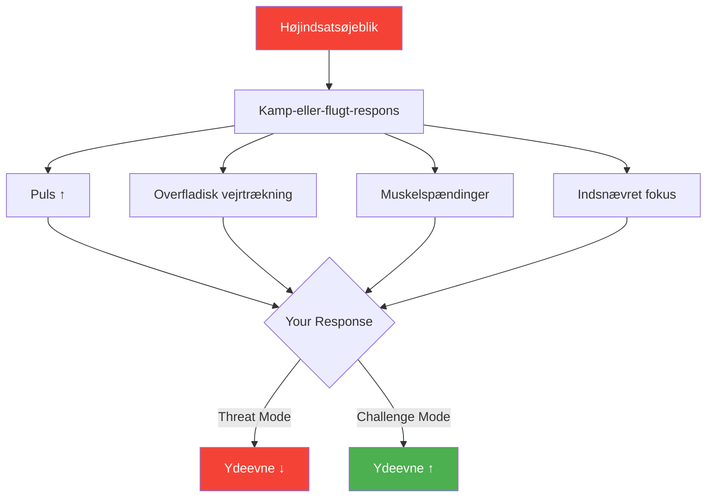

# Trykstyring i Petanque

> &quot;Elitespillere eliminerer ikke pres; de lærer at præstere med det, nogle gange endda på grund af det.&quot;

Pres er uundgåeligt i konkurrencepetanque. Spørgsmålet er ikke, om du vil mærke det – du vil. Spørgsmålet er, hvordan du vil reagere.

::: tip Sandheden om presset
**Tryk er ikke problemet – det er din reaktion på det.** Lær at bruge tryk som brændstof, ikke som en bremse.
:::

---

## Forståelse af pres

Pres er din krops reaktion på opfattede høje indsatser. Når du står over for et afgørende skud, aktiveres dit nervesystem:

Dette er kamp-eller-flugt-responsen – nyttig til at undslippe rovdyr, mindre nyttig til at kaste en kugle med præcision.

---

## Trykparadokset

::: warning Fælden
Jo hårdere du prøver at eliminere presset, jo stærkere bliver det. At sige til dig selv &quot;du skal ikke være nervøs&quot; forstærker kun nervøsiteten.
:::

Løsningen er ikke at bekæmpe presset, men at ændre dit forhold til det.

## Omformningstryk

### Fra trussel til udfordring

Din hjerne fortolker pressede situationer på en af to måder:
- **Trussel**: &quot;Dette kan gå galt, jeg fejler måske&quot;
- **Udfordring**: &quot;Dette er en mulighed for at vise, hvad jeg kan&quot;

Begge fortolkninger skaber ophidselse, men udfordrende tilstande fører til bedre præstation. De fysiske fornemmelser er ens – det er den betydning, du tildeler, der er forskellig.

### Praktiske omformuleringer

| Tryktanke | Omformulering |
|-----------------|---------|
| &quot;Jeg kan ikke gå glip af dette&quot; | &quot;Jeg må tage dette skud&quot; |
| &quot;Alle ser på&quot; | &quot;Jeg er klar til dette øjeblik&quot; |
| &quot;Dette er for vigtigt&quot; | &quot;Det er det, jeg træner til&quot; |
| &quot;Jeg er så nervøs&quot; | &quot;Jeg er spændt og klar&quot; |

## Fysiske teknikker

### Åndedrætskontrol

Den hurtigste måde at berolige dit nervesystem på:

**Box-åndedræt:**
1. Inhalér i 4 tællinger
2. Hold i 4 tællinger
3. Udånd i 4 tællinger
4. Hold i 4 tællinger
5. Gentag 2-3 gange

**Udvidet udånding:**
- Inhalér i 4 tællinger
- Udånd i 8 tællinger
- Den længere udånding aktiverer det parasympatiske nervesystem

### Progressiv afslapning

Mellem kastene:
1. Knæk dine næver hårdt i 3 sekunder
2. Slip fri og mærk afslapningen
3. Rul skuldrene op, hold, slip
4. Ryst dine hænder

### Jordforbindelse

Når presset føles overvældende:
- Føl dine fødder på jorden
- Læg mærke til kuglens vægt i din hånd
- Se på specifikke detaljer i dine omgivelser
- Nævn 5 ting du kan se

## Mentale teknikker

### Indsnævr dit fokus

Presset kommer ofte af at tænke for langt frem. Henvis din opmærksomhed til:
- Kun dette kast
- Kun dette øjeblik
- Processen, ikke resultatet

### Brug stikord

Enkeltord, der forankrer dit fokus:
- &quot;Glat&quot;
- &quot;Tillid&quot;
- &quot;Nu&quot;
- &quot;Ånde&quot;

### Visualisering

Før højtryksindsprøjtninger:
1. Luk øjnene kort
2. Se kuglen bevæge sig mod sit mål
3. Mærk det succesfulde kast i din krop
4. Åbn dine øjne og udfør

## Bygningstryktolerance

### Tryktræning

Du kan ikke lære at håndtere pres uden at opleve det. Skab pres i praksis:

- **Konsekvensøvelser**: Du laver armbøjninger, og så bommer du på dem.
- **Konkurrencesimulering**: Øvelse med noget på spil
- **Publikumsøvelse**: Inviter folk til at se din træning
- **Træthedstræning**: Træn når du er træt

### Eksponeringsstige

Øg gradvist trykeksponeringen:
1. Øv alene uden indsatser
2. Øv med en træningspartner, der ser på
3. Øvelse med små konsekvenser
4. Venskabskampe
5. Klubkonkurrencer
6. Regionale turneringer
7. Nationale begivenheder

## Strategier i kampene

### Før kampen
- Kom tidligt, og gør dig bekendt med terrænet
- Færdiggør din opvarmningsrutine
- Brug positiv selvsnak
- Visualiser succesfuld præstation

### Under trykmomenter
1. Anerkend presset (&quot;Jeg føler presset&quot;)
2. Accepter det (&quot;Dette er normalt, det betyder, at jeg holder af det&quot;)
3. Træk vejret (2-3 kontrollerede vejrtrækninger)
4. Fokusér igen (vend tilbage til din rutine før optagelserne)
5. Udfør (stol på din træning)

### Efter fejl
- Tag et fysisk skridt tilbage
- En dyb indånding
- Slip resultatet
- Fokuser på den næste mulighed

## Fordelen ved tryk

Med øvelse bliver pres til brændstof snarere end friktion. Eliteudøvere beskriver ofte deres bedste præstationer som værende under det højeste pres – ikke på trods af det, men på grund af det.

Den ophidselse, som trykket skaber, kan forstærke:
- Fokus og koncentration
- Fysisk parathed
- Hukommelse og genkaldelse
- Reaktionstid

Nøglen er at kanalisere denne energi produktivt i stedet for at lade den overvælde dig.

---

| *Relateret: [Håndtering af pres](/da/uddannelse/mentalt-spil/mental-styrke/håndtering-af-pres) | [Rutine før skud](/da/uddannelse/mentalt-spil/mental-styrke/rutine-før-skud) | [Zonen](/da/uddannelse/mentalt-spil/zonen/)* |

