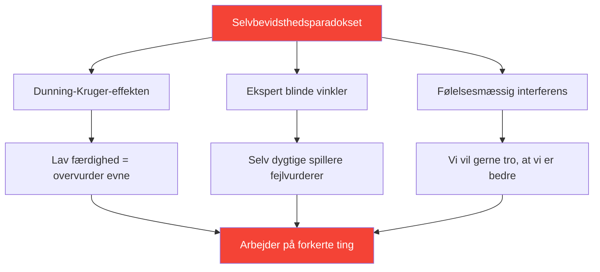

# Udvikling af selvbevidsthed: Fundamentet for forbedring

> &quot;Du kan ikke forbedre det, du ikke opfatter korrekt.&quot;

Selvbevidsthed – at kende dine faktiske styrker og svagheder – er fundamentet for effektiv udvikling.

::: danger Den ubehagelige sandhed
**De fleste spillere arbejder på de forkerte ting** fordi de ikke ser sig selv klart.
:::

---

## Selvbevidsthedsparadokset

---

## Hvorfor petanquespillere kæmper

Petanque gør selvevaluering særligt vanskelig:

| Udfordring | Hvorfor det er svært |
|-----------|--------------|
| **Resultatvarians** | Gode beslutninger kan føre til dårlige resultater (og omvendt) |
| **Sammenligningsbias** | Vi husker de bedste præstationer, bortforklarer de værste |
| **Identitetsbeskyttelse** | At indrømme svaghed føles truende |

::: warning Hukommelse er ikke data
**Vi konstruerer fortællinger, der beskytter vores selvbillede.** Objektiv sporing er afgørende.
:::

---

## Komponenterne af selvbevidsthed

Sand selverkendelse kræver indsigt i flere domæner:

| Domæne | Nøglespørgsmål |
|--------|---------------|
| **Teknisk** | Hvilke kast er faktisk pålidelige? Hvilke er inkonsistente? |
| **Mental** | Hvordan reagerer jeg på pres? Hvad udløser min indre kritiker? |
| **Fysisk** | Hvornår er min energi højest? Hvordan påvirker træthed mig? |
| **Taktisk** | Overangriber jeg? Underangriber jeg? Hvordan aflæser jeg situationer? |
| **Følelsesmæssig** | Hvad frustrerer mig? Hvornår spiller jeg tight? |
| **Interpersonel** | Hvordan opfatter holdkammeraterne min kommunikation? |

## Ekstern feedback: Det spejl, du har brug for

Du kan ikke se dine egne blinde vinkler. Du har brug for eksterne perspektiver.

### Strukturerede feedbackmetoder

**Videoanalyse**
- Optag kampe og træning
- Se med specifikke fokusområder
- Læg mærke til mønstre, du overser i øjeblikket

**Fællebedømmelse**
- Spørg betroede holdkammerater om ærlig feedback
- Brug [Vurderingsværktøjet](/da/vurdering/) til validering af fagfæller
- Sammenlign din egen vurdering med deres vurdering

**Trænerobservation**
- Friske øjne ser, hvad velkendte øjne overser
- Bed om specifik feedback, ikke generelle indtryk
- Spor feedbacktemaer over tid

### Feedbackkløften

Når din selvevaluering afviger væsentligt fra ekstern feedback, skal du være opmærksom på:

| Mellemrumstype | Mening | Handling |
|----------|---------|--------|
| Du vurderer højere | Mulig blind vinkel | Undersøg med video/data |
| Du vurderer lavere | Muligt tillidsproblem | Fokus på bevis for kompetence |
| Konsekvent hul | Systematisk opfattelsesfejl | Genkalibrer din mentale model |

## Opbygning af selvbevidsthedsvaner

### Daglig refleksion (5 minutter)

Efter hver session, spørg dig selv:

1. **Hvad gik godt?** (Vær specifik)
2. **Hvad gik ikke godt?** (Vær ærlig)
3. **Hvad ville jeg gøre anderledes?** (Vær konstruktiv)
4. **Hvad overraskede mig?** (Vær nysgerrig)

### Ugentlig gennemgang (15 minutter)

Se efter mønstre:

- Hvilke situationer udfordrer mig konsekvent?
- Hvor forbedrer jeg mig?
- Hvilken feedback har jeg modtaget?
- Hvad undgår jeg at se på?

### Månedlig vurdering

Brug værktøjet [Spillervurdering](/da/vurdering/):

- Bedøm dig selv på alle 8 faktorer
- Anmod om peer-validering
- Sammenlign med foregående måned
- Identificér de største huller

## Datafordelen

Subjektiv opfattelse er upålidelig. Data giver objektivitet:

### Hvad skal spores

**Ydelsesdata**
- Succesrater efter kasttype
- Ydeevne under pres vs. intet pres
- Første sæt vs. senere sæt
- Med forskellige partnere

**Procesdata**
- Søvnkvalitet før kampene
- Overholdelse af rutine før kamp
- Mental tilstand i afgørende øjeblikke
- Restitutionstid efter fejl

### Sådan bruger du data

1. **Identificer mønstre** — Hvad korrelerer med god/dårlig præstation?
2. **Udfordr antagelser** — Stemmer dataene overens med dine overbevisninger?
3. **Guidetræning** — Fokus på faktiske svagheder, ikke opfattede
4. **Spor fremskridt** — Forbedring er ofte usynlig uden måling

## Almindelige selvbevidsthedsblokeringer

::: warning Hold øje med disse
- **Defensivitet** ved modtagelse af feedback
- **Bortforklaring** på dårlige præstationer
- **Søger bekræftelse** snarere end sandhed
- **Undgå måling** af svage områder
- **Give konsekvent skylden på eksterne faktorer**
:::

## Forbindelsen mellem væksttankegangen

Selvbevidsthed kræver accept af, at:

- Nuværende evne er ikke fast
- Svaghed er information, ikke identitet
- Feedback er en gave, ikke et angreb
- Forbedring kræver ærlig vurdering

## Handlingstrin

1. **I dag:** Udfyld [Selvvurderingen](/da/vurdering/)
2. **Denne uge:** Anmod om feedback fra to betroede holdkammerater
3. **Løbende:** Etabler daglig refleksionsvane
4. **Månedligt:** Følg fremskridt med gentagne evalueringer

---

## Relateret indhold

- [Selvbevidsthedsmodul](/da/uddannelse/selvbevidsthed/) — Fuldstændig uddannelse
- [Spillervurdering](/da/vurdering/) — Evaluer dine 8 faktorer
- [Den indre kritiker](/da/artikler/indre-kritiker) — Håndtering af selvdømmelse

