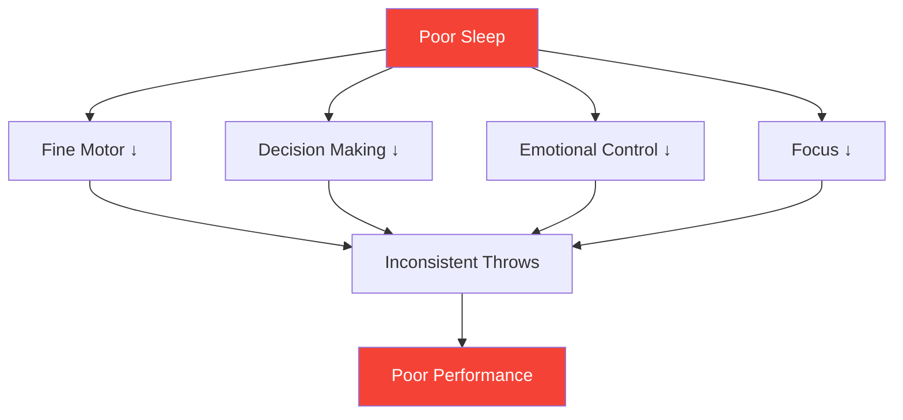

# Sleep: The Most Underrated Performance Factor

> "The player who slept better often wins."

Most players focus on technique and mental training. Few optimize their sleep. This is a mistake—sleep may be the highest-ROI improvement available to most competitive players.

::: tip High-ROI Improvement
**Sleep optimization requires zero talent and delivers massive returns.** It's the closest thing to a legal performance enhancer.
:::

---

## The Research

Sleep science reveals striking effects on precision sport performance:

### Reaction Time
- **24 hours without sleep** = reaction time equivalent to 0.1% blood alcohol
- **6 hours/night for 2 weeks** = equivalent to staying awake 48 hours
- Elite athletes average **8.5+ hours** vs 7 hours for general population

### Decision Making
- Sleep deprivation impairs the prefrontal cortex first
- Tactical decisions deteriorate before obvious fatigue appears
- You don't notice your impairment (meta-cognition fails too)

### Motor Control
- Fine motor skills (grip, release) require consolidated memory
- Memory consolidation happens during deep sleep
- Skill learning without adequate sleep = wasted practice

## The Precision Connection

Pétanque requires exactly what sleep deprivation destroys:

| Skill Required | Sleep Deprivation Effect |
|----------------|--------------------------|
| Fine motor control | Grip pressure becomes inconsistent |
| Visual processing | Distance judgment impaired |
| Decision making | Tactical errors increase |
| Emotional regulation | Frustration after mistakes increases |
| Sustained attention | Focus drifts in longer matches |

## Signs You're Under-Sleeping

You've adapted to chronic sleep deprivation if:

- You need an alarm to wake up
- You're drowsy in early afternoon
- You fall asleep within 5 minutes of lying down
- You "catch up" on weekends
- Coffee is essential, not optional

**Reality check:** If you need caffeine to function normally, you're sleep deprived.

## The Competition Week Protocol

### 7 Days Before
- Begin sleeping 30 minutes more per night
- Stabilize wake time (same time every day)

### 3 Days Before
- No alcohol (disrupts sleep architecture)
- No heavy meals after 7pm
- Reduce screen time after sunset

### Night Before
- Normal bedtime (don't go to bed early—you'll just lie awake)
- Familiar environment if possible
- Relaxation routine

### Competition Morning
- Wake at normal time
- Light exposure immediately
- Normal breakfast routine

## Optimizing Sleep Quality

It's not just duration—quality matters more.

### Sleep Environment
- **Temperature:** 18-20°C (65-68°F) is optimal
- **Darkness:** Complete darkness or sleep mask
- **Sound:** Consistent (white noise) or silent
- **Bedding:** Comfortable, not too warm

### Pre-Sleep Routine
- Screen-free 60+ minutes before bed
- Dim lights in evening
- Consistent wind-down activities
- Cool shower can trigger sleep onset

### Timing
- Consistent wake time (more important than bedtime)
- Avoid sleeping in more than 30 minutes on weekends
- Naps: before 3pm, under 20 minutes

## The Nap Strategy

Strategic napping for competition days:

### The Power Nap (10-20 min)
- Reduces fatigue without grogginess
- Best for between morning and afternoon sessions
- Set alarm—don't oversleep

### The Full Cycle (90 min)
- Complete sleep cycle
- Only if you have 2+ hours before competition
- Risk of grogginess if interrupted

### Never Nap If:
- You have sleep onset insomnia
- Competition is within 90 minutes
- It's after 3pm and you need to sleep that night

## Travel Considerations

For away competitions:

### Before Travel
- Bring familiar sleep items (pillow, sleep mask)
- Research hotel room (request quiet room)
- Adjust schedule if crossing time zones

### At Destination
- Stick to home sleep schedule if possible
- Light exposure controls circadian rhythm
- Avoid heavy meals close to bedtime

### Time Zone Crossing
- 1 day per hour to fully adjust
- Morning light exposure speeds eastward adjustment
- Evening light exposure speeds westward adjustment

## Tracking Your Sleep

What gets measured gets managed:

### Simple Tracking
- Wake time and bedtime
- Subjective quality (1-10)
- Performance correlation notes

### Advanced Tracking
- Sleep tracker or wearable
- HRV (heart rate variability) trends
- Sleep stage data

### What to Look For
- Correlation between sleep and performance
- Patterns (weekend catch-up, pre-competition insomnia)
- Trends over time

## Common Mistakes

::: warning Avoid These
- **Alcohol as sleep aid** — Helps onset, destroys quality
- **Catching up on weekends** — Can't "pay back" sleep debt
- **Screens in bed** — Trains brain that bed ≠ sleep
- **Inconsistent schedule** — Circadian rhythm needs consistency
- **Ignoring sleep for training** — Trading quality for quantity
:::

## Action Steps

1. **This week:** Track your actual sleep (duration + quality)
2. **Next week:** Establish consistent wake time
3. **Following weeks:** Optimize environment and routine
4. **Pre-competition:** Implement the competition week protocol

---

## Related Content

- [Sleep & Recovery Module](/da/education/sleep/) — Complete sleep education
- [Sleep Habits](/da/education/sleep/habits) — Building sustainable routines
- [Competition Sleep](/da/education/sleep/competition) — Event-specific protocols

