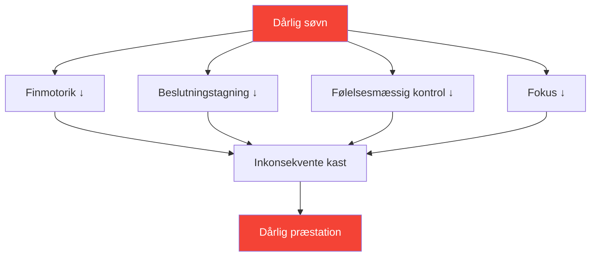

# Søvn: Den mest undervurderede præstationsfaktor

> &quot;Den spiller, der sov bedre, vinder oftest.&quot;

De fleste spillere fokuserer på teknik og mental træning. Få optimerer deres søvn. Dette er en fejltagelse – søvn er muligvis den forbedring med det højeste ROI, der er tilgængelig for de fleste konkurrencespillere.

::: tip Forbedring af højt ROI
**Søvnoptimering kræver intet talent og leverer massive afkast.** Det er det tætteste, man kommer på en lovlig præstationsfremmende middel.
:::

---

## Forskningen

Søvnvidenskab afslører slående effekter på præcisionssportspræstationer:

### Reaktionstid
- **24 timer uden søvn** = reaktionstid svarende til 0,1% alkohol i blodet
- **6 timer/nat i 2 uger** = svarer til at være vågen i 48 timer
- Eliteatleter bruger i gennemsnit **8,5+ timer** mod 7 timer for den generelle befolkning

### Beslutningstagning
- Søvnmangel forringer først den præfrontale cortex
- Taktiske beslutninger forringes, før tydelig træthed viser sig
- Du bemærker ikke din funktionsnedsættelse (metakognition fejler også)

### Motorstyring
- Finmotorik (greb, slip) kræver konsolideret hukommelse
- Hukommelseskonsolidering sker under dyb søvn
- Færdighedsindlæring uden tilstrækkelig søvn = spildt øvelse

## Præcisionsforbindelsen

Petanque kræver præcis det, som søvnmangel ødelægger:

| Nødvendig færdighed | Søvnmangel-effekt |
|----------------|--------------------------|
| Finmotorisk kontrol | Gribetrykket bliver ustabilt |
| Visuel bearbejdning | Forringet afstandsdømmekraft |
| Beslutningstagning | Taktiske fejl stiger |
| Følelsesmæssig regulering | Frustrationen efter fejltagelser stiger |
| Vedvarende opmærksomhed | Fokus skifter i længere kampe |

## Tegn på, at du sover for lidt

Du har tilpasset dig kronisk søvnmangel, hvis:

- Du har brug for en alarm for at vågne
- Du er døsig tidligt på eftermiddagen
- Du falder i søvn inden for 5 minutter efter du har lagt dig ned
- Du &quot;indhenter&quot; det forsømte i weekenderne
- Kaffe er essentielt, ikke valgfrit

**Realitetstjek:** Hvis du har brug for koffein for at fungere normalt, har du søvnmangel.

## Protokollen for konkurrenceugen

### 7 dage før
- Begynd at sove 30 minutter mere om natten
- Stabiliser vågnetiden (samme tidspunkt hver dag)

### 3 dage før
- Ingen alkohol (forstyrrer søvnstrukturen)
- Ingen tunge måltider efter kl. 19
- Reducer skærmtid efter solnedgang

### Natten før
- Normal sengetid (gå ikke tidligt i seng – du ligger bare vågen)
- Velkendte omgivelser, hvis muligt
- Afslapningsrutine

### Konkurrencemorgen
- Vågn op til normal tid
- Lyseksponering øjeblikkeligt
- Normal morgenmadsrutine

## Optimering af søvnkvalitet

Det er ikke kun varighed – kvaliteten er vigtigere.

### Søvnmiljø
- **Temperatur:** 18-20°C (65-68°F) er optimal
- **Mørke:** Fuldstændig mørke eller sovemaske
- **Lyd:** Konsekvent (hvid støj) eller lydløs
- **Sengetøj:** Komfortabelt, ikke for varmt

### Rutine før søvn
- Skærmfri 60+ minutter før sengetid
- Dæmpede lys om aftenen
- Konsekvente afslapningsaktiviteter
- Køligt brusebad kan udløse søvnbesvær

### Timing
- Konsekvent vågentid (vigtigere end sengetid)
- Undgå at sove mere end 30 minutter i weekenderne
- Lur: før kl. 15, under 20 minutter

## Nap-strategien

Strategisk lur til konkurrencedage:

### Power Nap (10-20 min)
- Reducerer træthed uden at blive døsig
- Bedst til mellem formiddags- og eftermiddagssessioner
- Sæt alarm – sov ikke for længe

### Den fulde cyklus (90 min)
- Komplet søvncyklus
- Kun hvis du har 2+ timer før konkurrencen
- Risiko for omtågethed ved afbrydelse

### Tag aldrig en lur, hvis:
- Du har søvnløshed
- Konkurrencen er inden for 90 minutter
- Klokken er over 15, og du skal sove den nat.

## Rejsehensyn

Til udebanekonkurrencer:

### Før rejsen
- Medbring velkendte soveartikler (pude, sovemaske)
- Undersøg hotelværelse (anmod om stille værelse)
- Juster tidsplanen, hvis du krydser tidszoner

### Ved destinationen
- Hold dig til din soveplan derhjemme, hvis det er muligt
- Lyseksponering styrer døgnrytmen
- Undgå tunge måltider tæt på sengetid

### Tidszoneovergang
- 1 dag i timen for fuldt ud at tilpasse sig
- Morgenlyseksponering fremskynder tilpasning mod øst
- Eksponering for aftenlys fremskynder vestlig tilpasning

## Sporing af din søvn

Det, der måles, styres:

### Simpel sporing
- Vågnetid og sengetid
- Subjektiv kvalitet (1-10)
- Noter om præstationskorrelation

### Avanceret sporing
- Søvntracker eller bærbar
- HRV-tendenser (pulsvariabilitet)
- Data om søvnstadier

### Hvad skal man kigge efter
- Sammenhæng mellem søvn og præstation
- Mønstre (weekendindhentning, søvnløshed før konkurrence)
- Tendenser over tid

## Almindelige fejl

::: warning Undgå disse
- **Alkohol som søvnmiddel** — Hjælper med at starte, ødelægger kvaliteten
- **Indhenter det forsømte i weekenderne** — Kan ikke &quot;betale&quot; søvngæld tilbage
- **Skærme i sengen** — Træner hjernen til at være seng ≠ søvn
- **Inkonsekvent tidsplan** — Døgnrytmen skal være konsistent
- **Ignorerer søvn for træning** — Bytter kvalitet for kvantitet
:::

## Handlingstrin

1. **Denne uge:** Spor din faktiske søvn (varighed + kvalitet)
2. **Næste uge:** Etabler et fast vågnetidspunkt
3. **Følgende uger:** Optimer miljø og rutine
4. **Før konkurrence:** Implementer konkurrenceugens protokol

---

## Relateret indhold

- [Søvn- og restitutionsmodul](/da/uddannelse/søvn/) — Komplet søvnuddannelse
- [Søvnvaner](/da/uddannelse/søvn/vaner) — Opbygning af bæredygtige rutiner
- [Konkurrencesøvn](/da/uddannelse/søvn/konkurrence) — Begivenhedsspecifikke protokoller

