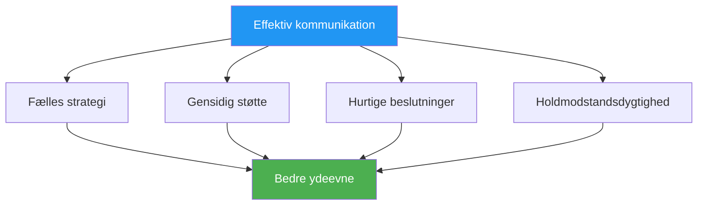

# Kommunikation under pres

> &quot;De rigtige ord på det rigtige tidspunkt opbygger selvtillid. De forkerte ord kan ødelægge selv dygtige teams.&quot;

::: tip Kommunikationssandheden
**Under pres er mindre mere.** Klar og præcis kommunikation overgår lange diskussioner hver gang.
:::

---

## Hvorfor kommunikation er vigtig

Petanque-hold står over for unikke udfordringer:
- Beslutninger skal træffes hurtigt
- Pres påvirker, hvordan vi taler og lytter
- Nonverbale signaler er synlige for modstandere
- Individuel præstation påvirker holddynamikken

---

## Kommunikationsprincipperne

### 1. Klarhed frem for kvantitet

| ❌ Sig ikke | ✅ Sig i stedet |
|-------------|---------------|
| &quot;Jeg tror måske, vi skulle prøve at pege her, men jeg er ikke sikker...&quot; | &quot;Jeg peger på venstre side. Der er jorden bedre.&quot; |

### 2. Positiv indramning

| ❌ Negativ | ✅ Positiv |
|------------|------------|
| &quot;Gå ikke glip af denne&quot; | &quot;Du har styr på det her – stol på dit kast&quot; |
| &quot;Det var forfærdeligt&quot; | &quot;Ryst den af, den næste&quot; |

### 3. Nuværende fokus

::: warning Fortid vs. nutid
**I stedet for:** &quot;Hvorfor smed du den der?&quot;
**Sig:** &quot;Okay, hvad er vores bedste mulighed nu?&quot;
:::

### 4. Ejerskabssprog

Brug &quot;jeg&quot;-udsagn til dine egne handlinger, &quot;vi&quot; til teamsituationer:

- &quot;Jeg tager dette skud&quot;
- &quot;Vi skal beskytte pointen&quot;
- &quot;Jeg synes, vi burde...&quot;

## Hvad skal man kommunikere

### Før hver ende

- **Strategidiskussion**: Kort afstemning om tilgang
- **Rolleklarhed**: Hvem gør hvad
- **Terrænobservationer**: Relevante forhold

### Under afspilning

- **Beslutninger**: Tydelig erklæring om den påtænkte handling
- **Støtte**: Opmuntring før kast
- **Information**: Relevante observationer om terræn eller modstandere

### Efter kast

- **Anerkendelse**: Kort anerkendelse (god eller dårlig)
- **Justering**: Eventuelle nødvendige strategiske ændringer
- **Nulstil**: Hjælp holdkammerater med at fokusere igen

## Hvad man IKKE skal kommunikere

### Undgå under presmomenter

- Tekniske instruktioner (&quot;Hold albuen inde&quot;)
- Kritik af tidligere kast
- Udtryk for frustration
- Tvivl om holdkammeratens evner
- Overdreven analyse

### Undgå generelt

- Skyld sprog
- Sarkasme eller passiv aggression
- Sammenligninger med andre spillere
- Forudsigelser om fiasko

## Nonverbal kommunikation

Dit kropssprog taler højt:

### Positive signaler
- Øjenkontakt med holdkammerater
- Åben, afslappet kropsholdning
- Nikken og anerkendelsen
- Rolige, stabile bevægelser

### Negative signaler (undgå)
- Øjenrulning eller suk
- Vender sig væk fra holdkammeraterne
- Krydsede arme eller lukket kropsholdning
- Synlig frustration

### Læsende holdkammerater

Lær at genkende, hvornår holdkammerater har brug for:
- **Mellemrum**: De behandler, afbryd ikke
- **Støtte**: De kæmper, tilbyd opmuntring
- **Information**: De er usikre, giv klarhed
- **Energi**: De er flade, bringer entusiasme

## Kommunikationsroller

### Pegeren
- Kommunikér din læsning af terrænet
- Angiv tydeligt din ønskede placering
- Bed om input, når du er usikker

### Skytteren
- Bekræft valg af mål
- Kommunikér selvtillidsniveau
- Anmod om information om vinkler

### Miljøet/Kaptajnen
- Facilitere teamdiskussioner
- Træf endelige beslutninger, når det er nødvendigt
- Styr teamets energi og fokus

## Pressede situationer

### Når du er bagud

- Forbliv løsningsfokuseret
- Bevar positiv energi
- Undgå bebrejdelse eller frustration
- Fejr små sejre

### Når forude

- Hold fokus, undgå selvtilfredshed
- Hold kommunikationen konsekvent
- Lav ikke om på det, der virker

### Matchpoint (deres)

- Anerkend presset kort
- Fokuser på processen
- Støt hinanden synligt

### Matchpoint (vores)

- Forbliv rolig og fokuseret
- Undgå for tidlig fejring
- Udfør som normalt

## Opbygning af kommunikationsevner

### I praksis

- Øv kommunikation under træning
- Giv og modtag feedback på kommunikation
- Eksperimentér med forskellige tilgange

### Teamaftaler

Etabler teamnormer:
- Hvordan vi håndterer uenigheder
- Sådan ser støtten ud
- Hvornår man skal tale, og hvornår man skal tie stille

### Gennemgang efter kampen

Diskuter kommunikation:
- Hvad fungerede godt?
- Hvad kunne forbedres?
- Nogle misforståelser at rette op på?

## Når kommunikationen bryder sammen

### I øjeblikket

1. Tag en indånding
2. Nulstil med en simpel sætning: &quot;Lad os fokusere på dette kast&quot;
3. Tilbage til det grundlæggende: klar, positiv, nærværende

### Efter kampen

- Håndter problemerne roligt
- Fokuser på adfærd, ikke personligheder
- Enighed om forbedringer
- Gå fremad sammen

## Den stille støtte

Nogle gange er den bedste kommunikation tilstedeværelse:
- Står sammen med en holdkammerat, der kæmper
- En hånd på skulderen
- Et nik af tillid
- Bare at være der

Ord er ikke altid nødvendige. Forbindelse er.

---

| *Relateret: [Teamdynamik](/da/uddannelse/teamdynamik/) | [Kommunikation](/da/uddannelse/teamdynamik/kommunikation) | [Håndtering af pres](/da/uddannelse/mentalt-spil/mental-styrke/håndtering-af-pres)* |

