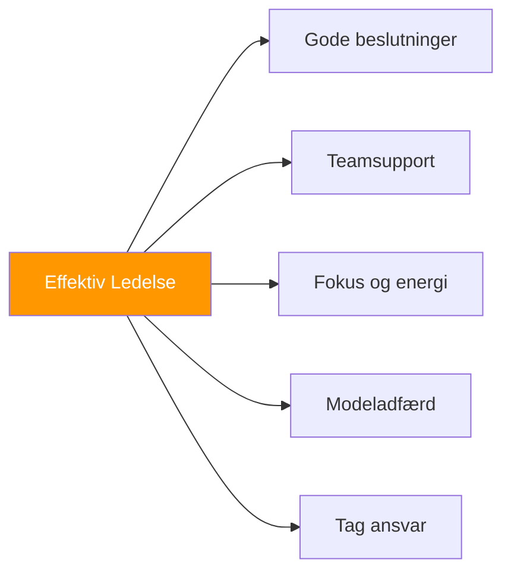

# Lederskab i petanque

> &quot;Ledelse handler ikke bare om at være anfører – det handler om at få det bedste frem i dit hold.&quot;

Enhver spiller kan lede på forskellige måder. Det handler om indflydelse, støtte og at være et forbillede for fremragende spillere.

::: tip Alle kan lede
**Du behøver ikke en titel for at være leder.** Lederskab er adfærd, ikke position.
:::

---

## Hvad er petanque-ledelse?

---

## Typer af lederskab

| Type | Fokus | Hvordan det ser ud |
|------|-------|--------------|
| **Positionel** | Myndighed | Kaptajnen træffer de endelige beslutninger og sætter kulturen |
| **Præstation** | Ekspertise | Konsekvent færdighed, god håndtering af pres |
| **Følelsesmæssig** | Energi | At forblive positiv, at støtte andre |
| **Taktisk** | Strategi | Læser spillet og giver indsigt |

### Positionsbaseret lederskab

Den udpegede kaptajn eller holdleder:
- Træffer endelige strategiske beslutninger
- Repræsenterer officielt holdet
- Styrer teamdynamikken
- Sætter tonen og kulturen

### Præstationsledelse

Ledelse gennem ekspertise:
- Demonstration af dygtighed og konsistens
- Viser hvordan man håndterer pres
- Sætter standarder gennem handling
- Inspirerende gennem performance

### Følelsesmæssigt lederskab

::: info Ofte undervurderet
**Følelsesmæssigt lederskab er afgørende** — den spiller, der forbliver positiv, når han er bagud 2-10, kan vende hele kampen.
:::

Håndtering af teamets energi og moral:
- At forblive positiv under pres
- Støtte til holdkammerater, der kæmper
- Fejring af succeser
- At bevare perspektivet

### Taktisk lederskab

Bidragende strategisk tænkning:
- Læser spillet godt
- Tilbyder værdifuld indsigt
- At se mønstre, som andre overser
- Tænker fremad

## Den effektive leder

### I praksis

- Ankommer forberedt og fokuseret
- Arbejder hårdt og opmuntrer andre
- Giver konstruktiv feedback
- Skaber et positivt træningsmiljø

### Før konkurrencen

- Sørger for, at holdet er forberedt
- Sætter klare forventninger
- Håndterer nerverne før kampen
- Skaber fokus og selvtillid

### Under konkurrencen

- Træffer klare, rettidige beslutninger
- Støtter synligt holdkammerater
- Forbliver rolig under pres
- Tilpasser strategien efter behov

### Efter konkurrencen

- Håndterer sejre med ynde
- Håndterer tab med perspektiv
- Leder konstruktive debriefinger
- Vedligeholder teamrelationer

## Lederskabsudfordringer

### At træffe svære beslutninger

Nogle gange skal du:
- Vælg mellem muligheder uden et klart svar
- Uenig med holdkammeraterne
- Tag ansvar for resultater
- Handl beslutsomt trods usikkerhed

**Nærme sig:**
- Indsaml input hurtigt
- Træf beslutningen
- Forpligt dig fuldt ud
- Lær af resultaterne

### Håndtering af konflikter

Holdkonflikter er uundgåelige:
- Forskellige meninger om strategi
- Frustration efter fejltagelser
- Personlighedskonflikter
- Ulige engagement

**Nærme sig:**
- Håndter problemer tidligt
- Lyt til alle perspektiver
- Fokus på løsninger
- Bevar respekten

### Støtte til spillere, der kæmper

Når en holdkammerat præsterer dårligt:
- Tilføj ikke pres
- Tilbyd specifik, positiv støtte
- Justér strategien om nødvendigt
- Bevar tilliden til dem

### Håndtering af dine egne kampe

Ledere kæmper også:
- Anerkend det (over for dig selv)
- Lad det ikke påvirke dit lederskab
- Stol på holdkammeraterne
- Modellér modstandsdygtighed

## Lederskabsstile

### Kommandøren

- Direkte og afgørende
- Klare forventninger
- Tager ansvar i krise
- Risiko: Kan være overvældende

### Træneren

- Udvikler andre
- Stiller spørgsmål
- Opbygger kapacitet
- Risiko: Kan være langsom i krise

### Samarbejdspartneren

- Søger input
- Skaber konsensus
- Værdsætter alle stemmer
- Risiko: Kan være ubeslutsom

### Tilhængeren

- Fokuserer på relationer
- Skaber tryghed
- Opmuntrer og bekræfter
- Risiko: Kan undgå hårde sandheder

**De bedste ledere tilpasser deres stil til situationen.**

## Udvikling af lederevner

### Selvbevidsthed

Kend din:
- Naturlig lederstil
- Styrker og svagheder
- Indvirkning på andre
- Udløsere og reaktioner

### Følelsesmæssig intelligens

Udvikle evnen til at:
- Genkende følelser (dine og andres)
- Administrer dine svar
- Vis empati med holdkammerater
- Naviger i sociale dynamikker

### Kommunikationsevner

Praksis:
- Klar og præcis besked
- Aktiv lytning
- Giver konstruktiv feedback
- Vanskelige samtaler

### Beslutningstagning

Forbedres gennem:
- Analyse af tidligere beslutninger
- Søger feedback
- Læring af fejl
- Øvelse under pres

## Leder uden titel

Du behøver ikke at være kaptajn for at lede:

### Gå foran med et godt eksempel
- Mød op forberedt
- Giv fuld indsats
- Håndter modgang godt
- Støt holdkammerater

### Lede gennem støtte
- Opmuntr andre
- Tilbyd hjælp
- Fejr holdkammeraternes succes
- Vær pålidelig

### Lede gennem bidrag
- Del observationer
- Kom med idéer på en respektfuld måde
- Tag initiativ
- Udfyld huller

## Lederskabstankegangen

### Ansvar frem for skyld

Ledere tager ansvar:
- &quot;Vi klarede os ikke godt&quot;, ikke &quot;De missede&quot;.
- &quot;Jeg burde have kommunikeret bedre&quot; ikke &quot;De lyttede ikke&quot;

### Hold frem for sig selv

Ledere prioriterer teamets succes:
- Fejr holdets præstationer
- Del æren generøst
- Tag skylden personligt
- Sæt teamets behov først

### Vækst frem for komfort

Ledere tager udfordringerne op:
- Opsøg vanskelige situationer
- Lær af fiaskoer
- Pres på forbedringer
- Modellér kontinuerlig vækst

## Når lederskab fejler

Selv gode ledere fejler nogle gange:
- Forkerte beslutninger sker
- Hold taber trods god ledelse
- Forholdsbelastning

**Gendannelse:**
1. Anerkend hvad der skete
2. Tag passende ansvar
3. Lær lektierne
4. Gå fremad med ydmyghed

---

| *Relateret: [Teamdynamik](/da/uddannelse/teamdynamik/) | [Kommunikation](/da/uddannelse/teamdynamik/kommunikation) | [Opbygning af teamkemi](/da/artikler/teamkemi)* |

