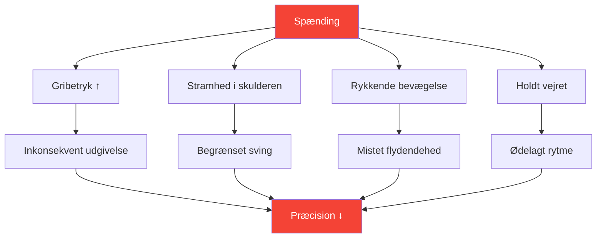
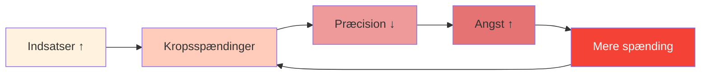

# Spænding og præcision: Den skjulte forbindelse

> &quot;Man kan ikke være både anspændt og præcis. Det er fysisk umuligt.&quot;

Du har mærket det: det afgørende kast, hvor din krop strammer sig, dit greb øges, og bolden går præcis derhen, hvor du ikke ønskede den. Spænding er præcisionens stille dræber.

::: danger Den skjulte fjende
**Det meste spænding er usynligt for den spiller, der oplever det.** Du ved ikke, at du er anspændt, før det er for sent.
:::

---

## Spændingens biomekanik

---

## Hvor spændingen gemmer sig

De fleste spillere er opmærksomme på grov spænding (spændte skuldre før et stort kast). Få bemærker subtil spænding, der konsekvent forringer præstationen:

| Beliggenhed | Effekt på kast | Sådan bemærker du |
|----------|-----------------|---------------|
| **Greb** | Inkonsekvent udgivelsestidspunkt | Boldmærker på håndfladen |
| **Underarm** | Reduceret håndledsvæske | Brændende fornemmelse |
| **Skulder** | Begrænset svingbue | Kastet føles &quot;kort&quot; |
| **Hals** | Ændret hovedstilling | Stivhed efter kampe |
| **Kæbe** | Helkropsspændingskaskade | Sammenbidte tænder |
| **Ånde** | Forstyrret rytme | Holder vejret |

---

## Tryk-spændingsspiralen

Under pres begynder en destruktiv cyklus:

::: tip Bryd cyklussen
**Afbryd ved trin 2** — før spændingen påvirker præstationen. Derfor er rutiner før skud med spændingstjek afgørende.
:::

## Registrering af dine spændingsmønstre

### Kropsscanningsmetoden

Før du øver dig, luk øjnene og scan:

1. Start ved dine fødder — Har du fat i tæerne?
2. Bevæg dig op gennem benene — Er der låste knæ?
3. Bemærk hofter og core — Er der nogen afstivning?
4. Tjek skuldrene — Er der nogen hævning?
5. Scan arme og hænder — Har du for tidligt greb?
6. Bemærk hals og ansigt — Nogen klemning?

Spændingsniveauet skal være 0-10 på hvert sted. **Din basislinje skal være 2 eller mindre.**

### Videometoden

Optag dig selv i at kaste:
- Lavindsatsøvelse
- Træning med moderate indsatser
- Konkurrence med høje indsatser

Sammenlign dit kropssprog. Hvor spænder du op, når indsatsen stiger?

### Partnermetoden

Bed en holdkammerat om at observere:
- Dit ansigt før vigtige kast
- Din holdning ændrer sig under pres
- Dine vejrtrækningsmønstre
- Din grebsadfærd

Eksterne observatører ser det, vi ikke kan føle.

## Frigivelsesteknikker

### Hurtigudløsninger (brug under konkurrence)

**Udrystelsen**
- Korte, kraftige hånd- og armtryk
- Frigiver holdingmønstre
- Tager 2-3 sekunder

**Udåndingsdråbet**
- Dyb indånding
- Sænk bevidst skuldrene ved udånding
- Slip kæbespændingen samtidigt

**Grip-nulstillingen**
- Åben hånden helt
- Spred fingrene bredt
- Grib igen med minimal nødvendig kraft

### Dybe frigivelser (brug i træning/præ-konkurrence)

**Progressiv muskelafslapning**
- Spænd hver muskelgruppe bevidst (5 sekunder)
- Slip helt (15 sekunder)
- Bemærk forskellen
- Arbejd gennem hele kroppen

**Forbindelse mellem åndedræt og krop**
- Langsom vejrtrækning (4 tællinger ind, 6 tællinger ud)
- Slip et kropsområde ved hver udånding
- Fortsæt indtil fuld kropsafslapning opnås

## Pre-shot-integrationen

Indbyg spændingsbevidsthed i din rutine før optagelserne:

### Før man træder ind i cirklen
- Hurtig kropsscanning (2 sekunder)
- En udløsende udånding
- Bekræft et afslappet greb

### I cirklen
- Sidste åndedrag for at falde til ro
- Blødt fokus på målet
- Start kast fra afslappet tilstand

### Efter kastet
- Bemærk hvor spændingen har samlet sig
- Ryst ud om nødvendigt
- Nulstil til næste kast

## Træning af spændingsbevidsthed

### Øvelse 1: Minimumsgrebet

Find det minimale grebtryk, der opretholder kontrollen:
- Start med et fast greb — kast 5 bolde
- Reducer grebet med 20% — kast 5 bolde
- Fortsæt med at reducere, indtil du mister kontrollen
- Gå et niveau tilbage – dette er dit optimale greb

De fleste spillere griber 40-60% hårdere end nødvendigt.

### Øvelse 2: Tryksimulering

Øv under kunstigt pres, mens du overvåger spændingen:
- Skab konsekvenser for øvelseskast
- Læg mærke til hvor spændingen opstår
- Øv dig i at give slip, mens du bevarer fokus
- Øg gradvist tryktolerancen

### Øvelse 3: Den afslappede peger

Bedøm dig selv på to dimensioner:
- Teknisk resultat (hvor landede bolden?)
- Spændingsniveau (hvor afslappet var du?)

**Mål:** Maksimere begge dele samtidigt. Mange spillere må acceptere lidt dårligere resultater i starten, efterhånden som de lærer at kaste afslappet.

## Protokol for konkurrencedagen

### Før kampen
- 10 minutters progressiv afslapning
- Kropsscanning for at identificere holdemønstre
- Shake-out rutine

### Mellem enderne
- Kort omrøring
- Et udløsende åndedrag
- Spændingskontrol før kritiske kast

### Under kast
- Stol på din rutine før indtagelse
- Udløsningsteknikken er forprogrammeret
- Kontroller ikke bevidst under udførelsen

## Almindelige fejl

::: warning Undgå disse
- **Overafslapning** — En vis aktivering er nødvendig
- **Bevidst kontrol under kast** — Forstyrrer flowet
- **Kun afslappende ved store kast** — Skal være konsekvent
- **Ignorerer åndedræt** — Åndedræt og spænding er forbundet
- **At haste rutinen** — At frigøre spændinger tager tid
:::

## Den langsigtede fordel

Spillere, der mestrer spændingshåndtering:
- Præster mere konsekvent under pres
- Oplev mindre fysisk træthed
- Genoprette sig hurtigere efter fejl
- Nyd konkurrencen mere

---

## Relateret indhold

- [Modul i spændingshåndtering](/da/uddannelse/spænding/) — Fuldstændig uddannelse
- [Fysisk forberedelse](/da/uddannelse/spænding/fysisk) — Kropsparathed
- [Preshåndtering](/da/artikler/preshåndtering) — Mentale aspekter

