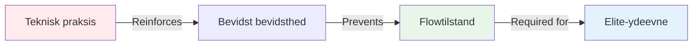

# Hvorfor elitespillere har mere brug for mental træning end teknisk træning

<AdBanner />

*Læsetid: 8 minutter*

Hvis du har spillet petanque i årevis og har en solid teknik, vil denne artikel udfordre alt, hvad du tror, du ved om træning. Den ubehagelige sandhed er: **mere teknisk øvelse holder dig måske tilbage.**

## Paradokset ved eliteudvikling

Her er noget, der overrasker de fleste spillere:

::: warning Inversionsprincippet
Efterhånden som dine tekniske færdigheder øges, bør forholdet mellem teknisk og mental træning **vendes**.

- **Begyndere:** 90% teknisk, 10% mental
- **Mellem:** 70% teknisk, 30% mental
- **Avanceret:** 50% teknisk, 50% mental
- **Elite:** 20% teknisk, 80% mental
:::

Dette er ikke intuitivt. De fleste spillere antager, at de skal øve deres teknik mere for at blive bedre. Men på eliteniveau forårsager denne tilgang faktisk problemer.

## Hvorfor teknisk træning kan skade elitepræstationer

### Problemet med overtænkning

Når du øver teknik i vid udstrækning, forstærker du **bevidstheden** om dine bevægelser. Dette er perfekt for begyndere, der opbygger neurale baner. Men for elitespillere skaber det en farlig vane: at tænke på teknik under udførelsen.

<AdInArticle />

**Eksempel fra terrænet:**

*Begynder:* Skal tænke &quot;bøj knæene, slip jævnt, følg op&quot; for at udføre korrekt.

*Elitespiller:* Har allerede 10.000+ timers træning. Bevægelsen er automatisk. Tanken om at &quot;bøj knæene&quot; forstyrrer faktisk det trænede mønster.

### Flowtilstandsbarrieren

Flowtilstande (at være &quot;i zonen&quot;) kræver **forbigående hypofrontalitet** - en midlertidig reduktion i aktiviteten i den præfrontale cortex (den analytiske del af din hjerne).

Jo mere du øver teknik bevidst, jo sværere bliver det at &quot;slukke fra&quot; under konkurrence.

## Hvad elitespillere rent faktisk har brug for

### 1. Muligheden for at skifte tilstand

Elitepræstation kræver mestring af overgangen mellem to hjernetilstande:

**Planlægningstilstand (uden for cirklen)**
- Analytisk tænkning
- Strategivurdering
- Beslutningstagning
- Risikovurdering

**Udførelsestilstand (inde i cirklen)**
- Automatisk urværk
- Kun målfokus
- Tillid til træning
- Adgang til flowtilstand

De fleste elitespillere sidder fast i planlægningstilstand under udførelsen. De skal træne **skiftet**, ikke teknikken.

### 2. Trykstyring

Teknisk træning under behagelige forhold forbereder dig ikke på det psykologiske pres ved konkurrence.

**Hvad sker der under pres:**
- Hjertefrekvensen stiger
- Vejrtrækningen bliver overfladisk
- Musklerne spændes
- Opmærksomheden indsnævres
- Indre kritiker aktiveres

Du kan have perfekt teknik under træning og miste den fuldstændigt under pres. Dette er ikke et teknisk problem – det er et mentalt.

### 3. Fejlretning

Elitespillere laver ikke færre fejl end gode spillere. De **kommer sig hurtigere**.

**God spiller efter et dårligt kast:**
- Dvæler ved fejlen
- Analyserer, hvad der gik galt
- Bekymringer om det næste kast
- Ydeevnen forringes

**Elitespiller efter et dårligt kast:**
- Neutral observation
- Hurtig læring
- Øjeblikkelig nulstilling
- Ydeevne vedligeholdt

Dette er en trænet færdighed, ikke et personlighedstræk.

## Videnskaben: Hvorfor mental træning virker

### Neurovidenskab af ekspertise

Forskning i ekspertpræstationer viser, at eliteatleter har:

1. **Automatiserede motoriske mønstre** - Bevægelser sker uden bevidst kontrol
2. **Overlegen mønstergenkendelse** - Se situationer hurtigere
3. **Bedre følelsesmæssig regulering** - Håndter pres effektivt
4. **Hurtigere gendannelse** - Nulstilling efter fejl

Bemærk: Kun #1 er teknisk. De andre tre er mentale.

### 10.000-timers tærsklen

Når du har investeret cirka 10.000 timer i bevidst træning (ca. 8-10 års seriøst spil), er dine tekniske mønstre stort set etablerede. Yderligere teknisk forbedring viser aftagende udbytte.

Men mental spiludvikling? Det er dér, hvor massive gevinster stadig er mulige.

## Sådan omstrukturerer du din træning

### For elitespillere (8+ års erfaring)

**Nuværende typiske opdeling:**
- 80% teknisk praksis
- 20% spil/konkurrence

**Anbefalet opdeling:**
- 20% teknisk vedligeholdelse
- 40% mental spiltræning
- 40% konkurrence-/pressituationer

### Sådan ser mental spiltræning ud

**Ikke dette:**
- &quot;Bare slap af&quot;
- &quot;Tænk ikke på det&quot;
- &quot;Vær selvsikker&quot;

**Men dette:**
- Struktureret mindfulness-praksis (10 min dagligt)
- Udvikling og øvelse af rutiner før skud
- Tryksimulering i træning
- Protokoller for fejlretning
- Identifikation af flowtilstandstrigger
- Indre coach vs. indre kritiker arbejde

Se vores afsnit [Uddannelse](/da/education/) for specifikke teknikker.

## Den ubehagelige sandhed

Hvis du er en elitespiller, der stadig bruger 80% af din træningstid på tekniske øvelser, træner du som en nybegynder. Din teknik er allerede god nok. Begrænsningen er ikke din arm – det er dit sind.

::: tip Det virkelige spørgsmål
Det er ikke &quot;Hvordan kan jeg forbedre min pegeteknik?&quot;

Det er &quot;Hvordan kan jeg konsekvent få adgang til min bedste teknik under pres?&quot;
:::

## Praktiske næste skridt

### 1. Vurder din nuværende rente

Registrer din træning i en uge:
- Timer på teknisk øvelse
- Timer på mentalt spilarbejde
- Timer i konkurrence-/pressede situationer

### 2. Start småt

Vend ikke forholdet natten over. Tilføj:
- 10 minutters daglig mindfulness
- Ét mentalt spilfokus per træningssession
- Rutinemæssig træning før skud

### 3. Mål mental præstation

Spore:
- Restitutionstid efter fejl
- Konsistens under pres
- Flowtilstandsfrekvens
- Overholdelse af rutine før indsprøjtning

### 4. Brug uddannelsesmodulerne

Start med:
1. [Zonen](/da/education/the-zone/) - Forstå flowtilstande
2. [Mental styrke](/da/education/mental-styrke/) - Opbyg presfærdigheder
3. [Mindfulness](/da/education/mindfulness/) - Udvikle fokus i nuet

## Konklusion

Vejen til elitepræstationer er ikke mere teknisk træning – det er smartere mental træning. Din teknik er allerede god nok. Spørgsmålet er: Kan du få adgang til den, når det gælder?

De spillere, der foretager dette skift – som omfavner mental træning som deres primære udviklingsfokus – er dem, der bryder igennem præstationsplateauer og opnår vedvarende ekspertise.

**Valget er dit:** Fortsæt med at træne som en nybegynder, eller start med at træne som en elitespiller.

<AdBanner />

---

## Relaterede ressourcer

- [Zonen: Forståelse af flowtilstand](/da/education/the-zone/)
- [Casestudier: Elitespillere i aktion](/da/casestudier)
- [Målskabelon](/da/målskabelon) - Planlæg din mentale spiludvikling

**Spørgsmål eller kommentarer?** E-mail [patrik.wiik@gmail.com](mailto:patrik.wiik@gmail.com)

