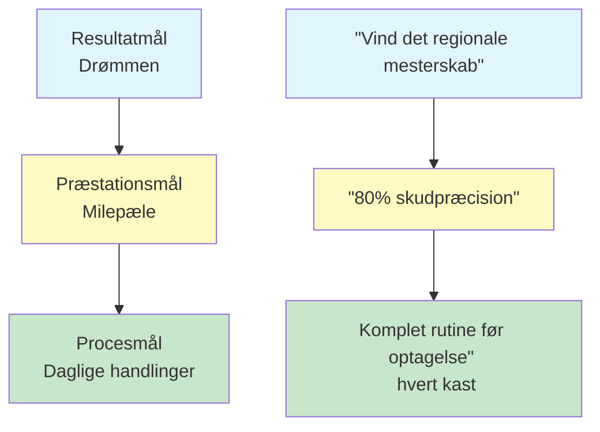

# Målsætning for petanquespillere
<AdBanner />

Klare mål er dit kompas. De giver retning til din træning, motivation når det bliver svært, og en måde at måle fremskridt på. Uden mål kaster du bare kugler. Med mål bygger du hen imod noget.

::: tip Kerneprincippet
**Et mål uden en plan er blot et ønske.** Sæt klare mål, nedbryd dem, fokuser på det, du kontrollerer, og følg dine fremskridt.
:::

## Hvorfor mål er vigtige

Mål tjener flere formål:
- **Retning:** Vid, hvad du skal arbejde med
- **Motivation:** Hav noget at stræbe efter
- **Måling:** Følg dine fremskridt
- **Fokus:** Prioritér din begrænsede tid

For den selvstyrende spiller er mål særligt vigtige. Uden en træner, der presser dig, bliver dine mål din guide.

## De tre typer mål

Ikke alle mål er lige. At forstå de forskellige typer hjælper dig med at sætte bedre mål.

### 1. Resultatmål
**Hvad:** Det ønskede slutresultat
**Eksempel:** &quot;Vind det regionale mesterskab&quot;
**Kontrolniveau:** Lav - afhænger af modstandere, forhold og held

### 2. Præstationsmål
**Hvad:** Specifikke præstationsstandarder
**Eksempel:** &quot;Opnå 80% nøjagtighed på skydeøvelser&quot;
**Kontrolniveau:** Mellem - afhænger mest af dig

### 3. Procesmål
**Hvad:** Handlinger og adfærd du kontrollerer
**Eksempel:** &quot;Fuldfør min rutine før kast ved hvert kast&quot;
**Kontrolniveau:** Højt - helt op til dig

### Målhierarkiet

::: warning Vigtig indsigt
**Fokuser mest af din opmærksomhed på procesmål.** Det er dem, du kontrollerer, og de fører til de resultater, du ønsker.

- **Resultatmål:** Lav kontrol, høj motivation
- **Præstationsmål:** Middel kontrol, målbar fremgang
- **Procesmål:** Høj kontrol, daglig fokus ← **Fokus her**
:::

## SMART-rammen

::: info SMART-målstjekliste
Ethvert mål bør være:
- ✅ **Specifik - Klar og veldefineret
- ✅ **Målbar** - Du kan spore fremskridt
- ✅ **Opnåelig** - Udfordrende men muligt
- ✅ **R**elevant - Afstemt med dit større billede
- ✅ **Tidsbundet - Har en deadline
:::

<AdInArticle />

### S - Specifik
❌ &quot;Bliv bedre til at skyde&quot;
✅ &quot;Forbedre min præcision i direkte træf fra 8 meter&quot;

### M - Målbar
❌ &quot;Skyd mere præcist&quot;
✅ &quot;Scor mindst 24/30 på skydestigen&quot;

### A - Opnåelig
❌ &quot;Gå aldrig glip af et skud&quot; (umuligt)
✅ &quot;Forbedr nøjagtigheden med 10% over 8 uger&quot; (udfordrende, men realistisk)

### R - Relevant
❌ &quot;Løb et maraton&quot; (ikke direkte relateret)
✅ &quot;Forbedrer balance og stabilitet for bedre kast&quot; (understøtter dit spil)

### T - Tidsbegrænset
❌ &quot;En dag bliver jeg bedre&quot;
✅ &quot;Inden den 15. marts vil jeg opnå...&quot;

## Eksempler på mål til petanque

| Type | Dårligt mål | SMART-mål |
|------|-----------|------------|
| Resultat | &quot;Vind mere&quot; | &quot;Nå semifinalerne i forårsturneringen&quot; |
| Præstation | &quot;Peg bedre&quot; | &quot;Opnå 70% af pointene inden for 50 cm på 8 m afstand&quot; |
| Behandle | &quot;Øv mere&quot; | &quot;Gennemfør 3 fokuserede træningssessioner om ugen&quot; |

## Nedbrydning af store mål

Store mål kan føles overvældende. Opdel dem i mindre dele:

### Eksempel: &quot;Vind klubmesterskabet (om 12 måneder)&quot;

**Årligt mål:** Vinde klubmesterskabet

**Kvartalsvise mål:**
- Q1: Forbedr skydepræcisionen til 75%
- Q2: Udvikl en ensartet rutine før indsprøjtning
- Q3: Situationer med overordnet pres
- Q4: Toppræstation og konkurrenceforberedelse

**Månedlige mål (1. kvartal):**
- Måned 1: Etablering af baseline, identificering af svagheder
- Måned 2: Fokus på skydeteknik
- Måned 3: Sæt pres på skydetræningen

**Ugentlige mål (Måned 2):**
- Uge 1: 3 optagelsessessioner, videoanalyse
- Uge 2: Arbejd med identificeret teknikproblem
- Uge 3: Øg distancen gradvist
- Uge 4: Test fremskridt, juster plan

## Forbind mål med dit &quot;hvorfor&quot;

Mål fungerer bedre, når de er forbundet med dybere motivation.

Spørg dig selv:
- Hvorfor vil jeg opnå dette?
- Hvad vil det betyde for mig?
- Hvordan vil jeg have det, når jeg får succes?
- Hvad driver mig til at forbedre mig?

Skriv dine svar ned. Vend tilbage til dem, når motivationen forsvinder.

## I dette afsnit

- **[SMART Mål i Detaljer](/da/uddannelse/mål/smarte-mål)** - Dybdegående indsigt i at skabe effektive mål
- **[Oprettelse af din træningsplan](/da/uddannelse/mål/planlægning)** - Gør mål til handling

## Resumé: Regler for målsætning

::: tip Regel nr. 1: Kontrolreglen
**Fokuser på procesmål (det du kontrollerer) frem for resultatmål.**
Procesmål fører til præstationsmål, som fører til resultatmål.
:::

::: tip Regel nr. 2: SMART-reglen
**Mål skal være specifikke, målbare, opnåelige, relevante og tidsbestemte.**
Vage mål giver vage resultater. SMART-mål giver fremskridt.
:::

::: tip Regel nr. 3: Opdelingsreglen
**Store mål kræver kvartalsvise, månedlige og ugentlige milepæle.**
Opdel store mål i små, handlingsrettede trin, som du kan gennemføre i denne uge.
:::

::: tip Regel nr. 4: Forbindelsesreglen
**Forbind mål med dit dybere &quot;hvorfor&quot;.**
Når motivationen svinder ind, er det dit &quot;hvorfor&quot;, der holder dig i gang.
:::

## Vigtig konklusion

> Et mål uden en plan er blot et ønske.

Sæt klare mål. Nedbryd dem. Fokuser på det, du kontrollerer. Spor dine fremskridt.

<AdBanner />
