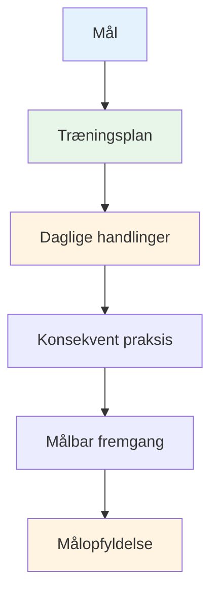

# Oprettelse af din træningsplan
<AdBanner />

Mål uden en plan er blot ønsker. Denne guide hjælper dig med at forvandle dine mål til en struktureret træningsplan, der rent faktisk virker.

::: tip Den store idé
**Mål uden en plan er blot ønsker.** En struktureret træningsplan omdanner dine mål til daglige handlinger, der resulterer i reel fremgang.
:::

## De 8 faser af selvstyret udvikling

### Fase 1: Sæt dit kompas (mål)
Du har allerede lært om SMART-mål. Sæt dem nu i et hierarki:

1. **Langsigtet mål** (1-2 år): Din drøm
2. **Årligt mål**: Årets mål
3. **Kvartalsvise mål**: 3-måneders milepæle
4. **Månedlige mål**: Specifikke fokusområder
5. **Ugentlige mål**: Træningsmål

### Fase 2: Vurder dine ressourcer

Før du planlægger, så vurder ærligt, hvad du har:

| Ressource | Spørgsmål at stille |
|----------|-----------------|
| **Tid** | Hvor mange timer om ugen kan du realistisk set træne? |
| **Beliggenhed** | Har du adgang til en ordentlig piste? Hvad er kvaliteten af underlaget? |
| **Udstyr** | Har du passende boules? Måleværktøjer? Videofunktion? |
| **Viden** | Hvad er dine tekniske styrker og svagheder? |
| **Fysisk tilstand** | Er der nogen begrænsninger? Er der områder, der skal arbejdes med? |

Vær ærlig. En realistisk plan slår en ambitiøs fantasi.

### Fase 3: Vælg dine øvelser

Vælg øvelser, der direkte understøtter dine mål:

**Til forbedring af pointgivning:**
- Præcisionsvisning af markerede zoner
- Distancevariationsøvelser
- Forskellig overfladepraksis

**Til forbedring af skydning:**
- Skydestige (progressive distancer)
- Forhindringsskydning (tvungen høj bue)
- Øvelse i bevægelsesmål

**Til mental udvikling:**
- Rutinemæssig træning før skud
- Visualiseringssessioner
- Tryksimulering

**Balancer dit program:**
- Teknisk arbejde (pege, skyde)
- Mental træning (mindfulness, visualisering)
- Fysisk konditionering (balance, fleksibilitet)
- Matchspil (anvendelse af færdigheder)

### Fase 4: Opret din tidsplan

Lav en realistisk ugentlig plan:

<AdInArticle />

| Dag | Morgen | Eftermiddag | Aften | Fokus |
|-----|---------|-----------|---------|-------|
| man | - | Teknisk: Pegning | Let mobilitet | Præcision |
| Tirsdag | - | Teknisk: Skydning | - | Effekt/nøjagtighed |
| Ons | - | Mental træning | - | Mindfulness |
| Torsdag | - | Blandet: Spilscenarier | Let mobilitet | Anvendelse |
| Fre | - | Teknisk: Svaghed | - | Forbedring |
| Lør | Kampspil eller konkurrence | - | - | Præstation |
| Sol | Hvile | Ugentlig gennemgang | Planlægning | Genopretning |

**Nøgleprincipper:**
- Prioritér mental træning (den bliver ofte forsømt)
- Inkluder hviledage
- Balancer forskellige færdigheder
- Efterlad fleksibilitet for livet

### Fase 5: Forbered dig på forhindringer

Tingene vil gå galt. Planlæg for det.

| Risiko | Sandsynlighed | Indvirkning | Backupplan |
|------|------------|--------|-------------|
| Tidsmangel | Høj | Medium | Hav en &quot;minimumssession&quot; klar (20 min) |
| Dårligt vejr | Medium | Medium | Indendørs visualisering, videostudie |
| Lav motivation | Høj | Medium | Vend tilbage til &quot;hvorfor&quot;, mindre mål, tag en pause |
| Mindre skade | Medium | Høj | Fokus på mental træning, ikke-påvirkede færdigheder |
| Ingen øvepartner | Medium | Lav | Soloøvelser, video selvanalyse |

### Fase 6: Spor dine fremskridt

Det, der måles, bliver styret.

**Før en træningsdagbog:**
- Dato og varighed
- Øvelser gennemført
- Scorer/resultater
- Hvordan du havde det (energi, fokus, flow)
- Tekniske noter
- Vejr/forhold

**Ugentlige opfølgningsspørgsmål:**
- Fik jeg gennemført mine planlagte sessioner?
- Hvilke scorer opnåede jeg?
- Hvad føltes godt? Hvad var svært?
- Nogle flow-erfaringer?
- Hvad skal jeg justere?

### Fase 7: Forbliv motiveret

Motivation svinger. Byg systemer til at vedligeholde den:

**Intern motivation:**
- Forbind dig med dit &quot;hvorfor&quot;
- Fejr små sejre
- Bemærk forbedring over tid
- Find glæde i processen

**Ekstern support:**
- Træningspartnere (selv lejlighedsvis)
- Del mål med nogen
- Deltag i onlinefællesskaber
- Sporstriber og konsistens

**Når motivationen falder:**
- Lav en minimumssession (noget slår intet)
- Ændr dine omgivelser
- Gennemgå dine fremskridt
- Husk tidligere succeser
- Tag en planlagt pause, hvis det er nødvendigt

### Fase 8: Gennemgang og tilpasning

Din plan bør udvikle sig:

**Ugentligt:** Hurtig gennemgang, mindre justeringer
**Månedligt:** Vurder fremskridt i forhold til månedlige mål, juster fokus
**Kvartalsvis:** Stor gennemgang, fastsættelse af mål for næste kvartal
**Årligt:** Fuld vurdering, ny årsplan

**Spørgsmål til gennemgang:**
- Gør jeg fremskridt i retning af mine mål?
- Er min træning effektiv?
- Har jeg brug for forskellige øvelser?
- Er mine mål stadig relevante?
- Hvad har jeg lært?

## Eksempel på 8-ugers plan

**Mål:** Forbedre skudpræcisionen med 15%

| Uge | Fokus | Nøglesessioner |
|------|-------|--------------|
| 1 | Basislinje | Test af strømniveau, videoanalyse |
| 2 | Teknik | Identificer og arbejd med centrale problemstillinger |
| 3 | Gentagelse | Træning med høj volumen af skydning |
| 4 | Prøve | Midtvejsevaluering, juster |
| 5 | Variation | Forskellige afstande og vinkler |
| 6 | Tryk | Tilføj konsekvenser til øvelser |
| 7 | Integration | Spillignende scenarier |
| 8 | Slutprøve | Mål forbedring |

## Vigtig konklusion

> Planlæg dit arbejde, og arbejd derefter på din plan. Men vær forberedt på at tilpasse dig.

Den bedste plan er en, du rent faktisk følger. Start simpelt, vær konsekvent, og juster, efterhånden som du lærer.

<AdBanner />
