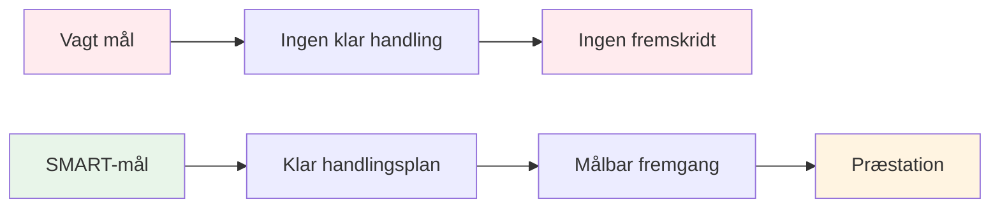

# SMART-mål for petanque
<AdBanner />

SMART-rammen omdanner vage ønsker til handlingsrettede mål. Lad os se nærmere på hvert element med specifikke eksempler til petanque.

::: tip Den store idé
**Vage mål fører til vage resultater.** SMART-mål skaber klarhed, handling og målbar fremgang. Forvandl &quot;Jeg vil gerne blive bedre&quot; til specifikke mål, du rent faktisk kan opnå.
:::

## S - Specifik

Et specifikt mål besvarer disse spørgsmål:
- **Hvad** er det præcist, jeg vil opnå?
- **Hvor** vil dette ske?
- **Hvilke** aspekter er involveret?

### Gør mål specifikke

| Uklar | Bestemt |
|-------|----------|
| &quot;Forbedr min pegeteknik&quot; | &quot;Forbedre min pegepræcision på grusoverflader på 7-9 meters afstand&quot; |
| &quot;Bliv mentalt stærkere&quot; | &quot;Udvikle en ensartet rutine før kast, som jeg bruger til hvert kast&quot; |
| &quot;Vind flere kampe&quot; | &quot;Vinder mindst 60% af mine konkurrencekampe i denne sæson&quot; |

### Specificitetstjekliste
- [ ] Kan en anden forstå præcis, hvad jeg prøver at gøre?
- [ ] Har jeg defineret betingelserne (afstand, overflade, situation)?
- [ ] Er der kun én fortolkning af dette mål?

## M - Målbar

Hvis du ikke kan måle det, kan du ikke styre det. Målbare mål lader dig spore fremskridt og vide, hvornår du har haft succes.

### Måder at måle petanque-mål på

**Kvantitative målinger:**
- Point scoret i øvelser (f.eks. 24/30)
- Procentuel nøjagtighed (f.eks. 75 % hitrate)
- Afstand fra målet (f.eks. gennemsnitlig 30 cm fra donkraften)
- Konsistens (f.eks. 3 succesfulde sessioner i træk)

**Brug af træningsøvelser som måleinstrumenter:**

| Bore | Hvad den måler | Måleksempel |
|-------|-----------------|----------------|
| Skydestige | Skydepræcision under pres | Nå 10m inden for 30 kugler |
| Pegepræcision | Pegepræcision til zone | 24/30 point |
| Afstandsvariation | Dybdekontrol | 80% inden for 50 cm |

### Sporing af dine målinger
Hold en simpel logbog:
- Dato
- Øvelse/motion
- Score/resultat
- Forhold (overflade, vejr)
- Noter

## A - Opnåelig (men udfordrende)

Mål skal udfordre dig uden at være umulige.

### At finde det rigtige niveau

**For let:** &quot;Øv én gang i denne måned&quot;
- Ingen vækst, ingen motivation

<AdInArticle />

**For svært:** &quot;Gå aldrig glip af et skud&quot;
- Umuligt, fører til frustration

**Lige præcist:** &quot;Forbedr skydepræcisionen med 15 % på 8 uger&quot;
- Udfordrende, men realistisk med indsats

### Spørgsmål til at teste opnåelighed
- Har andre på mit niveau opnået dette?
- Har jeg den nødvendige tid og de nødvendige ressourcer?
- Er dette (for det meste) inden for min kontrol?
- Er jeg villig til at gøre, hvad der kræves?

### Strækmål
Det er okay at have ambitiøse langsigtede mål. Bare sørg for, at dine kortsigtede mål er opnåelige skridt i retning af dem.

## R - Relevant

Dine mål skal stemme overens med dit større billede.

### Relevansspørgsmål
- Understøtter dette mål min samlede udvikling?
- Er det den rigtige prioritet lige nu?
- Passer dette med min tid og mine ressourcer til rådighed?
- Er jeg oprigtigt motiveret af dette mål?

### Eksempel: Kontrol af relevans

**Situation:** Du ønsker at konkurrere på nationalt niveau

**Relevante mål:**
- Forbedre skydepræcisionen (påvirker resultaterne direkte)
- Udvikle mentale rutiner (hjælper i pressede situationer)
- Øg træningsfrekvensen (opbygger færdigheder hurtigere)

**Mindre relevante mål:**
- Lær trick shots (sjovt, men ikke konkurrencepræget)
- Køb dyre nye boules (udstyr er ikke din begrænsende faktor)

## T - Tidsbegrænset

Deadlines skaber hastværk og muliggør planlægning.

### Indstilling af tidsrammer

| Måltype | Typisk tidsramme |
|-----------|------------------|
| Langsigtet | 1-3 år |
| Årlig | 12 måneder |
| Kvartalsvis | 3 måneder |
| Månedlig | 4 uger |
| Ugentlig | 7 dage |
| Session | Enkelt praksis |

### Eksempel på tidslinje

**Langvarig (2 år):** Kvalificér dig til landsholdsudtagelse

**Årlig:** Placering i top 10 på regionale ranglister

**Kvartalsvis (Q1):**
- Etabler en fast træningsrutine
- Forbedr skydepræcisionen til 70%

**Månedligt (januar):**
- Uge 1: Vurder det nuværende niveau, sæt baselines
- Uge 2-3: Fokus på skydeteknik
- Uge 4: Test og mål fremskridt

**Ugentlig:**
- Mandag: Teknisk skydesession
- Onsdag: Pointgivning og kampsituationer
- Fredag: Mental træning og visualisering
- Weekend: Konkurrence- eller kamptræning

## At sætte det hele sammen

### Målsætningsark

**Mit mål (første udkast):**
_________________________________

**Specifikt - Hvad præcist?**
_________________________________

**Målbar - Hvordan ved jeg det?**
_________________________________

**Opnåeligt - Er det realistisk?**
_________________________________

**Relevant - Hvorfor er dette vigtigt?**
_________________________________

**Tidsbestemt - Hvornår?**
_________________________________

**Mit SMART-mål (endelig version):**
_________________________________

### Eksempel færdiggjort

**Første udkast:** &quot;Bliv bedre til at skyde&quot;

**SMART-version:** &quot;Inden den 30. april vil jeg opnå en score på 24/30 eller højere på Shooting Ladder-øvelsen (6-10 m med forhindringer) i tre på hinanden følgende træningssessioner, målt ud fra min træningslog.&quot;

## Vigtig konklusion

> SMARTE mål forvandler drømme til planer og planer til resultater.

Tag dig tid til at formulere dine mål ordentligt. Et veldefineret mål er halvdelen af rejsen.

<AdBanner />
