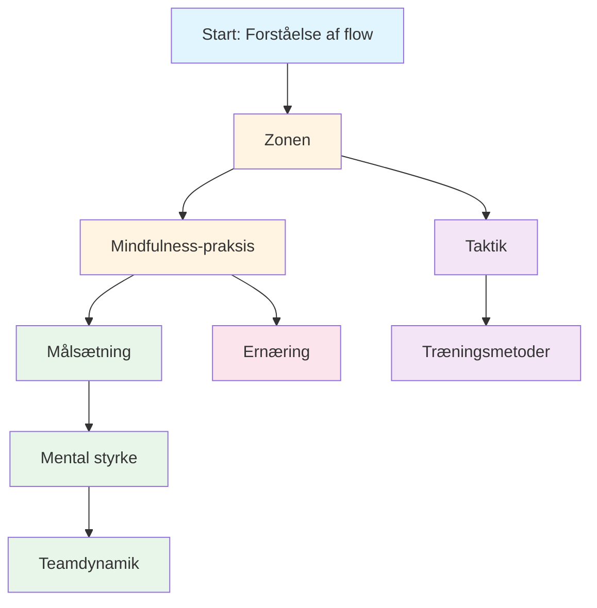

# Undervisning
<AdBanner />

Velkommen til Pétanque Academys uddannelsesprogram. Det er her, elitespillere lærer at mestre det mentale spil.

::: tip Kerneprincip
På eliteniveau bliver **mental træning vigtigere end teknisk træning**. Forholdet vender om, efterhånden som du udvikler dig: begyndere har brug for 90% teknisk arbejde, eksperter har brug for 80% mentalt arbejde.
:::

## Hvorfor mental træning er vigtig

På eliteniveau er tekniske færdigheder kun udgangspunktet. Forskning viser, at mental indstilling kan være lige så vigtig som fysisk færdighed i præcisionssportsgrene som petanque. Forskellen mellem gode spillere og store spillere ligger ofte i deres sind.

> &quot;Sport er 100% mentalt. Sindet er drivkraften bag alle fysiske evner.&quot;

## Din læringsrejse

Her er den anbefalede vej gennem vores uddannelsesprogram:

**Anbefalet rækkefølge:**
1. **Grundlag:** Start med Zonen og Mindfulness
2. **Struktur:** Tilføj målsætning og træningsmetoder
3. **Konkurrence:** Opbyg mental styrke og taktik
4. **Holdspil:** Mestre holddynamik
5. **Optimering:** Finjustering med ernæring

## Vores læringsstier

<AdInArticle />

### 🎯 [Zonen (Flowtilstand)](/da/uddannelse/zonen/)
Lær, hvad &quot;zonen&quot; egentlig er, og hvordan du får adgang til den. Forstå videnskaben bag flowtilstande, og opdag praktiske teknikker til at præstere bedst muligt, når det gælder mest.

### 🧘 [Mindfulness](/da/uddannelse/mindfulness/)
Mestre kunsten at være til stede. Lær videnskabeligt dokumenterede teknikker til at berolige dit sind, forbedre fokus og komme dig hurtigt over fejl.

### 📊 [Målsætning](/da/uddannelse/mål/)
Lav en køreplan for din udvikling. Lær SMART-rammeværket tilpasset til petanque, og lav en træningsplan, der rent faktisk virker.

### 💪 [Mental styrke](/da/uddannelse/mental-styrke/)
Opbyg den mentale styrke, der er nødvendig for konkurrence. Lær at håndtere pres, overvinde angst og udvikle rutiner, der udløser toppræstation.

### 🤝 [Holddynamik](/da/uddannelse/holdspiller/)
Bliv den holdkammerat, som alle vil spille med. Lær om kommunikation, tillid og hvordan du bidrager til en vindende holdkultur.

### ♟️ [Taktik](/da/uddannelse/taktik/)
Tænk strategisk om enhver situation. Lær sandsynlighedsbaseret beslutningstagning og hvornår du skal tage risici.

### 🏋️ [Træningsmetoder](/da/uddannelse/træning/)
Træn smartere, ikke bare hårdere. Lær hvordan du strukturerer din træning for maksimal forbedring.

### 🥗 [Ernæring](/da/uddannelse/ernæring/)
Giv din hjerne brændstof til præcisionspræstationer. Lær hvordan du opretholder stabil energi og fokus under hele konkurrencen.

<AdInArticle />

## Rejsen fra teknik til flow

Efterhånden som du udvikler dig som spiller, vendes dit træningsforhold - mental træning bliver vigtigere, ikke mindre:

| Niveau | Forhold (Teknologi:Mental) | Primært mål |
|-------|---------------------|-------------------|
| **Nybegynder** | 90 : 10 | Byg maskinen |
| **Mellemniveau** | 70:30 | Stabiliser færdigheden |
| **Fremskreden** | 50:50 | Stol på maskinen |
| **Ekspert** | 20:80 | Frihed til at præstere |

Du kan ikke træne en begynder som en ekspert (de mangler neurale baner), og du kan ikke træne en ekspert som en begynder (høj teknisk volumen forårsager overtænkning).

## Hurtig reference: Nøgleprincipper fra hvert afsnit

| Afsnit | Kerneprincip | Vigtig konklusion |
|---------|---------------|--------------|
| **Zonen** | Skift fra analytisk til automatisk tilstand | *&quot;Der findes ingen teknikker, der altid producerer en perfekt kugle. Men der er en mental tilstand, hvor perfekte kugler bliver naturlige.&quot;* |
| **Mindfulness** | Vælg hvor du vil rette din opmærksomhed | *&quot;Mindfulness handler ikke om at tømme sit sind. Det handler om at vælge, hvor man vil rette sin opmærksomhed hen.&quot;* |
| **Målsætning** | Fokuser på det, du kontrollerer | *&quot;Et mål uden en plan er blot et ønske.&quot;* |
| **Mental styrke** | Gør det godt trods nerverne | *&quot;Mental styrke handler ikke om at eliminere nerver eller aldrig at lave fejl. Det handler om at præstere godt på trods af dem.&quot;* |
| **Teamdynamik** | Tillid og kommunikation vinder kampe | *&quot;De bedste hold er ikke altid de dygtigste - det er dem, der spiller bedst sammen.&quot;* |
| **Taktik** | Beslutningstagningsteknik | *&quot;På eliteniveau er forskellen sjældent teknikken - det er beslutningstagningen.&quot;* |
| **Uddannelse** | Kvalitet frem for kvantitet | *&quot;Træn smartere, ikke bare hårdere.&quot;* |
| **Ernæring** | Stabil energi = stabil ydeevne | *&quot;Din hjerne er et præcisionsinstrument. Giv den brændstof i overensstemmelse hermed.&quot;* |

## Alle vigtige regler og konklusioner

::: details Klik for at udvide: Komplet liste over principper
Dette er din hurtige referenceguide. Gem dette afsnit som bogmærke, og vend tilbage til det regelmæssigt.

### Zonereglerne
1. **Switch-reglen:** Analysér før cirklen, udfør i cirklen, observér bagefter
2. **Inversionsreglen:** Efterhånden som færdighederne øges, bliver mental træning vigtigere end teknisk træning
3. **Tillidsreglen:** Din bevidsthed planlægger, din underbevidsthed udfører

### Mindfulness-regler
1. **Bevidsthedsreglen:** Observer uden at dømme
2. **SOAS-reglen:** Stop, observer, accepter, slip (giv slip)
3. **Den nuværende regel:** Du kan kun kontrollere dette øjeblik, dette kast

### Regler for målsætning
1. **Kontrolreglen:** Fokuser på procesmål (hvad du kontrollerer) frem for resultatmål
2. **SMART-reglen:** Mål skal være specifikke, målbare, opnåelige, relevante og tidsbestemte
3. **Opdelingsreglen:** Store mål kræver kvartalsvise, månedlige og ugentlige milepæle

### Regler for mental styrke
1. **Rutinereglen:** Konsekvente rutiner før indsprøjtning udløser toppræstation
2. **Nulstillingsreglen:** Udvikl en 10-sekunders nulstillingsrutine efter fejl
3. **Tillidsløkken:** Bedre forberedelse → Mere selvtillid → Bedre præstation

### Taktiske regler
1. **Sandsynlighedsreglen:** Vælg kast, hvor sandsynligheden for succes retfærdiggør risikoen
2. **Reglen om knægtkontrol:** Holdet, der kontrollerer knægtpositionen, har fordelen
3. **Afstandsreglen:** Kort afstand favoriserer skud, lang afstand favoriserer pegning
4. **Stilreglen:** Tving spillet ind i dit holds stærkeste stil
5. **Boule-styringsreglen:** Nogle gange er det bedre at give 1 point end at risikere 3

### Regler for holddynamik
1. **Kommunikationsreglen:** Klar, positiv kommunikation opbygger tillid
2. **Støttereglen:** Hvordan du reagerer på holdkammeraters fejltagelser er vigtigere end dine evner
3. **Rollereglen:** Kend din rolle og udfør den fuldt ud

### Træningsregler
1. **Specificitetsreglen:** Træn det, du vil forbedre
2. **Variationsreglen:** Tilfældig træning slår blokeret træning ved konkurrenceoverførsel
3. **Restitutionsreglen:** Hvile er, når tilpasning sker

### Ernæringsregler
1. **Stabilitetsreglen:** Undgå blodsukkerstigninger og styrt
2. **Hydreringsreglen:** Selv 2% dehydrering forringer præstationen
3. **Timingreglen:** Spis 2-3 timer før konkurrencen
:::

## Start din rejse

::: tip Anbefalet udgangspunkt
Start med [Zonen](/da/uddannelse/zonen/) for at forstå grundlaget for elitepræstation, og udforsk derefter [Mindfulness](/da/uddannelse/mindfulness/) for praktiske teknikker, du kan bruge med det samme.
:::

<AdBanner />
:::
