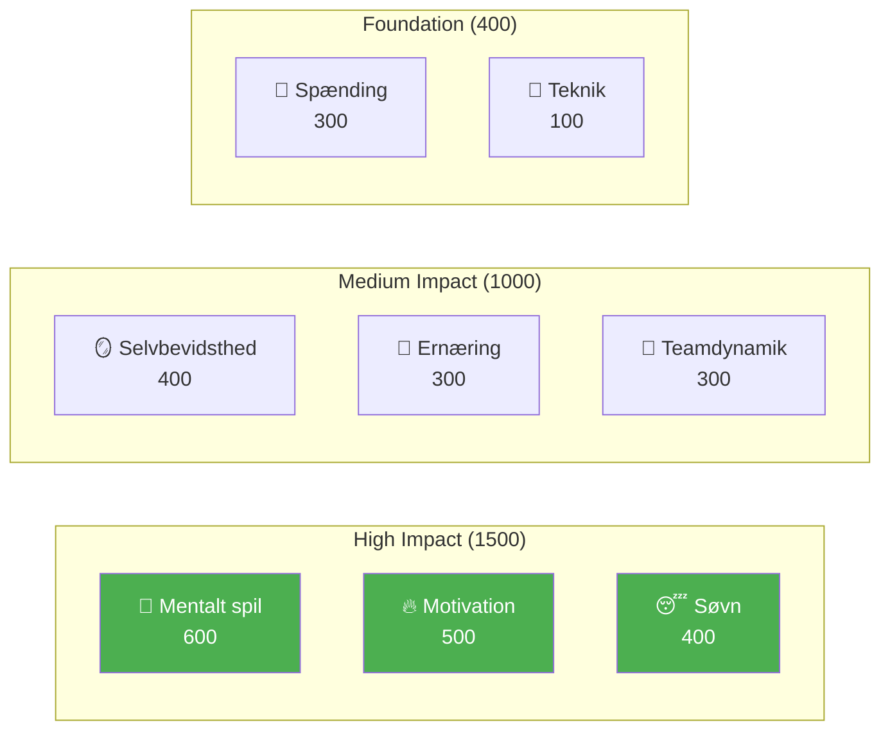

# Udvikling af elitespillere

Velkommen til Pétanque Academys uddannelsesprogram — det komplette spillerudviklingssystem baseret på 8 præstationsfaktorer.

::: tip Kerneprincip
På eliteniveau bliver **mental træning vigtigere end teknisk træning**. Bemærk, at teknik vægter lavest — ikke fordi det ikke betyder noget, men fordi alle på eliteniveau har god teknik. Det, der adskiller dem, er mentale.
:::

---

## 8-faktor præstationsmodellen

Vores pensum er struktureret omkring 8 nøglefaktorer, vægtet efter deres indflydelse på elitepræstationer:

| Faktor | Vægt | Beskrivelse |
|--------|--------|-------------|
| 🧠 [**Mentalt spil**](/da/uddannelse/mentalt-spil/) | **600** | Tankemønstre, fokus, flowtilstande, selvsnak |
| 🔥 [**Motivation**](/da/uddannelse/motivation/) | **500** | Drivkraft, formål, målorientering, vedholdenhed |
| 😴 [**Søvn &amp; Restitution**](/da/uddannelse/søvn/) | **400** | Søvnkvalitet, restitution, hvile før konkurrence |
| 🪞 [**Selvbevidsthed**](/da/uddannelse/selvbevidsthed/) | **400** | Præcis selvopfattelse, blindvinkelgenkendelse |
| 🥗 [**Ernæring**](/da/uddannelse/ernæring/) | **300** | Blodsukkerstabilitet, hydrering, konkurrencebrændstof |
| 🤝 [**Teamdynamik**](/da/uddannelse/teamdynamik/) | **300** | Kommunikation, tillid, klarhed over roller |
| 💆 [**Spændingshåndtering**](/da/uddannelse/spænding/) | **300** | Fysisk spænding, afslapning, åndedrætskontrol |
| 🎯 [**Teknik**](/da/education/technique/) | **100** | Fysisk mekanik, kasterepertoire |

**I alt: 2.900 point**

---

## Hvorfor disse vægte?

Vægtene afspejler **indflydelse på eliteniveau**:

> &quot;Ved det regionale mesterskab er det teknikken, der adskiller de bedste 50%. Ved det nationale mesterskab har alle i rummet eliteteknik. Det, der adskiller dem, er alt andet.&quot;

---

## Udforsk hver faktor

### 🧠 Mentalt spil (600 point)

**Den mest betydningsfulde faktor for elitepræstationer.**

Din evne til at styre tanker, opretholde fokus og få adgang til flowtilstande.

- [Zonen](/da/uddannelse/mentalt-spil/zonen/) — Forståelse og adgang til flowtilstande
- [Mental styrke](/da/uddannelse/mentalt-spil/mental-styrke/) — Håndtering af pres, rutiner før skud
- [Mindfulness](/da/uddannelse/mentalt-spil/mindfulness/) — Fokus i nuet, bedring fra fejltagelser

### 🔥 Motivation (500 point)

**Hvad driver dig til at forbedre dig dag efter dag, år efter år.**

- [Målsætning](/da/uddannelse/motivation/) — SMART-mål, proces vs. resultatfokus
- [Motivationspsykologi](/da/uddannelse/motivation/motivation) — Intrinsisk vs. ydre, Selvbestemmelsesteori
- [Opretholdelse af motivation](/da/uddannelse/motivation/opretholdelse) — Forebyggelse af udbrændthed, plateaunavigation

### 😴 Søvn og restitution (400 point)

**Ofte overset, men enormt betydningsfuld.**

Søvnkvalitet påvirker direkte reaktionstid, beslutningstagning og følelsesmæssig regulering.

- [Søvnvidenskab for atleter](/da/uddannelse/søvn/) — Hvorfor søvn er vigtig for præcisionssport
- [Opbygning af søvnvaner](/da/uddannelse/søvn/vaner) — Praktisk søvnhygiejne
- [Søvn &amp; Konkurrence](/da/uddannelse/søvn/konkurrence) — Protokoller før arrangementet, rejsehåndtering

### 🪞 Selvbevidsthed (400 point)

**Du kan ikke forbedre det, du ikke kan se.**

Præcis selvopfattelse muliggør målrettet forbedring.

- [Fordelen ved selvbevidsthed](/da/uddannelse/selvbevidsthed/) — Hvorfor selverkendelse er vigtig
- [Få feedback](/da/uddannelse/selvbevidsthed/feedback) — Eksterne perspektiver
- [Videoanalyse](/da/uddannelse/selvbevidsthed/video) — Brug af video til selvopdagelse

### 🥗 Ernæring (300 point)

**Stabil energi = stabil ydeevne.**

Din hjerne er et præcisionsinstrument – giv den brændstof i overensstemmelse hermed.

- [Brændstofpræstation](/da/uddannelse/ernæring/) — Blodsukker, hydrering, konkurrenceernæring

### 🤝 Holddynamik (300 point)

**De bedste hold er ikke altid de dygtigste.**

Kommunikation og tillid vejer ofte tungere end individuelt talent.

- [At være en god holdkammerat](/da/uddannelse/holddynamik/) — Holdkultur og støtte
- [Teamkommunikation](/da/uddannelse/teamdynamik/kommunikation) — Klar, positiv kommunikation

### 💆 Spændingshåndtering (300 point)

**Spænding er præcisionens fjende.**

Du kan ikke være både anspændt og præcis.

- [Forståelse af spænding](/da/uddannelse/spænding/) — Fysisk vs. mental spænding
- [Udløsningsteknikker](/da/uddannelse/spænding/teknikker) — PMR, vejrtrækning, hurtige nulstillinger
- [Konkurrencehåndtering](/da/uddannelse/spænding/konkurrence) — Protokoller før og under kampen

### 🎯 Teknik (100 point)

**Fundamentet — nødvendigt, men ikke tilstrækkeligt.**

På eliteniveau er teknik en selvfølge. Fordelene ligger ovenover.

- [Teknisk oversigt](/da/uddannelse/teknik/) — Fysisk mekanik
- [Træningsmetoder](/da/uddannelse/teknik/træning/) — Bevidst praksis
- [Taktik](/da/uddannelse/teknik/taktik/) — Strategisk beslutningstagning

---

## Udviklingsrejsen

Efterhånden som du udvikler dig som spiller, inverteres dit træningsforhold:

| Niveau | Forhold (Teknologi:Mental) | Fokus |
|-------|---------------------|-------|
| **Nybegynder** | 90 : 10 | Byg maskinen |
| **Mellemniveau** | 70:30 | Stabiliser færdigheden |
| **Fremskreden** | 50:50 | Stol på maskinen |
| **Ekspert** | 20:80 | Frihed til at præstere |

Du kan ikke træne en begynder som en ekspert (de mangler neurale baner), og du kan ikke træne en ekspert som en begynder (høj teknisk volumen forårsager overtænkning).

---

## Hurtig reference: Kerneprincipper

::: details Klik for at udvide: Komplet liste over principper

### Mentale spilleregler
1. **Switch-reglen:** Analysér før cirklen, udfør i cirklen, observér bagefter
2. **Tillidsreglen:** Din bevidsthed planlægger, din underbevidsthed udfører
3. **Den nuværende regel:** Du kan kun kontrollere dette øjeblik, dette kast

### Motivationsregler
1. **Kontrolreglen:** Fokuser på procesmål frem for resultatmål
2. **SMART-reglen:** Mål skal være specifikke, målbare, opnåelige, relevante og tidsbestemte
3. **Den indre regel:** Indre motivation varer længere end ydre belønninger

### Søvnregler
1. **Konsistensreglen:** Samme vågnetidspunkt hver dag, selv i weekender
2. **Bufferreglen:** Slap af i rutinen 60+ minutter før sengetid
3. **Konkurrencereglen:** Ekstra søvn ugen før, ikke kun natten før

### Regler for selvbevidsthed
1. **Feedbackreglen:** Søg aktivt eksterne perspektiver
2. **Videoreglen:** Hvad du føler ≠ hvad der er ægte — optag og gennemgå
3. **Blindvinkelreglen:** Lav selvbevidsthed påvirker alle andre vurderinger

### Ernæringsregler
1. **Stabilitetsreglen:** Undgå blodsukkerstigninger og styrt
2. **Hydreringsreglen:** Selv 2% dehydrering forringer præstationen
3. **Timingreglen:** Spis 2-3 timer før konkurrencen

### Regler for holddynamik
1. **Kommunikationsreglen:** Klar, positiv kommunikation opbygger tillid
2. **Støttereglen:** Hvordan du reagerer på fejl betyder mere end færdigheder
3. **Rollereglen:** Kend din rolle og udfør den fuldt ud

### Spændingsregler
1. **Udløsningsreglen:** Du kan ikke være både anspændt og præcis
2. **Yerkes-Dodson-reglen:** Find din optimale arousalzone
3. **Nulstillingsreglen:** 10 sekunders nulstilling før hvert kast

### Teknikregler
1. **Specificitetsreglen:** Træn det, du vil forbedre
2. **Variationsreglen:** Tilfældig øvelse slår blokeret øvelse
3. **Restitutionsreglen:** Hvile er, når tilpasning sker
:::

---

## Start din rejse

::: tip Anbefalet udgangspunkt
Start med [Mental Game](/da/uddannelse/mental-game/) for at forstå grundlaget for elitepræstationer. Udforsk derefter [Søvn](/da/uddannelse/søvn/) — det er ofte den forbedring med det højeste ROI for spillere under udvikling.
:::

