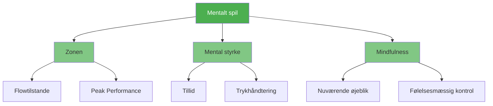

# Mentalt spil

::: tip Den vigtigste faktor
**Vægt: 600 point** — Det mentale spil har den største indflydelse på din præstation. Mestre dit sind, og alt andet følger efter.
:::

Det mentale spil omfatter alt, hvad der sker mellem dine ører: dine tanker, fokus, selvtillid og selvsnak. Elitespillere har ikke bare bedre teknik – de har bedre kontrol over deres mentale tilstand.

## De tre søjler

### 🎯 [Zonen](/da/uddannelse/mentalt-spil/zonen/)
Få adgang til flowtilstanden, hvor præstation føles ubesværet. Lær, hvad der udløser flow, og hvordan du opnår det konsekvent.

- [Introduktion til Zonen](/da/uddannelse/mentalt-spil/zonen/)
- [Teknisk vs. Flowtræning](/da/uddannelse/mentalt-spil/zonen/teknisk-vs.-flow)
- [Indtræden i zonen](/da/uddannelse/mentalt-spil/zonen/indtræden-i-zonen)

### 💪 [Mental styrke](/da/uddannelse/mentalt-spil/mental-styrke/)
Opbyg den psykologiske modstandsdygtighed til at præstere under pres. Udvikl selvtillid, håndter tilbageslag og bevar roen.

- [Opbygning af mental styrke](/da/uddannelse/mentalt-spil/mental-styrke/)
- [Håndtering af pres](/da/uddannelse/mentalt-spil/mental-styrke/håndtering-af-pres)
- [Rutine før skud](/da/uddannelse/mentalt-spil/mental-styrke/rutine-før-skud)

### 🧘 [Mindfulness](/da/uddannelse/mentalt-spil/mindfulness/)
Udvikl bevidsthed om nuet for at forblive fokuseret og hurtigt komme dig over fejl.

- [Introduktion til Mindfulness](/da/uddannelse/mentalt spil/mindfulness/)
- [Mindfulness-teknikker](/da/uddannelse/mentalt-spil/mindfulness/teknikker)
- [Daglig praksis](/da/uddannelse/mental-leg/mindfulness/daglig-øvelse)

## Hvorfor mentalt spil er vigtigst

| Aspekt | Teknisk træning | Mental træning |
|--------|-------------------|-----------------|
| **I praksis** | Du kan lave skuddet | Du kan lave skuddet |
| **I konkurrence** | Teknikken kan svigte under pres | Mentale færdigheder opretholder præstationen |
| **Forskellen** | Fysisk færdighed er nødvendig | Mental færdighed er multiplikatoren |

::: warning Den almindelige fejl
De fleste spillere bruger 90% af deres tid på teknik og 10% på mentale færdigheder. Elitespillere ændrer ofte dette forhold, når de har et solidt fundament.
:::

## Hvor skal man starte?

**Ny inden for mental træning?** Start med [The Zone](/da/uddannelse/mental-spil/the-zone/) for at forstå, hvordan det føles at præstere optimalt.

**Kæmper du under pres?** Gå til [Mental styrke](/da/uddannelse/mental-spil/mental-styrke/) for praktiske teknikker.

**Tankerne vandrer under kampe?** [Mindfulness](/da/uddannelse/mentalt-spil/mindfulness/) vil hjælpe dig med at forblive til stede.

## Relaterede ressourcer

- [Selvbevidsthed](/da/uddannelse/selvbevidsthed/) — Kend dig selv for at forbedre dig hurtigere
- [Spændingshåndtering](/da/uddannelse/spænding/) — Fysisk afslapning giver mental klarhed
- [Vurderingsværktøj](/da/uddannelse/) — Evaluer dit mentale spil og få personlige anbefalinger

