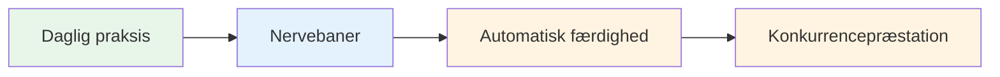
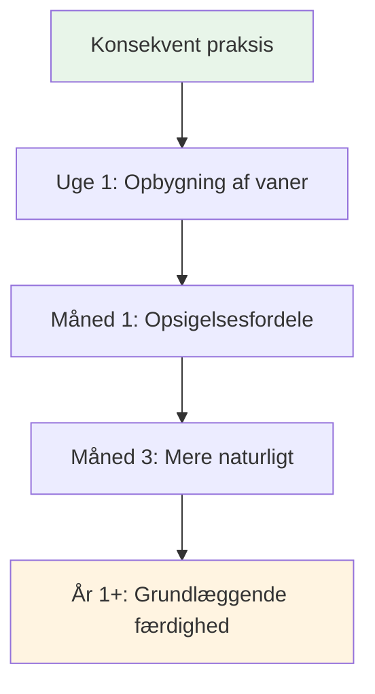

# Opbygning af en daglig mindfulness-praksis

Fordelene ved mindfulness kommer af konsekvent praksis. Sådan gør du det til en del af dit liv.

::: tip Den store idé
**Konsistens er bedre end intensitet.** Fem minutter hver dag er bedre end en time én gang om ugen. Start i det små, vær konsekvent, og fordelene forstærkes over tid.
:::

## Hvorfor daglig praksis er vigtig

::: info Mindfulness er som fysisk træning
- ❌ Du kan ikke blive i form fra én træningssession
- ✅ Regelmæssig træning skaber varig forandring
- ✅ Effekterne forstærkes over tid
- ✅ Det bliver lettere med konsistens
:::

::: tip Forskningsbaseret
Forskning viser, at selv **3 minutter dagligt** skaber målbare fordele. Men du skal gøre det regelmæssigt.
:::

## Oprettelse af din rutine

### Trin 1: Vælg din tid

Vælg et fast tidspunkt, der passer til dit liv:

| Tid | Fordele | Overvejelser |
|------|------------|----------------|
| **Morgen** | Sætter tonen for dagen, færre afbrydelser | Har brug for at vågne tidligere |
| **Middag** | Bryder dagen op, nulstiller fokus | Kan glemme, planlægge konflikter |
| **Aften** | Slap af, reflekter over dagen | Kan være træt, mindre vågen |
| **Før træning** | Direkte forbindelse til petanque | Afhænger af træningsplanen |

**Bedste fremgangsmåde:** Forbind det med en eksisterende vane (efter kaffe, før frokost osv.)

### Trin 2: Start småt

Sigt ikke efter 30 minutter på dag ét.

**Anbefalet progression:**
- Uge 1-2: 3-5 minutter
- Uge 3-4: 5-10 minutter
- Måned 2: 10-15 minutter
- Måned 3+: 15-20 minutter

Det er bedre at gøre det 5 minutter hver dag end 30 minutter én gang om ugen.

### Trin 3: Skab dit rum

Du behøver ikke et meditationsrum, men det hjælper at have et fast sted:
- Et stille sted (eller brug hovedtelefoner)
- Komfortable siddepladser
- Minimale distraktioner
- Samme sted hver gang, hvis muligt

### Trin 4: Fjern barrierer

Gør det nemt at øve:
- Sæt din telefon på lydløs
- Bed familie/bofæller om ikke at afbryde
- Hav alt klar (pude, timer)
- Vent ikke på &quot;perfekte&quot; forhold

## Eksempel på daglige skemaer

### Minimal øvelse (5 minutter)
- Morgen: 3 minutters bevidst vejrtrækning
- I løbet af dagen: 3 mindfulness-klokkeøjeblikke
- Aften: 2 minutters kropsbevidsthed før sengetid

### Standardøvelse (15 minutter)
- Morgen: 10 minutters siddende meditation
- Middag: 2 minutters bevidst vejrtrækning
- Aften: 3 minutters kropsscanning

### Intensiv træning (30 minutter)
- Morgen: 15 minutters siddende meditation
- Middag: 5 minutters gåmeditation
- Aften: 10 minutters kropsscanning
- Plus: Mindful spisning ved ét måltid

## Integration med petanque-træning

### Før træning
- 5 minutters siddende meditation
- Sæt en intention for sessionen
- Kropsscanning for at opdage eventuelle spændinger

### Under træning
- Brug rutinen før shots som mindfulness-øvelse
- Anvend SOAS efter fejl
- Vær til stede mellem kastene

### Efter træning
- 3 minutters refleksion (uden fordømmelse)
- Bemærk eventuelle flowmomenter
- Bevidst vejrtrækning for at komme ud af overgangen

## Sporing af din praksis

At holde styr på tingene hjælper med at opretholde konsistens:

### Simpel log
| Dato | Varighed | Type | Noter |
|------|----------|------|-------|
| man | 10 minutter | Siddende | Sindet er meget travlt |
| Tirsdag | 10 minutter | Siddende | Roligere i dag |
| Ons | 5 minutter | Kropsscanning | Fandt spændinger i skuldrene |

### Hvad skal spores
- Har du øvet dig? (Ja/Nej)
- Hvor længe?
- Hvilken type?
- Kort om erfaring (valgfrit)

### Apps der hjælper
- Hovedrum
- Berolige
- Indsigtstimer
- Enkle vanesporere

## Overvindelse af almindelige hindringer

### &quot;Jeg har ikke tid&quot;
- Du har 3 minutter
- Det handler om prioritet, ikke tid
- Prøv at linke til eksisterende aktiviteter

### &quot;Jeg bliver ved med at glemme&quot;
- Indstil en daglig alarm
- Forbindelse til eksisterende vane
- Sæt en visuel påmindelse et sted, hvor du kan se den

### &quot;Jeg gør det ikke rigtigt&quot;
- Der er ingen &quot;rigtig&quot; måde
- Hvis du er opmærksom, gør du det
- Vandrende tanker er normale og forventede

### &quot;Jeg ser ingen resultater&quot;
- Fordelene er subtile i starten
- Før en dagbog for at se ændringer over tid
- Stol på forskningen - den virker

### &quot;Det er kedeligt&quot;
- Kedsomhed er bare endnu en oplevelse at observere
- Prøv forskellige teknikker
- Husk hvorfor du gør det

## Tegn på fremskridt

Du bemærker måske ikke dramatiske ændringer, men hold øje med:
- At fange dig selv, når tankerne vandrer (hurtigere)
- Hurtigere at komme sig over frustration
- At bemærke spændinger, før de opbygges
- Følelse af mere tilstedeværelse under kampene
- Bedre søvn
- Mindre reaktiv på dårlige kast

## Det lange spil

Mindfulness er en livslang praksis. Eliteatleter siger ofte, at det er den mest værdifulde færdighed, de har udviklet.

**Måned 1:** Opbygning af vanen
**Måned 2-3:** Begynder at mærke fordele
**Måned 4-6:** Bliver mere naturlig
**1. klasse+:** En fundamental del af, hvem du er

## Vigtig konklusion

> Konsistens er bedre end intensitet. Fem minutter hver dag er bedre end en time én gang om ugen.

Start i dag. Start småt. Fortsæt.

