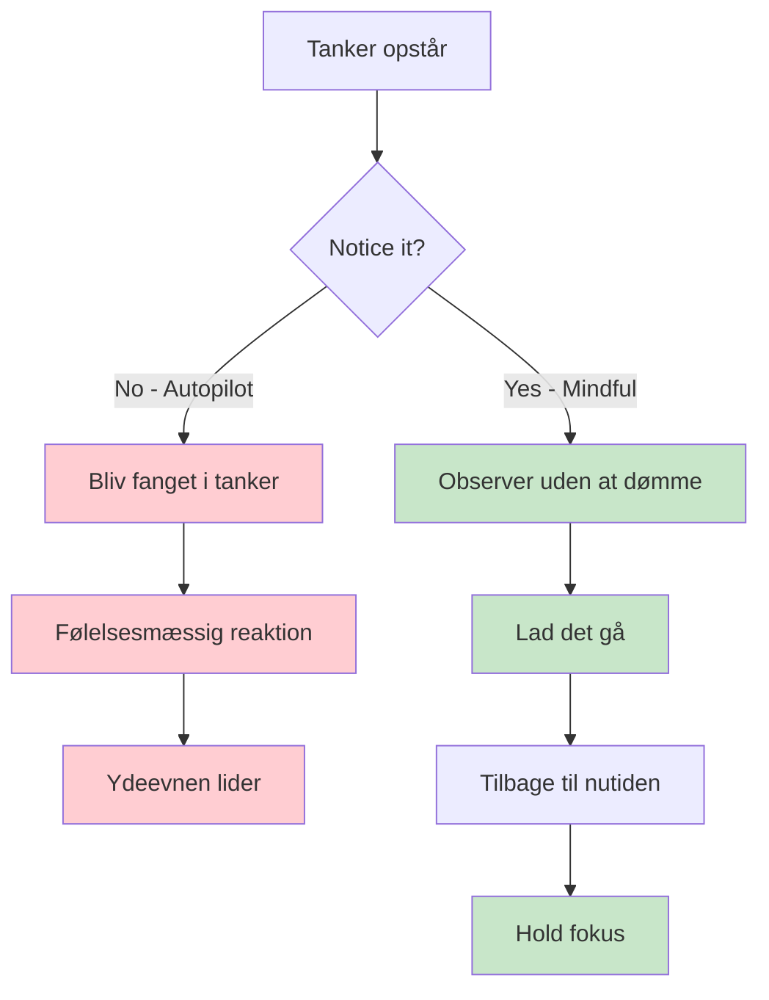
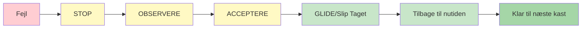

# Mindfulness for petanquespillere

Mindfulness er et af de mest kraftfulde værktøjer, der er tilgængelige for atleter. Det er ikke mystisk eller kompliceret - det er simpelthen øvelsen i at være opmærksom på nuet uden at dømme.

::: tip Kerneprincippet
**Mindfulness handler ikke om at tømme sit sind. Det handler om at vælge, hvor man vil rette sin opmærksomhed hen.** Du kan ikke forhindre tanker i at opstå, men du kan vælge ikke at følge dem.
:::

## Hvad er mindfulness?

Mindfulness betyder at være fuldt til stede og bevidst om:
- Hvor du er
- Hvad du laver
- Hvordan du har det

...uden at blive overvældet af, hvad der sker omkring dig, eller reagere på det.

For petanque-spillere betyder dette:
- At være fuldt til stede for hvert kast
- At bemærke tanker uden at blive fanget i dem
- Hurtig genopretning efter fejl
- At forblive rolig under pres

## Videnskaben bag det

Mindfulness er ikke bare filosofi – det er bakket op af solid forskning:

### Effekter på din hjerne
- **Reducerer aktiviteten i amygdala** (din hjernes alarmsystem)
- **Styrker den præfrontale cortex** (beslutningstagning og fokus) - dette hjælper dig med at tænke klart under planlægning
- **Forbedrer din evne til at finde ro i sindet** når det er nødvendigt - afgørende for at opnå flowtilstand under udførelse
- **Forbedrer forbindelserne** mellem hjerneområder
- **Skaber varige strukturelle ændringer** med regelmæssig øvelse

### Effekter på ydeevne
| Fordel | Hvordan det hjælper dit spil |
|---------|----------------------|
| Stressreduktion | Lavere kortisol, mere stabile hænder |
| Bedre fokus | Færre distraktioner, klarere beslutninger |
| Følelsesmæssig kontrol | Lad ikke dårlige kast udvikle sig til en spiral |
| Hurtigere bedring | Kom hurtigt tilbage fra fejl |
| Forbedret søvn | Bedre hvile, bedre præstation |

## Hvorfor petanquespillere har brug for mindfulness

Petanque har unikke mentale udfordringer:

1. **Tid mellem kastene** - Masser af mulighed for negative tanker
2. **Synlige fejl** - Alle ser, når du rammer ved siden af
3. **Holdpres** - Dit kast påvirker dine partnere
4. **Lange konkurrencer** - Mental træthed over mange timer
5. **Tætte kampe** - Højt pres i afgørende øjeblikke

Mindfulness hjælper dig med at håndtere alt dette.

## Kernefærdigheden: Ikke-dømmende bevidsthed

Nøgleordet er &quot;ikke-dømmende&quot;.

::: danger Dømmende tænkning (tilføjer følelsesmæssig vægt)
❌ &quot;Det var et forfærdeligt kast&quot;
❌ &quot;Jeg savner altid disse&quot;
❌ &quot;Mine holdkammerater må være frustrerede&quot;

**Resultat:** Spiral af negative følelser, spændinger, dårligere præstation
:::

::: tip Ikke-dømmende bevidsthed (kun observationer)
✅ &quot;Kastet gik til venstre for målet&quot;
✅ &quot;Jeg mærker, at jeg føler mig anspændt&quot;
✅ &quot;Mine tanker vandrer til partituret&quot;

**Resultat:** Klar observation, hurtig bedring, fastholdelse af fokus
:::

**Forskellen?** Dømmekraft tilføjer følelsesmæssig vægt og udløser reaktioner. Bevidsthed observerer blot og giver dig mulighed for at reagere dygtigt.

## Kom godt i gang

Du behøver ikke timevis af meditation. Start med disse enkle øvelser:

### 1. Bevidst vejrtrækning (2 minutter)
- Sid behageligt
- Fokuser på dit åndedræt
- Når dine tanker vandrer (det vil de), så vend blidt tilbage til åndedrættet
- Ingen fordømmelse af vandring - bare vend tilbage

### 2. Kropsscanning (5 minutter)
- Læg mærke til fornemmelser i dine fødder
- Bevæg langsomt opmærksomheden opad gennem din krop
- Bare observer - prøv ikke at ændre noget
- Læg mærke til spændingsområder uden at bekæmpe dem

### 3. Mindful Moments
- Vælg en hverdagsaktivitet (drikke kaffe, gå en tur)
- Gør det med fuld opmærksomhed
- Læg mærke til alle de involverede sanseindtryk
- Når dine tanker vandrer, så vend tilbage til aktiviteten

## Mindfulness i konkurrence

### Før kampen
- Brug 2-3 minutter på bevidst vejrtrækning
- Sæt en intention for, hvordan du vil spille (ikke resultatet, men processen)
- Læg mærke til enhver nervøsitet uden at forsøge at eliminere den

### Under spillet
- Brug din rutine før shots som et mindfulness-anker
- Mellem kastene, vend opmærksomheden tilbage til nutiden
- Læg mærke til tanker om score/resultat, og slip dem derefter

### Efter fejl

::: warning SOAS-metoden (dit nulstillingsværktøj)
**S**top - Hold pause før du reagerer
**OBSERVERE - Hvad skete der? Hvad føler jeg?**
**A**accept - Det skete. Det er overstået.
**Slip det frit (Slip det)** - Slip det, vend tilbage til nuet

**Tid brugt:** 10 sekunder
**Brug det:** Efter hver fejl, dårlig opvisning eller frustrerende øjeblik
:::

## I dette afsnit

- **[Teknikker](/da/education/mental-game/mindfulness/teknikker)** - Praktiske øvelser du kan bruge
- **[Daglig praksis](/da/education/mental-game/mindfulness/daglig-praksis)** - Byg mindfulness ind i dit liv

## Resumé: Mindfulnessregler

::: tip Regel nr. 1: Bevidsthedsreglen
**Observer uden at dømme.**
Læg mærke til tanker og følelser uden at betegne dem som gode eller dårlige.
:::

::: tip Regel nr. 2: SOAS-reglen
**Stop, observer, accepter, slip (giv slip).**
Din 10-sekunders nulstilling efter fejl. Brug den hver gang.
:::

::: tip Regel nr. 3: Den nuværende regel
**Du kan kun kontrollere dette øjeblik, dette kast.**
Tidligere kast er overstået. Fremtidige kast findes ikke endnu. Vær her nu.
:::

::: tip Regel nr. 4: Øvelsesreglen
**Start i det små: 2-5 minutter dagligt.**
Konsistens er bedre end varighed. Daglig træning opbygger færdigheden.
:::

## Vigtig konklusion

> Mindfulness handler ikke om at tømme sit sind. Det handler om at vælge, hvor man vil rette sin opmærksomhed hen.

Du kan ikke forhindre tanker i at opstå. Men du kan vælge ikke at følge dem ned i kaninhullet.

