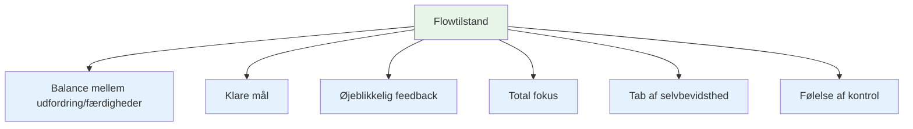
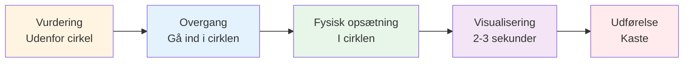
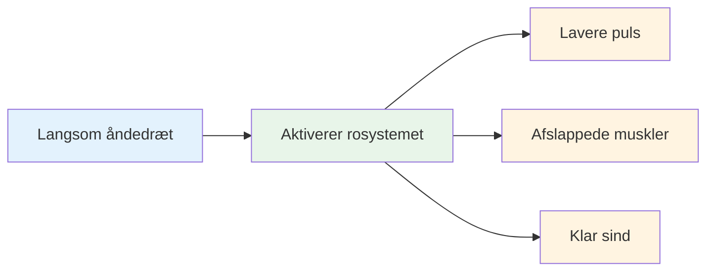
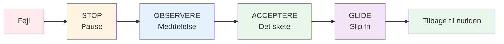

# Indtræden i zonen: Praktiske teknikker

Zonen er ikke noget, der bare sker for dig. Med øvelse kan du lære at bruge den mere regelmæssigt. Her er gennemprøvede teknikker, der bruges af eliteatleter.

::: tip Den store idé
**Du kan træne dig selv til at komme ind i flowtilstande mere pålideligt.** Zonen er ikke magi - det er en færdighed, du udvikler gennem specifikke teknikker og konsekvent øvelse.
:::

## De seks betingelser for flow

Forskning viser, at strømningstilstande kræver visse betingelser:

| Tilstand | Hvad det betyder | I petanque |
|-----------|---------------|-------------|
| **Balance mellem udfordring/færdigheder** | Opgaven udfordrer dig, men er opnåelig | Konkurrence på dit niveau, hverken for let eller umuligt |
| **Klare mål** | Du ved præcis, hvad du prøver at gøre | Specifikt mål, klar intention for hvert kast |
| **Øjeblikkelig feedback** | Du ser resultaterne af dine handlinger | Bolden lander, du ved, om den virkede |
| **Totalt fokus** | Fuld opmærksomhed på opgaven | Ingen distraktioner, kun nuet |
| **Tab af selvbevidsthed** | Ikke bekymret for, hvordan du ser ud | Ligegyldigt hvem der ser med |
| **Kontrolfølelse** | Føler mig i stand til at håndtere det | Stol på din træning og dine evner |

::: info Vigtig indsigt
Når disse seks betingelser stemmer overens, bliver flow muligt. Dit job er at skabe disse betingelser bevidst.
:::

## Teknik 1: Rutinen før optagelse

Din rutine før træningen er din indgang til zonen. Det er en konsekvent sekvens, der signalerer til din hjerne: &quot;Det er tid til at udføre.&quot;

### Opbygning af din rutine

En god rutine har disse elementer:

::: details 1. Visuel vurdering (uden for cirklen)
- Læs terrænet
- Vælg dit mål og landingssted
- Beslut dig for kastetypen

**Det er her, tænkningen sker.** Tag dig god tid her.
:::

::: details 2. Overgang (Indtræden i cirklen)
- Tag en indånding
- Slip analysen
- Skift til udførelsestilstand

**Dette er kontakten.** Analysen stopper her.
:::

::: details 3. Fysisk udløser (i cirklen)
- En konsekvent holdningsopsætning
- En specifik grebstest
- En lille bevægelse, der føles naturlig for dig

**Gør det konsekvent.** Det samme hver gang.
:::

::: details 4. Visualisering (Kort, 2-3 sekunder)
- Se boldens bane
- Føl det vellykkede kast
- Forbind dig med dit mål

**Hold det kort.** For langt = overtænkning.
:::

::: details 5. Udførelse
- Fokuser kun på målet
- Stol på din krop
- Slip uden tøven

**Kun eksternt fokus.** Mål, ikke teknik.
:::

### Hvorfor rutiner virker

Din rutine bliver en &quot;mindfulness-klokke&quot; - et signal, der ændrer din hjernetilstand. Med nok gentagelse vil blot at starte din rutine udløse det mentale skift til flow.

::: tip Øvelsestip
Brug din rutine på HVERT kast under træning - ikke kun i konkurrencer. Rutinen skal blive automatisk.
:::

## Teknik 2: Eksternt fokus

Hvor du lægger din opmærksomhed, betyder enormt meget.

| Fokustype | Hvad du synes om | Eksempeltanker |
|------------|---------------------|------------------|
| **Intern** ❌ | Din kropsmekanik | &quot;Hold min albue lige&quot;  &quot;Følg ordentligt op&quot;  &quot;Grib ikke for hårdt&quot; |
| **Ekstern** ✅ | Mål og resultat | &quot;Land den lige der&quot;  &quot;Se stien&quot;  &quot;Ram målet&quot; |

::: tip Forskningsresultater
Studier viser konsekvent, at **eksternt fokus giver bedre resultater** for dygtige spillere. Din krop ved, hvad den skal gøre - lad den arbejde.
:::

### Øv dig i eksternt fokus
- Vælg et bestemt sted på jorden (ikke kun &quot;nær donkraften&quot;)
- Visualiser boldens fulde bane
- Hold øjnene på målet, ikke på din hånd

::: warning Almindelig fejl
Under pres vender spillerne ofte tilbage til internt fokus (&quot;Ødelæg ikke min teknik&quot;). Det er præcis, når man har mest brug for eksternt fokus.
:::

## Teknik 3: Venstrehåndsklem

Denne usædvanlige teknik har videnskabelig støtte.

::: info Videnskaben
Klem din venstre hånd (hvis du er højrehåndet) i 10-15 sekunder før du kaster:
- ✅ Aktiverer den højre hjernehalvdel (rumlig, intuitiv)
- ✅ Stilner venstre hjernehalvdel (verbal, analytisk)
- ✅ Reducerer overtænkning
:::

**Sådan bruger du det:**
1. Lav en knytnæve med din ikke-kastende hånd
2. Klem godt fast i 10-15 sekunder
3. Slip dig løs og start din rutine
4. Kaste

::: tip Hvornår skal man bruge
Dette fungerer bedst, når du bemærker, at du overtænker eller føler pres. Det er en &quot;nulstillingsknap&quot; for din hjerne.
:::

## Teknik 4: Åndedrætskontrol

Dit åndedræt påvirker direkte din mentale tilstand.

**Inden du træder ind i cirklen:**
- Tag en langsom, dyb indånding
- Udånd helt
- Føl dine skuldre sænke sig

**I cirklen:**
- Træk vejret naturligt
- Hold ikke vejret under kastet
- Lad udåndingen ledsage din udløsning

::: details 4-7-8-teknikken (til højt tryk)
1. Inhalér i 4 tællinger
2. Hold i 7 tællinger
3. Udånd i 8 tællinger
4. Gentag en eller to gange

**Hvorfor det virker:** Dette aktiverer dit parasympatiske nervesystem (&quot;ro-ned-systemet&quot;).
:::

## Teknik 5: Udløsende ord

Et triggerord eller en -sætning kan øjeblikkeligt ændre din mentale tilstand.

::: tip Populære triggerord
- &quot;Glat&quot;
- &quot;Tillid&quot;
- &quot;Se det, lad det være&quot;
- &quot;Slip fri&quot;
- &quot;Flyde&quot;
- &quot;Let&quot;
:::

**Sådan udvikler du din:**
1. Tænk på en gang, hvor du præsterede perfekt
2. Hvilket ord indfanger den følelse?
3. Brug det ord i din rutine
4. Sig det stille, mens du forbereder dig på at kaste

::: info Hvorfor det virker
Med gentagelse bliver ordet knyttet til din bedste præstationstilstand. Det er en mental genvej til flow.
:::

## Teknik 6: Nulstil efter fejl

Fejl vil ske. Nøglen er ikke at lade ét dårligt kast blive til to.

**SOAS-metoden:**

| Trin | Handling | Hvad det betyder |
|------|--------|---------------|
| **Stop | Hold pause, reager ikke med det samme | Kast ikke hænderne op, band ikke |
| **Observere | Læg mærke til, hvad der skete, uden at dømme | &quot;Bolden gik til venstre&quot; ikke &quot;Jeg er forfærdelig&quot; |
| **Acceptere | Det skete, det er gjort | Kan ikke ændre fortiden |
| **Glide | Slip det, slip det | Tilbage til nuet |

::: warning Kritisk færdighed
Dette kræver øvelse, men det forhindrer den frustrationsspiral, der dræber flowet. Øv dig i SOAS i hverdagen, så det sker automatisk i konkurrencer.
:::

## Opbygning af dit flowværktøjssæt

Ikke alle teknikker virker for alle. Eksperimentér og find ud af, hvad der hjælper dig:

| Situation | Prøv dette |
|-----------|----------|
| Overtænkning | Venstrehåndsklem, ekstern fokus |
| Nervøs/spændt | Åndedrætskontrol, triggerord |
| Efter en fejltagelse | SOAS-metoden |
| Vigtigt kast | Fuld rutine før optagelse |
| Mister fokus | Tilbage til de grundlæggende rutiner |

## Øvelse gør varig

Disse teknikker virker kun, hvis du øver dig i dem:

1. **Brug din rutine i hvert træningskast** - ikke kun i konkurrencer
2. **Simuler pres** - skab konsekvenser i praksis
3. **Læg mærke til når du er i flow** - hvad udløste det?
4. **Evaluering efter sessioner** - hvad hjalp, hvad gjorde ikke?

## Vigtig konklusion

::: tip Huske
**Zonen er ikke held. Det er en færdighed, du kan udvikle.**

Start med din rutine før indsprøjtning. Gør den konsekvent. Stol på den. Zonen vil følge.
:::

