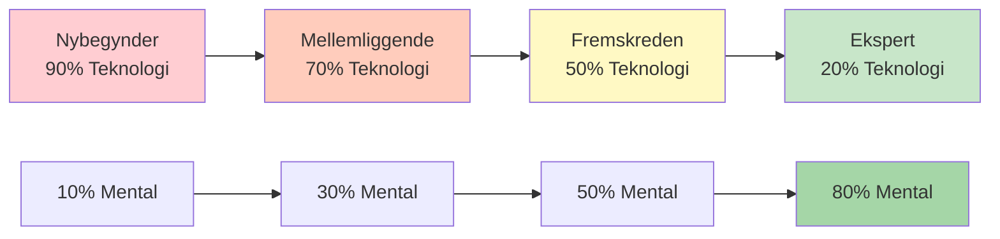

# Teknisk træning vs. flowtræning

Det er vigtigt at forstå forskellen mellem teknisk træning og flowtræning for eliteudvikling. Begge er nødvendige, men de tjener forskellige formål og kræver forskellige tilgange.

::: tip Kerneprincippet
**Du kan ikke træne en begynder som en ekspert** (de mangler neurale baner), og **du kan ikke træne en ekspert som en begynder** (høj teknisk volumen forårsager overtænkning).
:::

## To typer træning

::: info Teknisk træning (eksplicit læring)
**Fokus:** Mekanik og form
**Opmærksomhed:** Bevidste kropsbevægelser
**Metode:** Nedbrydning af færdigheder, gentagen øvelse
**Bedst til:** At lære nye færdigheder, rette op på dårlige vaner, bygge fundament

**Eksempel:** Øv dit frigørelsespunkt 50 gange med videoanalyse
:::

::: info Flowtræning (implicit læring)
**Fokus:** Resultater, ikke mekanik
**Opmærksomhed:** At lade underbevidstheden tage over
**Metode:** Varieret, spillignende øvelse, visualisering
**Bedst til:** Konkurrenceforberedelse, opbygning af selvtillid, toppræstation

**Eksempel:** At spille træningskampe med pres, kun fokusere på mål
:::

## Den dynamiske inversionsmodel

Det korrekte træningsforhold er omvendt korreleret med teknisk kompetence. Efterhånden som du mestrer teknikken, bliver mental træning vigtigere - ikke mindre.

### 1. Begynder (kognitivt stadie)
- Du tænker bevidst over *hvad* du skal gøre
- Bevægelser føles akavede og kræver indsats
- Hjernen er fuldt mættet med mekanik
- **Forhold:** 90% Teknisk / 10% Mental
- **Mental fokus:** Nydelse, eksternt fokus (se på målet), ikke kompleks visualisering

### 2. Mellemstadiet (Associativt stadie)
- Du forfiner færdigheden med mindre bevidst tankegang
- Bevægelser bliver mere jævne, fejl falder
- Du begynder at opdage dine egne fejl
- **Forhold:** 70% Teknisk / 30% Mental
- **Mental fokus:** Udvikling af din præ-performance rutine (PPR)

### 3. Avanceret (tærskel for autonomi)
- Færdigheden er i vid udstrækning automatiseret
- Dit selvbillede halter ofte bagefter dine fysiske evner
- Træningen fokuserer på tryksimulering
- **Forhold:** 50% Teknisk / 50% Mental
- **Mental fokus:** Visualisering, selvbillede, angstkontrol

### 4. Ekspert (Autonom fase)
- Tekniske færdigheder er fuldstændig underbevidste
- Bevidst opmærksomhed på mekanik forstyrrer præstationen
- Vedligeholdelsesvolumen er alt, hvad du teknisk set behøver
- **Forhold:** 20% Teknisk / 80% Mental
- **Mental fokus:** Flowtilstand, strategi, at få sindet til at falde til ro

## Progressionstabellen

| Niveau | Teknologi: Mental | Primært mål |
|-------|---------------|-------------------|
| Nybegynder | 90 : 10 | Byg maskinen |
| Mellemliggende | 70:30 | Stabiliser færdigheden |
| Fremskreden | 50:50 | Stol på maskinen |
| Ekspert | 20:80 | Frihed til at præstere |

## Ekspertfælden

For avancerede og ekspertspillere er det farligt at vende tilbage til et højt teknisk fokus.

**Problemet:** Når du har automatiseret en færdighed, men bevidst overvåger den under konkurrencen, aktiverer du det bevidste sind og tilsidesætter det underbevidste. Dette forårsager præstationsangst og &quot;kvælningsangst&quot;.

**Videnskaben:** Den mængde, der kræves for at vedligeholde en færdighed, er betydeligt lavere (ofte 1/3 til 1/9) end den mængde, der kræves for at opbygge den. Eksperter behøver minimalt teknisk arbejde for at bevare deres touch.

**Eliteeksempel:** Mestre som Philippe Quintais og Dylan Rocher fokuserer i høj grad på taktiske scenarier og kritiske øjeblikke frem for mekaniske øvelser.

Tegn på, at du overtænker teknikken:
- Lammelse ved analyse
- Ujævn præstation trods god teknik
- Dårligere resultater i konkurrence end i træning
- Følelse af &quot;mekanisk&quot; i stedet for flydende

## Sammenligning af træningsmetoder

| Aspekt | Teknisk træning | Flowtræning |
|--------|-------------------|---------------|
| **Øvelsestype** | Blokeret (samme færdighed gentagne gange) | Tilfældige (varierede færdigheder) |
| **Feedback** | Øjeblikkelig, detaljeret | Forsinket, resultatfokuseret |
| **Miljø** | Kontrolleret, forudsigelig | Variabel, spillignende |
| **Mental tilstand** | Analytisk, bevidst | Intuitiv, automatisk |
| **Bedste tidspunkt** | Uden for sæsonen, færdighedsopbygning | Før konkurrence, vedligeholdelse |

## Blokeret vs. tilfældig øvelse

**Blokeret øvelse:** Gentag det samme kast 20 gange
- Føles produktiv (du ser hurtig forbedring)
- God til indledende læring
- Dårlig til langsigtet fastholdelse

**Tilfældig øvelse:** Varier afstand, mål og kastetype
- Føles sværere (flere fejl)
- Bedre til konkurrencetransfer
- Opbygger tilpasningsevne og beslutningstagning

## Praktiske retningslinjer

### Til tekniske sessioner
1. Fokuser på ÉT aspekt ad gangen
2. Brug videoanalyse
3. Få feedback fra en træner eller træningspartner
4. Accepter at det vil føles akavet i starten
5. Hold sessionerne kortere (kvalitet frem for kvantitet)

### Til flowsessioner
1. Skab et pres i et spil
2. Fokuser på målet, ikke din krop
3. Brug din rutine før indsprøjtning konsekvent
4. Analysér ikke under sessionen
5. Stol på din træning

## Integrationsudfordringen

Den virkelige færdighed er at vide, hvornår man skal bruge hver tilstand:

**Under en konkurrencekamp:**
- Teknisk tænkning: ALDRIG under udførelsen
- Flowtilstand: ALTID når man kaster

**Under træning:**
- Tekniske sessioner: Planlagt, specifikt fokus
- Flowsessioner: Spilsimulering, trykøvelser

## Eksempel på ugentlig saldo

| Dag | Sessionstype | Fokus |
|-----|-------------|-------|
| mandag | Teknisk | Pegepræcision |
| tirsdag | Teknisk | Skydepræcision |
| onsdag | Flyde | Mental træning, visualisering |
| torsdag | Blandet | Spilscenarier med fokus på flow |
| fredag | Teknisk | Svaghedsområde |
| lørdag | Flyde | Matchspil, konkurrencesimulering |
| søndag | Hvile | Genopretning, refleksion |

## Resumé: Regler for træningsbalance

::: tip Regel nr. 1: Match træningen til niveau
**Begyndere (90/10):** Byg maskinen - fokuser på teknik
**Mellem (70/30):** Stabiliser færdigheden - tilføj mentalt arbejde
**Avanceret (50/50):** Stol på maskinen - balancer begge dele
**Ekspert (20/80):** Præstationsfrihed - primært mental
:::

::: tip Regel nr. 2: Blokeret vs. tilfældig øvelse
**Blokeret øvelse** (samme kast gentagne gange): God til indledende læring, dårlig til fastholdelse
**Tilfældig træning** (varierede kast): Sværere i træning, bedre i konkurrence
:::

::: tip Regel nr. 3: Ekspertfælden
**For eksperter:** Høj teknisk volumen forårsager overtænkning og kvælning
**Løsning:** Minimal teknisk vedligeholdelse, maksimal mental træning
:::

## Vigtig konklusion

> Du kan ikke træne en begynder som en ekspert (de mangler de neurale baner til mentalt arbejde), og du kan ikke træne en ekspert som en begynder (høj teknisk volumen forårsager udbrændthed og overtænkning).

Rejsen fra teknik til flow kræver strategisk inversion. Tilpas din træning til dit udviklingstrin.

