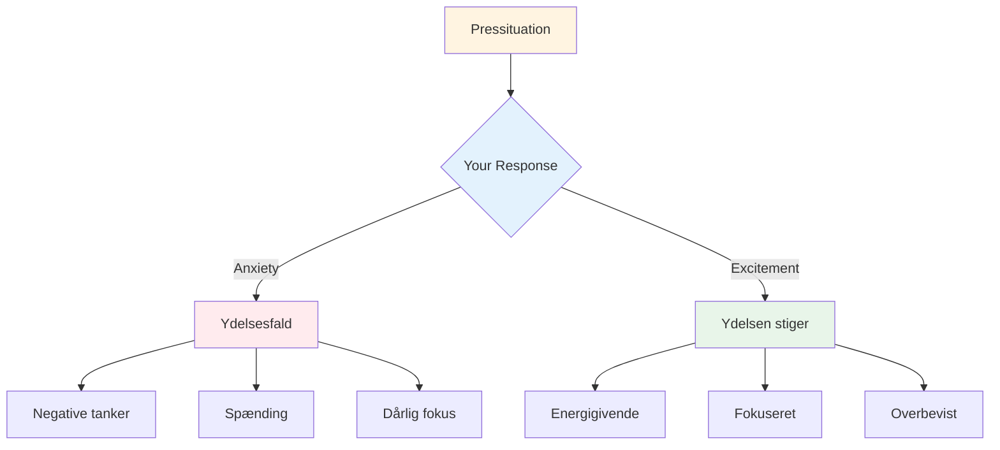

# Håndtering af tryk

Pres er en del af konkurrence. Målet er ikke at eliminere det - det er umuligt. Målet er at præstere godt på trods af det, og endda bruge det til din fordel.

::: tip Den store idé
**Pres forsvinder ikke med erfaring - man bliver bare bedre til at præstere med det.** De bedste spillere er ikke rolige; de er dygtige til at bruge deres ophidselse produktivt.
:::

## Forståelse af pres

### Hvad skaber pres?
- Høje indsatser (vigtig kamp, afgørende kast)
- At blive set (publikum, holdkammerater)
- Forventninger (dine og andres)
- Usikkerhed (tæt stilling, ukendte modstandere)
- Tid (at løbe ud, for lang ventetid)

### Hvad pres gør ved din krop
Når du føler pres, reagerer din krop:
- Hjertefrekvensen stiger
- Vejrtrækningen bliver overfladisk
- Musklerne spændes
- Hænderne kan ryste
- Fokus indsnævres (nogle gange for meget)

Det er din krop, der forbereder sig på handling. Det er ikke dårligt – det er energi, du kan bruge.

## Omformningstryk

### Pres som spænding

De fysiske fornemmelser af angst og spænding er næsten identiske. Forskellen ligger i, hvordan du fortolker dem.

**Angstfortolkning:** &quot;Jeg er nervøs, der kan ske noget slemt&quot;
**Spændingsfortolkning:** &quot;Jeg er energisk, det her er vigtigt for mig&quot;

**Prøv dette:** Når du føler dig presset, så sig til dig selv: &quot;Jeg er spændt&quot; i stedet for &quot;Jeg er nervøs&quot;.

### Pres som privilegium

Kun vigtige øjeblikke skaber pres. Hvis du føler det, er du i en situation, der betyder noget.

> &quot;Pres er et privilegium - det kommer kun til dem, der fortjener det.&quot; - Billie Jean King

## Teknikker til højtryksmomenter

### 1. Åndedrætskontrol

Dit åndedræt er den hurtigste måde at ændre din tilstand på.

**4-7-8-teknikken:**
1. Inhalér i 4 tællinger
2. Hold i 7 tællinger
3. Udånd i 8 tællinger
4. Gentag 2-3 gange

**Hurtig nulstilling (i cirklen):**
- En langsom, dyb indånding
- Føl dine fødder på jorden
- Sænk skuldrene ved udåndingen

### 2. Fysisk jordforbindelse

Forbind dig med fysiske fornemmelser for at komme ud af dit hoved:
- Mærk vægten af kuglen
- Læg mærke til dine fødder på jorden
- Klem og slip din ikke-kastende hånd
- Rul dine skuldre tilbage

### 3. Fokusindsnævring

I pressede øjeblikke, fokuser kun på det, der betyder noget:
- Ikke scoren
- Ikke publikum
- Ikke hvad der kunne ske
- Bare dette kast, dette mål, dette øjeblik

**Ledeord:** &quot;Her. Nu. Dette.&quot;

### 4. Procesfokus

Skift fra resultat til proces:

**Resultatfokus (skaber pres):**
- &quot;Jeg er nødt til at lave dette&quot;
- &quot;Hvis jeg misser, taber vi&quot;
- &quot;Alle ser på&quot;

**Procesfokus (reducerer pres):**
- &quot;Følg min rutine&quot;
- &quot;Se målet&quot;
- &quot;Stol på min træning&quot;

### 5. Venstrehåndsklem

For højrehåndede spillere, klem venstre hånd i 10-15 sekunder:
- Aktiverer den højre hjernehalvdel
- Stilner analytisk overtænkning
- Hjælper med at få adgang til automatisk udførelse

Brug dette, når du bemærker, at du overtænker.

## Forberedelse til pres

### Simuler tryk i praksis

Du kan ikke håndtere konkurrencepres, hvis du aldrig oplever det til træning.

**Måder at skabe træningspres på:**
- Sæt konsekvenser (armstrækninger for fejl, køb kaffe til partneren)
- Skab &quot;must-make&quot; scenarier
- Øv med et publikum
- Tidspres (skudur)
- Træthed (øv dig når du er træt)

### Visualisering

Øv mentalt situationer med højt pres:
1. Luk dine øjne
2. Forestil dig et presscenarie i detaljer
3. Føl trykket
4. Se dig selv klare det godt
5. Udfør med succes i dit sind

Gør dette regelmæssigt, ikke kun før konkurrencer.

### Opbyg en trykhistorik

Hold styr på de gange, du har håndteret pres godt:
- Hvad var situationen?
- Hvordan havde du det?
- Hvad gjorde du?
- Hvad blev resultatet?

Gennemgå dette før konkurrencer for at minde dig selv om: &quot;Jeg har gjort dette før.&quot;

## Under konkurrencen

### Før trykkastet
1. Træd tilbage, tag en indånding
2. Mind dig selv om din rutine
3. Fokus på proces, ikke resultat
4. Brug dit triggerord eller din ledetråd

### I cirklen
1. Gennemfør din rutine præcis som øvet
2. Fokuser eksternt (mål, ikke krop)
3. Stol på din træning
4. Slip uden tøven

### Efter kastet
- Accepter resultatet uden at dømme
- Hvis godt: kort takkeord, gå videre
- Hvis defekt: SOAS-metode, nulstil til næste kast

## Almindelige trykfejl

| Fejl | Bedre tilgang |
|---------|----------------|
| Rushing | Sæt farten ned, brug fuld rutine |
| Overtænkning | Eksternt fokus, tillidstræning |
| Ændring af teknik | Hold fast i det, du kender |
| Fokus på resultat | Fokus på processen |
| Bekæmpelse af nerver | Accepter og brug energien |

## Vigtig konklusion

> Presset forsvinder ikke med erfaring. Man bliver bare bedre til at præstere med det.

De bedste spillere er ikke rolige - de er dygtige til at bruge deres ophidselse produktivt.

