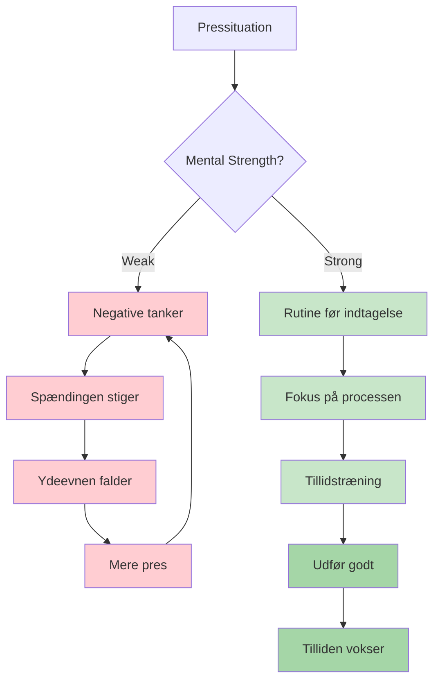
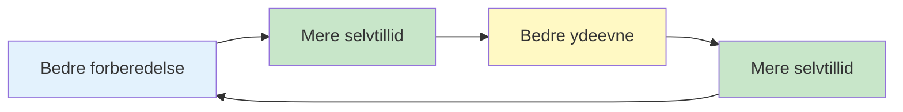

# Mental styrke

Mental styrke er det, der adskiller spillere, der præsterer godt til træning, fra dem, der præsterer godt, når det gælder. Det er evnen til at håndtere pres, komme sig over tilbageslag og opretholde fokus gennem lange konkurrencer.

::: tip Kerneprincippet
**Mental styrke handler ikke om at eliminere nerver eller aldrig at begå fejl. Det handler om at præstere godt på trods af dem.** Du kan ikke kontrollere, hvad der sker. Du kan kontrollere, hvordan du reagerer.
:::

## Hvad er mental styrke?

Mental styrke omfatter:
- **Selvtillid:** Tro på dine evner
- **Fokus:** At holde fokus på det, der betyder noget
- **Modstandsdygtighed:** At komme sig over fejltagelser
- **Ro:** At bevare roen under pres
- **Motivation:** Opretholdelse af indsats over tid

Dette er ikke faste egenskaber – det er færdigheder, du kan udvikle.

## De mentale krav ved petanque

Petanque har unikke mentale udfordringer:

| Udfordring | Hvorfor det er svært |
|-----------|--------------|
| Tid mellem kast | Mulighed for negative tanker |
| Synlige resultater | Alle ser dine fejl |
| Holdformat | Pres for ikke at skuffe partnere |
| Lange konkurrencer | Mental træthed over mange timer |
| Lukkede spil | Høje indsatser på enkelte kast |
| Momentumudsving | Følelsesmæssig rutsjebane |

## Opbygning af mental styrke

### 1. Udvikl selvtillid

Selvtillid kommer fra:
- **Forberedelse:** Viden om, at du har gjort arbejdet
- **Tidligere succeser:** Husker tidspunkter, hvor du klarede dig godt
- **Positiv selvsnak:** Hvordan du taler til dig selv
- **Kropssprog:** Stående oprejst, bevægelse med et formål

**Tillidsskabere:**
- Hold en succesdagbog
- Visualiser succesfulde præstationer
- Forbered dig grundigt til konkurrencer
- Brug et selvsikkert kropssprog (det påvirker dit sind)

### 2. Mestre din selvsnak

Stemmen i dit hoved betyder enormt meget.

**Destruktiv selvsnak:**
- &quot;Jeg savner altid disse&quot;
- &quot;Jeg kommer til at kvæles&quot;
- &quot;Mine holdkammerater regner med mig&quot; (pres)
- &quot;Det var forfærdeligt&quot;

**Konstruktiv selvsnak:**
- &quot;Jeg har lavet dette kast før&quot;
- &quot;Stol på min træning&quot;
- &quot;Et kast ad gangen&quot;
- &quot;Næste kast, en frisk start&quot;

**Ændring af din selvsnak:**
1. Læg mærke til, hvad du siger til dig selv
2. Udfordr negative udsagn
3. Erstat med realistiske, nyttige alternativer
4. Øv dig indtil det bliver automatisk

### 3. Opbyg modstandsdygtighed

Modstandsdygtighed er evnen til at komme sig over tilbageslag.

**Den robuste tankegang:**
- Fejl er information, ikke fiasko
- Et dårligt kast definerer dig ikke
- Tilbageslag er midlertidige
- Du kan altid reagere godt på, hvad der sker

**Opbygning af modstandsdygtighed:**
- Øv dig i at komme dig over fejl i træningen
- Brug SOAS-metoden (Stop, Observer, Accepter, Slip)
- Fokuser på responsen, ikke begivenheden
- Udvikl en kort hukommelse for dårlige kast

### 4. Administrer din energi

Mental styrke kræver energistyring:

**Fysisk energi:**
- Sov godt før konkurrencer
- Spis ordentligt (stabilt blodsukker)
- Hold dig hydreret
- Bevæg dig mellem spil (sid ikke for længe)

**Mental energi:**
- Tag pauser når det er muligt
- Overanalyser ikke mellem kastene
- Gem intenst fokus til når du har brug for det
- Hav rutiner for restitution

## Tillid-kompetence-løkken

::: info Den positive cyklus

**Byg det igennem:**
1. Kvalitetspraksis (opbygger kompetence)
2. Sporing af fremskridt (opbygger selvtillid)
3. Succesfulde præstationer (forstærker begge)
:::

## I dette afsnit

- **[Håndtering af pres](/da/uddannelse/mental-styrke/håndtering-af-pres)** - Teknikker til situationer med høje indsatser
- **[Rutine før skud](/da/uddannelse/mental-styrke/rutine-før-skud)** - Opbygning af din præstationstrigger

## Resumé: Regler for mental styrke

::: tip Regel nr. 1: Rutinereglen
**Konsekvente rutiner før indtagelse udløser optimal ydeevne.**
Samme rutine hver gang = pålidelig trigger for flowtilstand
:::

::: tip Regel nr. 2: Nulstillingsreglen
**Udvikl en 10-sekunders nulstillingsrutine efter fejl.**
Fysisk nulstilling (dyb indånding, skulderrulning) + mental nulstilling (SOAS-metoden)
:::

::: tip Regel nr. 3: Reglen om tillidsløkken
**Bedre forberedelse → Mere selvtillid → Bedre præstation.**
Løkken fungerer begge veje. Byg den gennem kvalitetspraksis og sporing af fremskridt.
:::

::: tip Regel nr. 4: Reglen om selvsnak
**Tal til dig selv, som du ville tale til en holdkammerat.**
Støttende, konstruktiv, fokuseret på hvad der skulle gøres (ikke hvad der gik galt)
:::

::: tip Regel nr. 5: Energistyringsreglen
**Gem intens fokus til når du har brug for det.**
Overanalyser ikke mellem kastene. Spar mental energi til udførelse.
:::

## Vigtig konklusion

> Mental styrke handler ikke om at eliminere nerver eller aldrig at lave fejl. Det handler om at præstere godt på trods af dem.

Du kan ikke kontrollere, hvad der sker. Du kan kontrollere, hvordan du reagerer.

