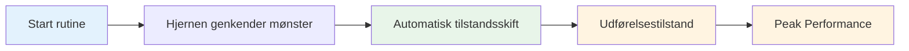

# Opbygning af din pre-shot-rutine

Your pre-shot routine is one of the most powerful tools in your mental game. It's a consistent sequence of actions that prepares you for each throw and triggers your best performance state.

::: tip Den store idé
**Din rutine er din gateway til zonen.** En konsekvent pre-shot rutine signalerer din hjerne: "Det er tid til at udføre." Med gentagelse bliver det en automatisk trigger for toppræstation.
:::

## Hvorfor rutiner virker

### Konsistens skaber tillid
Når du gør det samme hver gang, fjerner du variabler. Din krop ved, hvad der kommer. Dette skaber en følelse af kontrol og fortrolighed, selv i ukendte situationer.

### Rutiner udløser stater
Med gentagelser bliver din rutine knyttet til din præstationstilstand. Start af rutinen starter automatisk det mentale skift til udførelsestilstand.

### Rutiner blokerer distraktioner
En rutine giver dit sind noget at fokusere på. Der er ikke plads til at bekymre sig om partituret, publikum eller hvad der kan ske.

### Rutiner Administrer ophidselse
En veldesignet rutine hjælper med at regulere dit energiniveau - beroliger dig, hvis du er for kraftig, fokuserer dig, hvis du er flad.

## Elementer i en effektiv rutine

### Fase 1: Vurdering (uden for cirklen)

Inden du træder ind, skal du indsamle oplysninger:
- Læs terrænet (skråninger, forhindringer, overflade)
- Vurder situationen (score, kuglepositioner)
- Vælg dit mål og landingssted
- Beslut dig for kastetype (peg, skyd, lob, rul)

**Det er her, der tænkes.** Tag dig god tid her.

### Fase 2: Overgang (ind i cirklen)

Skiftet fra at tænke til at gøre:
- Fysisk handling (træde ind i cirkel på en konsekvent måde)
- Mental cue (et ord eller en sætning, der signalerer "udførelsestilstand")
- Åndedræt (én bevidst åndedrag for at centrere dig selv)

**Dette er kontakten.** Analysen stopper her.

### Fase 3: Opsætning (In the Circle)

Forbered din krop:
- Konsekvent holdning (samme hver gang)
- Grip check (mærk boulen)
- Tilpasning til målet
- Fysisk trigger (en lille bevægelse, der er din)

### Fase 4: Visualisering (kortfattet)

Se kastet før du laver det:
- Forestil dig boldens bane (maks. 2-3 sekunder)
- Mærk det vellykkede kast
- Forbind visuelt med dit mål

### Fase 5: Udførelse

Lav kastet:
- Eksternt fokus (kun mål)
- Stol på din krop
- Slip uden tøven
- Følg naturligt igennem

## Opbygning af din personlige rutine

### Trin 1: Observer, hvad du allerede gør

Du har sikkert allerede en rutine. Meddelelse:
- Hvad gør du før gode kast?
- Hvad føles naturligt for dig?
- Hvad hjælper dig med at fokusere?

### Trin 2: Design din rutine

Opret en sekvens, der inkluderer:
- [ ] Vurderingsfase
- [ ] Klart overgangsmoment
- [ ] Konsekvent fysisk opsætning
- [ ] Kort visualisering
- [ ] Udførelsesudløser

### Trin 3: Skriv det ned

Vær specifik. Eksempel:

1. **Vurder:** Læs terræn, vælg landingssted
2. **Overgang:** Træd ind i cirkel med venstre fod først, sig "tillid"
3. **Opsætning:** Fødder i skulderbredde, grebskontrol, juster skuldrene
4. **Visualiser:** Se stien, mærk frigivelsen
5. **Udfør:** Øjne på målet, kast

### Trin 4: Øv religiøst

Brug din rutine på HVER kast i træning:
- Lette kast
- Svære kast
- Når du er træt
- Når du er frisk

Rutinen skal blive automatisk.

### Trin 5: Forfin over tid

Din rutine vil udvikle sig. Læg mærke til, hvad der virker, og juster. Men skift det ikke under konkurrencen - kun mellem arrangementer.

## Rutinemæssig timing

Din rutine bør tage en ensartet tid:
- For hurtigt: Du skynder dig, ikke ordentligt forberedt
- For langsomt: Du overtænker, mister flow
- Lige rigtigt: Tid nok til at forberede sig, ikke så meget, at du tænker for meget

**Typisk timing:**
- Vurdering: 5-10 sekunder
- Overgang + Opsætning: 3-5 sekunder
- Visualisering + Udførelse: 3-5 sekunder
- **I alt: 10-20 sekunder**

## Almindelige rutinefejl

|  | Fejl | Problem | Løsning |  |
|--------|--------|--------|
|  | Spring over i praksis | Rutine er ikke automatisk | Brug det hvert eneste kast |  |
|  | For kompliceret | Svært at huske under pres | Forenkle til væsentlige |  |
|  | Tænker under udførelsen | Forstyrrer automatisk ydeevne | Klart overgangspunkt |  |
|  | Inkonsekvent timing | Skaber usikkerhed | Øv dig med konstant tempo |  |
|  | Skiftende midtkonkurrence | Indfører tvivl | Hold dig til det du ved |  |

## Rutinemæssig fejlfinding

**Hvis du skynder dig:**
- Tilføj et pust ved overgangen
- Sænk dine opsætningsbevægelser
- Pause før visualisering

**Hvis du tænker over:**
- Forkort rutinen
- Brug en stærkere overgangssignal
- Fokuser mere eksternt

**Hvis du er inkonsekvent:**
- Video selv for at tjekke
- Øv rutinen uden at kaste
- Få feedback fra en partner

## Eksempel på rutiner

### Simpel rutine
1. Vælg mål
2. Træd ind, træk vejret
3. Grib, juster
4. Se det, smid det

### Detaljeret rutine
1. Læs terræn, vælg landingssted
2. Træd først venstre fod ind
3. Sig "glat" internt
4. Et åndedrag, skuldrene falder
5. Fødder sat, greb kontrol
6. Juster skuldrene til målet
7. Se stien (2 sekunder)
8. Øjnene låses på målet
9. Kast

## Nøgle takeaway

> Din rutine er dit anker. I kaos er det din konstante.

Byg det omhyggeligt. Øv det altid. Stol helt på det.

