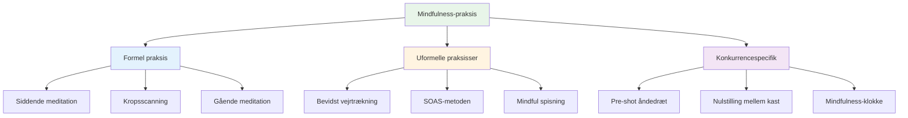

# Mindfulness-teknikker
<AdBanner />

Her er praktiske teknikker, du kan bruge til at udvikle mindfulness. Start med en eller to, og byg derfra.

::: tip Den store idé
**Mindfulness er en færdighed, ikke et talent.** Ligesom at pege eller skyde forbedres det med øvelse. Start småt, vær konsekvent, og fordelene forstærkes over tid.
:::

## Formel praksis

Disse er dedikerede mindfulness-sessioner - tid afsat specifikt til øvelse.

### Siddende meditation

Fundamentet for mindfulness-praksis.

**Sådan gør du det:**
1. Sid behageligt (på stol eller gulv)
2. Luk øjnene eller blødgør dit blik
3. Fokuser på dit åndedræt - fornemmelsen af luft, der kommer ind og ud
4. Når tanker opstår, så læg mærke til dem uden at dømme
5. Vend blidt opmærksomheden tilbage til åndedrættet
6. Start med 5 minutter, øg til 15-20

**Tips:**
- Tanker vil komme - det er normalt
- Hver gang du bemærker, at du har vandret og vender tilbage, opbygger du færdigheden
- Døm ikke dig selv for at vandre
- Konsistens er vigtigere end varighed

### Kropsscanning

Udvikler bevidsthed om fysiske sanseindtryk.

**Sådan gør du det:**
1. Lig ned eller sid behageligt
2. Start ved dine fødder - læg mærke til eventuelle fornemmelser
3. Bevæg langsomt opmærksomheden opad: ankler, lægge, knæ...
4. Læg mærke til uden at forsøge at ændre noget
5. Hvis du oplever spændinger, så træk vejret ind i det område
6. Fortsæt til toppen af dit hoved
7. Tager 10-20 minutter

**Til petanque:** Hjælper dig med at bemærke spændinger, før de påvirker dit kast.

### Gående meditation

Mindfulness i bevægelse - god forberedelse til pisten.

**Sådan gør du det:**
1. Gå langsomt og bevidst
2. Mærk hver del af skridtet: løft, bevæg, placer
3. Læg mærke til fornemmelserne i dine fødder og ben
4. Når dine tanker vandrer, så vend tilbage til de fysiske fornemmelser
5. 5-10 minutter er nok

## Uformelle praksisser

<AdInArticle />

Disse integrerer mindfulness i daglige aktiviteter.

### Bevidst vejrtrækning

Den enkleste teknik - tilgængelig når som helst.

**Øvelsen:**
- Tag 3 langsomme, bevidste indåndinger
- Fokuser fuldt ud på sansningen
- Brug den som en nulstillingsknap hele dagen

**Hvornår skal det bruges:**
- Før man træder ind i cirklen
- Når du bemærker ophobning af stress
- Mellem kampene
- Ethvert overgangsmoment

### SOAS-metoden

Dit værktøj til at håndtere svære øjeblikke.

| Trin | Handling | Eksempel |
|------|--------|---------|
| **Stop | Pause, reager ikke | Kast ikke hænderne op efter en forbipasserende |
| **Observere | Læg mærke til hvad der sker | &quot;Jeg føler mig frustreret. Min kæbe er stram.&quot; |
| **Acceptere | Anerkend uden at kæmpe | &quot;Sådan har jeg det lige nu.&quot; |
| **Glide | Lad det gå, kom videre | Slip spændingen, vend tilbage til nutiden |

**Øv dette i hverdagen**, så det sker automatisk i konkurrencer.

### Mindful spisning

En overraskende kraftfuld praksis.

**Sådan gør du det:**
- Spis ét måltid uden distraktioner (ingen telefon, tv)
- Læg mærke til farverne, duftene, teksturerne
- Tyg langsomt, smag grundigt
- Læg mærke til, hvornår du er tilfreds

**Hvorfor det er vigtigt:** Opbygger den generelle færdighed i at være opmærksom.

### Sensorisk bevidsthed

Fuldstændig engagement i dine omgivelser.

**5-4-3-2-1-teknikken:**
- Læg mærke til 5 ting, du kan se
- Læg mærke til 4 ting, du kan høre
- Læg mærke til 3 ting, du kan mærke
- Læg mærke til 2 ting du kan lugte
- Læg mærke til én ting du kan smage

**Brug dette:** Når dine tanker er på jagt før en stor kamp.

## Konkurrencespecifikke teknikker

### Pre-shot-åndedrættet

Integrer vejrtrækningen i din rutine:

1. Tag et bevidst åndedrag, inden du går ind i cirklen
2. Føl dine fødder på jorden
3. Lad dine skuldre sænke sig ved udåndingen
4. Så start din rutine

### Nulstilling mellem kast

Hvad skal man gøre, mens man venter:

- Læg mærke til, hvor din opmærksomhed går hen
- Hvis det går til score/resultat, anerkend og vend tilbage til præsentationen
- Fokuser på noget neutralt (din vejrtrækning, følelsen af en boule)
- Forbliv fysisk afslappet

### &quot;Mindfulness-klokken&quot;

Brug triggere til at minde dig om at være til stede:

- Hver gang du tager en kugle op
- Når du hører donkraften blive kastet
- Når du træder ind i cirklen
- Når et spil slutter

Hver trigger = ét bevidst åndedrag.

## Opbygning af din praksis

### Uge 1-2: Grundlæggende
- 5 minutters siddende meditation dagligt
- 3 bevidste vejrtrækninger før hvert måltid
- Øv SOAS én gang, når noget mindre går galt

### Uge 3-4: Udvidelse
- Øg meditationen til 10 minutter
- Tilføj kropsscanning to gange om ugen
- Brug mindfulness-klokkeudløsere i praksis

### Uge 5+: Integration
- 15-20 minutters daglig træning
- Fuld integration i rutinen før indtagelse
- SOAS bliver automatisk reaktion på fejl

## Almindelige udfordringer

| Udfordring | Løsning |
|-----------|----------|
| &quot;Jeg kan ikke holde op med at tænke&quot; | Det skal du ikke. Bare læg mærke til det og vend tilbage. |
| &quot;Jeg har ikke tid&quot; | Start med 3 minutter. Alle har 3 minutter. |
| &quot;Jeg falder i søvn&quot; | Prøv at sidde i stedet for at ligge ned, eller øv dig tidligere på dagen. |
| &quot;Det føles meningsløst&quot; | Fordele kommer med konsistens. Stol på processen. |
| &quot;Jeg glemmer at øve mig&quot; | Indstil en daglig påmindelse. Forbind den med en eksisterende vane. |

## Vigtig konklusion

> Mindfulness er en færdighed. Ligesom enhver anden færdighed forbedres den med øvelse.

Start småt. Vær konsekvent. Fordelene forstærkes over tid.

<AdBanner />
