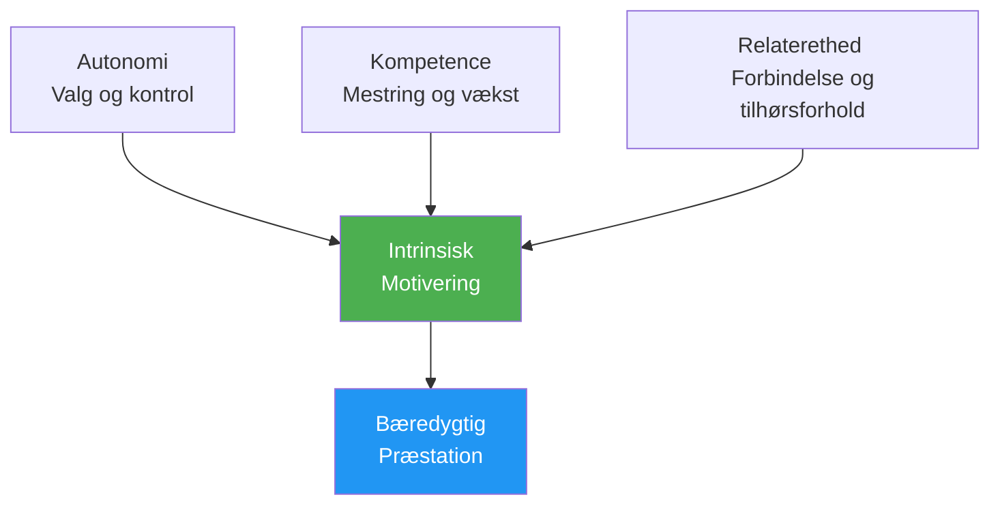

# Motivationspsykologi

At forstå HVORFOR du er motiveret – ikke bare at du er det – hjælper dig med at opbygge en bæredygtig drivkraft, der ikke afhænger af resultater.

---

## Intrinsisk vs. Ekstrem Motivation

### Ekstrem motivation

Motivation drevet af eksterne belønninger eller pres:

| Kilde | Eksempel |
|--------|---------|
| **Trofæer/medaljer** | &quot;Jeg vil vinde mesterskabet&quot; |
| **Rangeringer** | &quot;Jeg vil gerne være i top 10 i min region&quot; |
| **Anerkendelse** | &quot;Jeg vil have, at andre ser mig som en god spiller&quot; |
| **Undgå kritik** | &quot;Jeg vil ikke skuffe mit hold&quot; |
| **Finansiel** | &quot;Jeg vil gerne vinde præmiepenge&quot; |

**Karakteristika:**
- Kan give stærk indledende motivation
- Ofte aftager med tiden
- Afhængig af faktorer uden for din kontrol
- Kan undergrave nydelsen

### Intrinsisk motivation

Motivation fra selve aktiviteten:

| Kilde | Eksempel |
|--------|---------|
| **Mestring** | &quot;Jeg elsker følelsen af at blive bedre&quot; |
| **Flyde** | &quot;Tiden forsvinder, når jeg spiller&quot; |
| **Udfordring** | &quot;Jeg nyder at teste mig selv i forhold til problemer&quot; |
| **Udtryk** | &quot;Petanque giver mig mulighed for at udtrykke, hvem jeg er&quot; |
| **Glæde** | &quot;Jeg elsker simpelthen at spille dette spil&quot; |

**Karakteristika:**
- Mere bæredygtig over tid
- Uafhængig af resultater
- Forbundet til dybere tilfredshed
- Forbedrer ydeevnen naturligt

::: tip Forskningen
Studier viser konsekvent, at **indre motivation fører til bedre præstationer, mere vedholdenhed og større velvære** end ydre motivation alene.
:::

---

## Selvbestemmelsesteori (SDT)

SDT, udviklet af Deci &amp; Ryan, identificerer tre grundlæggende psykologiske behov, der driver indre motivation:

### 1. Autonomi

**Behovet for at føle kontrol over dine valg**

| Understøtter autonomi | Underminerer autonomi |
|-------------------|---------------------|
| Valg af dit træningsfokus | Får at vide præcis, hvad man skal gøre |
| At sætte dine egne mål | Eksternt pres for at præstere |
| Beslutning om, hvordan man skal øve sig | Tvungen deltagelse |
| At have indflydelse på teamets beslutninger | Kontrollerende trænere/holdkammerater |

**Til petanque:**
- Vælg hvilke aspekter du vil arbejde med
- Sæt din egen udviklingssti
- Træf selv taktiske beslutninger
- Ejer din træningsplan

### 2. Kompetence

**Behovet for at føle sig effektiv og dygtig**

| Understøtter kompetence | Underminerer kompetence |
|---------------------|----------------------|
| Passende udfordringer | Opgaver for lette eller for svære |
| Tydelig feedback på fremskridt | Ingen feedback eller kun negativ |
| Synlig forbedring | Stagnation uden forklaring |
| Færdighedsrelateret konkurrence | Konstant overmatchning |

**Til petanque:**
- Spor dine forbedringsmålinger
- Søg passende konkurrenceniveauer
- Fejr små sejre
- Få specifik feedback (ikke kun resultater)

### 3. Relationalitet

**Behovet for kontakt med andre**

| Understøtter beslægtethed | Underminerer tilknytning |
|----------------------|------------------------|
| Positive teamrelationer | Isolation |
| Delte mål med holdkammerater | Rent individuelt fokus |
| Tilhørsforhold til fællesskabet | Udelukkelse eller konflikt |
| Mentorskab (at give/modtage) | Kun konkurrenceprægede relationer |

**Til petanque:**
- Skab ægte teamforbindelser
- Find træningspartnere
- Deltag i klubbens fællesskabsaktiviteter
- Del viden med andre

---

## SDT-formlen

```
Autonomy + Competence + Relatedness = Intrinsic Motivation
```

Når alle tre behov er opfyldt, blomstrer den indre motivation naturligt.



---

## Motivationstyper Spektrum

SDT beskriver motivation på et spektrum fra ekstern til intern:

| Type | Beskrivelse | Eksempel | Kvalitet |
|------|-------------|---------|---------|
| **Motivation** | Ingen motivation | &quot;Hvorfor besvære dig?&quot; | ❌ |
| **Ekstern** | For at opnå belønninger/undgå straf | &quot;Jeg får en trofæ&quot; | ⭐ |
| **Introduceret** | Indre pres, skyldfølelse | &quot;Jeg burde øve mig&quot; | ⭐⭐ |
| **Identificeret** | Værdifuldt resultat | &quot;Dette hjælper mig med at forbedre mig&quot; | ⭐⭐⭐ |
| **Integreret** | I overensstemmelse med værdier | &quot;Det her er jeg&quot; | ⭐⭐⭐⭐⭐ |
| **Iboende** | Ren nydelse | &quot;Jeg elsker dette&quot; | ⭐⭐⭐⭐⭐⭐ |

**Mål:** Flyt din motivation mod den indre ende af spektret.

---

## Selvevaluering: Din motivationsprofil

Bedøm hvert udsagn (1 = Slet ikke, 5 = Helt):

**Ydre indikatorer:**
| Erklæring | Score |
|-----------|-------|
| Jeg spiller primært for at vinde turneringer | /5 |
| Anerkendelse fra andre betyder meget for mig | /5 |
| Jeg ville miste interessen uden konkurrencemæssig succes | /5 |
| **Ekstrinsik total** | /15 |

**Intrinsiske indikatorer:**
| Erklæring | Score |
|-----------|-------|
| Jeg ville spille, selvom der ikke var nogen konkurrencer | /5 |
| Følelsen af forbedring begejstrer mig | /5 |
| Jeg mister tidsfornemmelsen, når jeg spiller | /5 |
| **Intrinsisk total** | /15 |

**Fortolkning:**
- Højere intrinsisk total = mere bæredygtig motivation
- Balancen er fin, men sørg for at intrinsisk ≥ ydre
- Hvis det er ydre &gt;&gt; iboende, så genoptag forbindelsen til din kærlighed til spillet

---

## Skift mod indre motivation

### Genopret forbindelsen med glæden

- **Husk hvorfor du startede** — Hvad tiltrak dig i starten?
- **Spil uden indsatser** — Lejlighedsvise sessioner &quot;bare for sjov&quot;
- **Sæt pris på øjeblikke** — Læg mærke til, hvornår du nyder spillet

### Fokus på mestring

- **Sæt læringsmål** ikke kun resultatmål
- **Fejr forbedringer** uanset resultater
- **Omfavn udfordringer** som vækstmuligheder

### Opbyg autonomi

- **Træf dine egne valg** om træning
- **Tag ejerskab over din udvikling**
- **Modstå ydre pres** for at træne på bestemte måder

### Dyrk forbindelse

- **Investér i relationer** ud over konkurrencen
- **Del viden** med spillere i udvikling
- **Find dit fællesskab** inden for sporten

---

## Relateret indhold

- [Målsætning](/da/uddannelse/motivation/) — Sætte effektive mål
- [Opretholdelse af motivation](/da/uddannelse/motivation/opretholdelse) — Langsigtet bæredygtighed
- [Zonen](/da/uddannelse/mentalt-spil/zonen/) — Indre motivation og flow
- [Teamdynamik](/da/uddannelse/teamdynamik/) — Sammenhæng i teamkontekst

