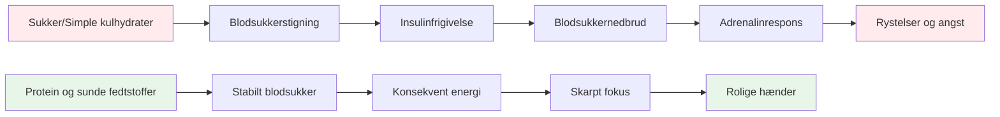
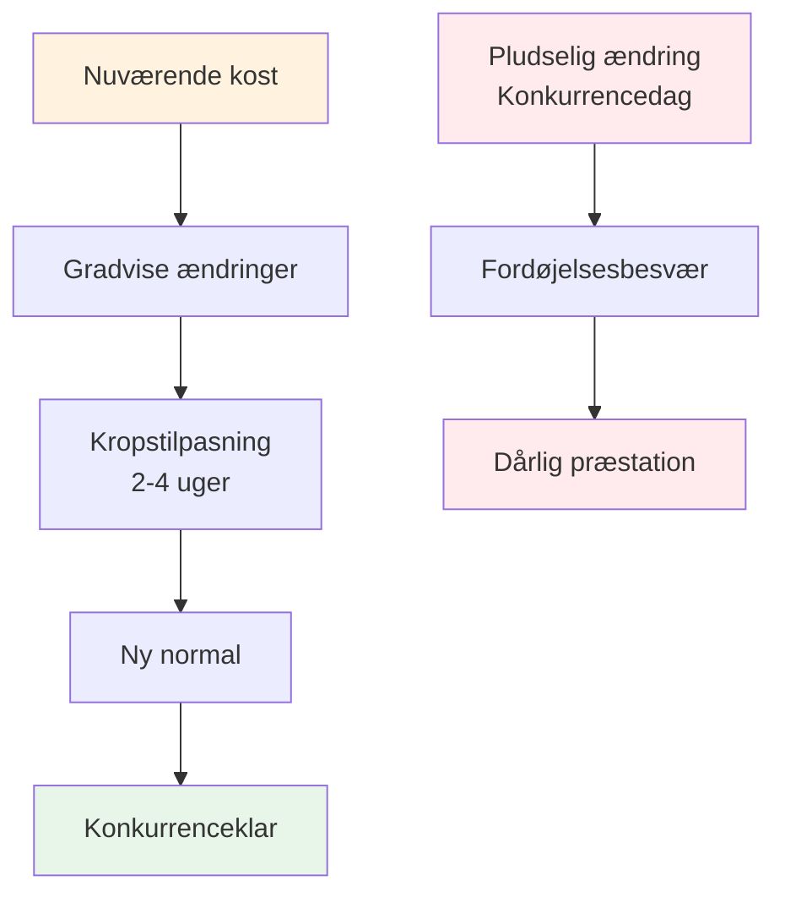

# Ernæring til præcisionspræstation


Petanque er en præcisionssport, ikke en udholdenhedssport. Dine ernæringsmæssige behov er anderledes end en maratonløbers eller en fodboldspillers. Det vigtigste er **hjernens brændstofstabilitet** - at holde dit sind skarpt og dine hænder stabile gennem en lang konkurrencedag.

::: tip Den store idé
**Din hjerne er dit vigtigste redskab i petanque. Giv den stabil brændstof, ikke rutsjebaneenergi.** Fokuser på protein, sunde fedtstoffer og at holde dig hydreret. Undgå sukkerstigninger.
:::



## Præcisionsatletens udfordring

I modsætning til højintensive sportsgrene kræver petanque ikke massive glykogenlagre eller hurtig energiopfyldning. Det, det kræver, er:

- **Stabilt blodsukker** - ingen stigninger eller fald
- **Konsekvent mental klarhed** - fokus der varer hele dagen
- **Stille hænder** - ingen rystelser eller rystelser
- **Rolige nerver** - lav angst og stressrespons

Din ernæringsstrategi bør optimere efter disse faktorer, ikke efter rå energiproduktion.

## Problemet med sukker og simple kulhydrater

Mange atleter vælger som standard en kulhydratrig kost. For petanque-spillere kan dette faktisk skade præstationen.

### Blodsukker-rutsjebanen

Når du spiser sukker eller simple kulhydrater:
1. Blodsukkeret stiger hurtigt
2. Insulin frigives for at sænke det
3. Blodsukkerfald (hypoglykæmi)
4. Din krop frigiver adrenalin for at kompensere
5. Du oplever rystelser, angst og dårlig fokus

**Dette er det modsatte af, hvad du har brug for til præcision.**

### Symptomer på ustabilitet i blodsukkeret

| Symptom | Indvirkning på ydeevne |
|---------|----------------------|
| Rystende hænder | Inkonsekvent udgivelse |
| Koncentrationsbesvær | Dårlig beslutningstagning |
| Irritabilitet | Teamkonflikt, dårlig ro |
| Træthed efter måltider | Eftermiddagsnedtur |
| Angst | Trykfølsomhed |
| Hjernetåge | Langsom taktisk tænkning |

## En bedre tilgang: Stabil energi

Målet er at forsyne din hjerne med regelmæssigt brændstof uden rutsjebanen.

### Nøgleprincipper

1. **Prioriter protein og sunde fedtstoffer** - De giver langsom, stabil energi
2. **Vælg komplekse kulhydrater frem for simple** - Hvis du spiser kulhydrater, så vælg dem, der fordøjes langsomt
3. **Undgå sukkerstigninger** - Især før og under konkurrence
4. **Hold jer hydreret** - Dehydrering påvirker koncentrationen betydeligt
5. **Spis regelmæssigt** - Lad dig ikke blive for sulten

### Madvarer der hjælper

| Madtype | Eksempler | Hvorfor det virker |
|-----------|----------|--------------|
| Protein | Æg, nødder, ost, kød | Langsom fordøjelse, stabil energi |
| Sunde fedtstoffer | Avocado, olivenolie, nødder | Langtidsholdbart brændstof |
| Komplekse kulhydrater | Grøntsager, bælgfrugter | Fiber forsinker absorptionen |
| Frugt med lavt sukkerindhold | Bær, æbler | Næringsstoffer uden pigge |

### Madvarer, der skal begrænses

| Madtype | Eksempler | Hvorfor det er problematisk |
|-----------|----------|---------------------|
| Sukker | Slik, sodavand, kager | Hurtig stigning og styrt |
| Hvidt brød/pasta | Sandwiches, pastaretter | Hurtig omdannelse til sukker |
| Frugtjuice | Appelsinjuice, smoothies | Koncentreret sukker |
| Energidrikke | De fleste kommercielle mærker | Sukker + koffein crash |

## Ernæring på konkurrencedagen

### Før konkurrencen

**2-3 timer før:**
- Balanceret måltid med protein, fedt og grøntsager
- Undgå tunge kulhydrater, der kan forårsage døsighed
- Eksempel: Æg med grøntsager eller salat med kylling

**1 time før:**
- Let snack om nødvendigt
- Nødder, ost eller en lille portion protein
- Undgå alt sukkerholdigt

### Under konkurrencen

**Mellem kampene:**
- Vand (vigtigst)
- Små proteinsnacks (nødder, ost, kød)
- Undgå sukkerholdige snacks og drikkevarer

**Tegn på, at du skal spise:**
- Koncentrationsbesvær
- Irritabilitet
- Følelse af rystelse
- Hovedpine

### Efter konkurrencen

- Genopfyld med et afbalanceret måltid
- Rehydrer fuldt ud
- &quot;Beløn&quot; ikke dig selv med sukker - det vil påvirke din restitution

## Hydrering

Dehydrering påvirker den kognitive funktion, før du føler dig tørstig.

### Retningslinier

- **Start med at drikke væske** - Drik vand i løbet af dagen før konkurrencen
- **Under leg** - Drik regelmæssigt vand, vent ikke til du er tørstig
- **Undgå for meget koffein** - Det er et vanddrivende middel
- **Vær opmærksom på tegn** - Hovedpine, mørk urin, træthed

### Hvor meget?

En generel retningslinje: Sigt efter en lysegul urin. Hvis den er mørk, har du brug for mere vand.

## Lavkulhydratmuligheden

Nogle præcisionsatleter følger lavkulhydrat- eller ketogene diæter. Teorien:

**Potentielle fordele:**
- Meget stabilt blodsukker (ingen mulige stigninger)
- Konsekvent mental klarhed
- Reduceret angst og rystelser
- Ingen energinedbrud eftermiddagen

**Overvejelser:**
- Kræver tilvænningsperiode (1-2 uger)
- Ikke egnet til alle
- Kræver planlægning og engagement
- Kontakt først en sundhedsudbyder


Dette er en avanceret strategi - ikke nødvendig for alle, men værd at overveje, hvis blodsukkerstabilitet er et væsentligt problem for dig.

## Mad som øvelse: Træning af din krop

::: warning Kritisk koncept
**Mad er ikke bare brændstof - det er noget, du træner med.** Ligesom du træner dit kast, skal du øve din ernæring for at gøre din krop fortrolig med at spise på konkurrencedagen.
:::

### Hvorfor er fødevarepraksis vigtig

Dit fordøjelsessystem kan trænes. Det, du spiser regelmæssigt, bliver det, din krop forventer og håndterer bedst. Hvis du kun spiser protein og grøntsager på konkurrencedage, vil din krop ikke være tilpasset det.

**Problemet:**
- At spise ukendt mad på konkurrencedagen kan forårsage fordøjelsesbesvær
- Din krop har brug for tid til at tilpasse sig nye spisemønstre
- Stress + ukendt mad = potentielle maveproblemer
- Præstationsangst er slemt nok uden at det øger fordøjelsesangsten

**Løsningen:**
- Øv din konkurrenceernæring under træning
- Gør din konkurrencedagsmad til en del af din regelmæssige rutine
- Træn din krop til at være komfortabel med mad med stabil energi

### Tilpasningsprocessen



Når du ændrer din kost:
1. **Uge 1-2:** Din krop vænner sig til nye fødevarer, men den kan føles anderledes
2. **Uge 3-4:** Tilpasning sker, nye fødevarer føles normale
3. **Uge 5+:** Din krop er komfortabel og effektiv med disse fødevarer

**Derfor kan du ikke bare &quot;spise sundt&quot; på konkurrencedagen og forvente optimale resultater.**

### Sådan øver du dig i din ernæring

#### 1. Start under træning

**Øv din konkurrencedagsspisning under træningssessionerne:**
- Spis det samme måltid før træning, som du ville spise før konkurrence
- Medbring de samme snacks, som du ville medbringe til en turnering
- Læg mærke til, hvordan din krop reagerer
- Justér baseret på, hvad der virker

**Eksempel på træningsdag:**
```
2-3 hours before: Eggs with vegetables (same as competition)
During training: Water + nuts (same as competition)
After training: Balanced meal with protein
```

#### 2. Gør det til din normale

**Hvis du ikke har en &quot;konkurrencediæt&quot; og en &quot;almindelig diæt&quot;** - dette skaber to problemer:
- Din krop tilpasser sig aldrig helt til nogen af delene
- Konkurrencemad føles uvant og stressende

**I stedet:**
- Gør mad med stabil energi til din daglige norm
- Din krop bliver effektiv til at bruge protein og fedt
- Konkurrencedagen føles normal, ikke anderledes
- Ingen fordøjelsesoverraskelser

#### 3. Test og forfin

**Brug træning til at eksperimentere:**

| Prøve | Hvad man skal bemærke | Tilpasse |
|------|----------------|--------|
| Måltider før træning | Energiniveauer, fokus | Find dit optimale vindue |
| Forskellige proteinkilder | Fordøjelse, komfort | Identificer, hvad der fungerer bedst |
| Snacktyper | Vedvarende energi | Find dine yndlingssnacks |
| Hydreringsmængder | Koncentration, toiletpauser | Balanceindtag |

**Før en simpel logbog:**
- Hvad du spiste og hvornår
- Hvordan du havde det under træningen
- Energiniveauer og fokus
- Eventuelle fordøjelsesproblemer

#### 4. Skab komfort og selvtillid

**Den psykologiske fordel:**

Når du har øvet din ernæring hundredvis af gange under træning:
- Du ved præcis, hvordan din krop vil reagere
- Ingen bekymring over madvalg
- Én ting mindre at bekymre sig om på konkurrencedagen
- Tillid til din forberedelse

**Dette er det samme princip som at øve dit kast** - gentagelse opbygger komfort og pålidelighed.

### Almindelige tilpasningsudfordringer

::: details Overgang fra kulhydratrig til energirig kost

**Udfordring:** Du er vant til brød, pasta og sukkerholdige snacks

**Tilvænningsperiode:** 2-4 uger

**Hvad du kan forvente:**
- Uge 1: Kan føles anderledes, trang til gammeldags mad
- Uge 2: Energien stabiliserer sig, trangen mindskes
- Uge 3-4: Ny normal, kropseffektiv med fedt/protein

**Sådan øver du dig:**
- Start med ét måltid ad gangen
- Erstat først simple kulhydrater med komplekse kulhydrater
- Øg gradvist protein og sunde fedtstoffer
- Øv dig først under træning med lav indsats
:::

::: details At finde fødevarer, der virker for dig

**Udfordring:** Ikke alle fordøjer den samme mad godt

**Hvad skal testes:**
- Forskellige proteinkilder (æg vs. kød vs. nødder)
- Måltidernes tidspunkt (2 timer vs. 3 timer før)
- Portionsstørrelser (for meget = sløv, for lidt = sulten)
- Specifikke fødevarer, der forårsager ubehag

**Øvelsesmetode:**
- Prøv én variabel ad gangen
- Giv hver test 2-3 træningssessioner
- Læg mærke til, hvad der får dig til at føle dig bedst tilpas
- Byg din personlige &quot;konkurrencemenu&quot;
:::

::: details Håndtering af turneringsmadmiljøer

**Udfordring:** Turneringer har ofte begrænsede madmuligheder

**Øvelsesløsning:**
- Medbring altid dine egne snacks (øv dig i dette)
- Undersøg steder på forhånd, når det er muligt
- Hav backupmuligheder, som du ved virker
- Øv dig i at spise i forskellige miljøer

**Mental forberedelse:**
- Stol ikke på maden på stedet
- Behandl mad som en del af dit udstyr
- Pak det, som du pakker dine boules
:::

### 30-dages ernæringspraksisplan

**Mål:** Gør stabil energispisning til din behagelige normalitet

**Uge 1-2: Fundament**
- Erstat ét måltid om dagen med konkurrencemad
- Øv dig i ernæring før træning
- Begynd at medbringe snacks til træning
- Læg mærke til, hvordan din krop reagerer

**Uge 3-4: Udvidelse**
- Lav to måltider om dagen stabilt energifokuserede
- Øv dig i at spise hele konkurrencedagen på træningsdagene
- Forfin dine snackvalg
- Lav din liste over madvarer

**Uge 5+: Mestring**
- Stabil energikost er din nye normal
- Kroppen er fuldt tilpasset
- Konkurrencedagen føles rutinemæssig
- Tillid til din ernæring

### Dit konkurrencemadsæt

**Øv dig i at pakke dette til hver træningssession:**

**Før konkurrencen (2-3 timer før):**
- [ ] Proteinkilde (æg, kød eller nødder)
- [ ] Grøntsager eller salat
- [ ] Sundt fedt (avocado, olivenolie, ost)

**Under konkurrencen:**
- [ ] Vandflaske (genopfyldelig)
- [ ] Blandede nødder (små portioner)
- [ ] Hårdkogte æg (hvis du kan holde dem kolde)
- [ ] Osteterninger eller strengeost
- [ ] Tørret eller tørret kød
- [ ] Backup-snacks

**Jo mere du øver dig med dette sæt, jo mere automatisk bliver det.**

## Praktiske tips

### Nemme konkurrencesnacks
- Blandede nødder (usaltede)
- Hårdkogte æg
- Osteterninger
- Tørret oksekød eller kalkun
- Grøntsager med hummus
- Oliven

### Hvad skal man undgå
- Snacks til automater
- Sukkerholdige sportsdrikke
- Bagværk og kager
- Slik- og chokoladebarer
- De fleste &quot;energi&quot;-barer (tjek sukkerindholdet)

## Vigtig konklusion

> Din hjerne er dit vigtigste redskab i petanque. Giv den stabil brændstof, ikke rutsjebaneenergi. Og øv dig i din ernæring, ligesom du øver dit kast - gentagelse skaber komfort og pålidelighed.

Fokuser på protein, sunde fedtstoffer og at holde dig hydreret. Undgå sukkerstigninger. **Vigtigst af alt: Gør din konkurrencedags ernæring til din daglige ernæring.** Din krop har brug for træning for at præstere bedst muligt.

**Husk:** Du ville ikke møde op til en turnering med en kasteteknik, du aldrig har øvet dig på. Mød heller ikke op med en ernæringsstrategi, du aldrig har øvet dig på.

