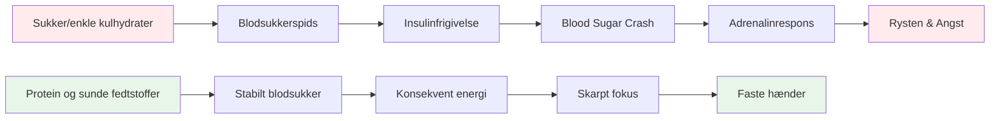

# Ernæring til præcisionsydelse

Petanque er en præcisionssport, ikke en udholdenhedssport. Dit ernæringsbehov er anderledes end en maratonløber eller en fodboldspiller. Det, der betyder mest, er **hjernebrændstofstabilitet** - at holde dit sind skarpt og dine hænder stabile gennem en lang konkurrencedag.

::: tip Den store idé
**Din hjerne er dit vigtigste værktøj i petanque. Giv den stabilt brændstof, ikke energi fra rutsjebane.** Fokuser på protein, sunde fedtstoffer og forbliv hydreret. Undgå sukkerspidser.
:::

## Præcisionsatletens udfordring

I modsætning til højintensiv sport kræver petanque ikke massive glykogenlagre eller hurtig energigenopfyldning. Hvad det kræver er:

- **Stabilt blodsukker** - ingen spidser eller styrt
- **Konsekvent mental klarhed** - fokus, der varer hele dagen
- **Stabile hænder** - ingen rystelser eller rystelser
- **Rolige nerver** - lav angst- og stressreaktion

Din ernæringsstrategi bør optimere for disse faktorer, ikke for rå energiproduktion.

## Problemet med sukker og simple kulhydrater

Mange idrætsudøvere vælger som standard diæter med højt kulhydratindhold. For petanquespillere kan dette faktisk skade præstationen.

### Blood Sugar rutsjebanen

Når du spiser sukker eller simple kulhydrater:
1. Blodsukkeret stiger hurtigt
2. Insulin frigives for at bringe det ned
3. Blodsukkerfald (hypoglykæmi)
4. Din krop frigiver adrenalin for at kompensere
5. Du oplever rystelser, angst og dårligt fokus

**Dette er det modsatte af, hvad du har brug for for præcision.**

### Symptomer på ustabilt blodsukker

|  | Symptom | Indvirkning på ydeevne |  |
|--------|----------------------------|
|  | Rystende hænder | Inkonsekvent udgivelse |  |
|  | Besvær med at koncentrere sig | Dårlig beslutningstagning |  |
|  | Irritabilitet | Teamkonflikt, dårlig ro |  |
|  | Træthed efter måltider | Eftermiddagsnedgang |  |
|  | Angst | Trykfølsomhed |  |
|  | Hjernetåge | Langsom taktisk tænkning |  |

## En bedre tilgang: Stabil energi

Målet er at give din hjerne ensartet brændstof uden rutsjebanen.

### Nøgleprincipper

1. **Prioriter protein og sunde fedtstoffer** - De giver langsom, stabil energi
2. **Vælg komplekse kulhydrater frem for simple** - Hvis du spiser kulhydrater, skal du vælge dem, der fordøjes langsomt
3. **Undgå sukkerspidser** - Især før og under konkurrence
4. **Forbliv hydreret** - Dehydrering påvirker koncentrationen betydeligt
5. **Spis regelmæssigt** - Lad dig ikke blive for sulten

### Mad der hjælper

|  | Fødevaretype | Eksempler | Hvorfor det virker |  |
|-----------|--------|-------------|
|  | Protein | Æg, nødder, ost, kød | Langsom fordøjelse, stabil energi |  |
|  | Sunde fedtstoffer | Avocado, olivenolie, nødder | Langtidsholdbart brændstof |  |
|  | Komplekse kulhydrater | Grøntsager, bælgfrugter | Fiber bremser absorptionen |  |
|  | Frugter med lavt sukkerindhold | Bær, æbler | Næringsstoffer uden spids |  |

### Fødevarer at begrænse

|  | Fødevaretype | Eksempler | Hvorfor det er problematisk |  |
|-----------|--------|------------------------|
|  | Sukker | Slik, sodavand, kager | Hurtig stigning og nedbrud |  |
|  | Hvidt brød/pasta | Sandwich, pastaretter | Hurtig omdannelse til sukker |  |
|  | Frugtjuice | Appelsinjuice, smoothies | Koncentreret sukker |  |
|  | Energidrikke | De fleste kommercielle mærker | Sukker + koffein crash |  |

## Konkurrencedag Ernæring

### Før konkurrence

**2-3 timer før:**
- Afbalanceret måltid med protein, fedt og grøntsager
- Undgå tunge kulhydrater, der kan forårsage døsighed
- Eksempel: Æg med grøntsager eller salat med kylling

**1 time før:**
- Let snack hvis nødvendigt
- Nødder, ost eller en lille portion protein
- Undgå alt sukkerholdigt

### Under konkurrence

**Mellem spil:**
- Vand (vigtigst)
- Små proteinsnacks (nødder, ost, kød)
- Undgå sukkerholdige snacks og drikkevarer

**Tegn, du skal spise:**
- Besvær med at koncentrere sig
- Irritabilitet
- Føler sig rystende
- Hovedpine

### Efter konkurrence

- Fyld op med et afbalanceret måltid
- Rehydrer fuldt ud
- Lad være med at "belønne" dig selv med sukker - det vil påvirke din restitution

## Hydrering

Dehydrering påvirker den kognitive funktion, før du føler dig tørstig.

### Retningslinier

- **Start hydreret** - Drik vand hele dagen før konkurrencen
- **Under leg** - Sip vand regelmæssigt, vent ikke til du er tørstig
- **Undgå overskydende koffein** - Det er et vanddrivende middel
- **Se efter tegn** - Hovedpine, mørk urin, træthed

### Hvor meget?

En generel retningslinje: sigt efter bleggul urin. Hvis det er mørkt, skal du bruge mere vand.

## Low-Carb muligheden

Nogle præcisionsatleter vedtager diæter med lavt kulhydratindhold eller ketogene diæter. Teorien:

**Potentielle fordele:**
- Meget stabilt blodsukker (ingen stigninger mulige)
- Konsekvent mental klarhed
- Reduceret angst og rysten
- Ingen eftermiddags energinedbrud

**Overvejelser:**
- Kræver tilpasningsperiode (1-2 uger)
- Ikke egnet til alle
- Kræver planlægning og engagement
- Rådfør dig med en sundhedsplejerske først

Dette er en avanceret strategi - ikke nødvendig for alle, men værd at overveje, hvis blodsukkerstabilitet er et væsentligt problem for dig.

## Praktiske tips

### Nem konkurrencesnacks
- Blandede nødder (usaltede)
- Hårdkogte æg
- Ostetern
- Oksekød eller kalkun jerky
- Grøntsager med hummus
- Oliven

### Hvad skal undgås
- Automat snacks
- Sukkerholdige sportsdrikke
- kager og bagværk
- Slik og chokoladebarer
- De fleste "energibarer" (tjek sukkerindhold)

## Nøgle takeaway

> Din hjerne er dit vigtigste værktøj i petanque. Giv den stabilt brændstof, ikke rutsjebaneenergi.

Fokuser på protein, sunde fedtstoffer og forblive hydreret. Undgå sukkerspidser. Din koncentration, ro og faste hænder vil takke dig.

