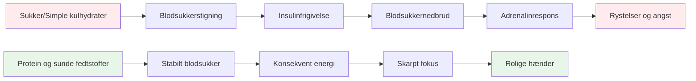

# Ernæring til præcisionspræstation

Petanque er en præcisionssport, ikke en udholdenhedssport. Dine ernæringsmæssige behov er anderledes end en maratonløbers eller en fodboldspillers. Det vigtigste er **hjernens brændstofstabilitet** - at holde dit sind skarpt og dine hænder stabile gennem en lang konkurrencedag.

::: tip Den store idé
**Din hjerne er dit vigtigste redskab i petanque. Giv den stabil brændstof, ikke rutsjebaneenergi.** Fokuser på protein, sunde fedtstoffer og at holde dig hydreret. Undgå sukkerstigninger.
:::

## Præcisionsatletens udfordring

I modsætning til højintensive sportsgrene kræver petanque ikke massive glykogenlagre eller hurtig energiopfyldning. Det, det kræver, er:

- **Stabilt blodsukker** - ingen stigninger eller fald
- **Konsekvent mental klarhed** - fokus der varer hele dagen
- **Stille hænder** - ingen rystelser eller rystelser
- **Rolige nerver** - lav angst og stressrespons

Din ernæringsstrategi bør optimere efter disse faktorer, ikke efter rå energiproduktion.

## Problemet med sukker og simple kulhydrater

Mange atleter vælger som standard en kulhydratrig kost. For petanque-spillere kan dette faktisk skade præstationen.

### Blodsukker-rutsjebanen

Når du spiser sukker eller simple kulhydrater:
1. Blodsukkeret stiger hurtigt
2. Insulin frigives for at sænke det
3. Blodsukkerfald (hypoglykæmi)
4. Din krop frigiver adrenalin for at kompensere
5. Du oplever rystelser, angst og dårlig fokus

**Dette er det modsatte af, hvad du har brug for til præcision.**

### Symptomer på ustabilitet i blodsukkeret

| Symptom | Indvirkning på ydeevne |
|---------|----------------------|
| Rystende hænder | Inkonsekvent udgivelse |
| Koncentrationsbesvær | Dårlig beslutningstagning |
| Irritabilitet | Teamkonflikt, dårlig ro |
| Træthed efter måltider | Eftermiddagsnedtur |
| Angst | Trykfølsomhed |
| Hjernetåge | Langsom taktisk tænkning |

## En bedre tilgang: Stabil energi

Målet er at forsyne din hjerne med regelmæssigt brændstof uden rutsjebanen.

### Nøgleprincipper

1. **Prioriter protein og sunde fedtstoffer** - De giver langsom, stabil energi
2. **Vælg komplekse kulhydrater frem for simple** - Hvis du spiser kulhydrater, så vælg dem, der fordøjes langsomt
3. **Undgå sukkerstigninger** - Især før og under konkurrence
4. **Hold jer hydreret** - Dehydrering påvirker koncentrationen betydeligt
5. **Spis regelmæssigt** - Lad dig ikke blive for sulten

### Madvarer der hjælper

| Madtype | Eksempler | Hvorfor det virker |
|-----------|----------|--------------|
| Protein | Æg, nødder, ost, kød | Langsom fordøjelse, stabil energi |
| Sunde fedtstoffer | Avocado, olivenolie, nødder | Langtidsholdbart brændstof |
| Komplekse kulhydrater | Grøntsager, bælgfrugter | Fiber forsinker absorptionen |
| Frugt med lavt sukkerindhold | Bær, æbler | Næringsstoffer uden pigge |

### Madvarer, der skal begrænses

| Madtype | Eksempler | Hvorfor det er problematisk |
|-----------|----------|---------------------|
| Sukker | Slik, sodavand, kager | Hurtig stigning og styrt |
| Hvidt brød/pasta | Sandwiches, pastaretter | Hurtig omdannelse til sukker |
| Frugtjuice | Appelsinjuice, smoothies | Koncentreret sukker |
| Energidrikke | De fleste kommercielle mærker | Sukker + koffein crash |

## Ernæring på konkurrencedagen

### Før konkurrencen

**2-3 timer før:**
- Balanceret måltid med protein, fedt og grøntsager
- Undgå tunge kulhydrater, der kan forårsage døsighed
- Eksempel: Æg med grøntsager eller salat med kylling

**1 time før:**
- Let snack om nødvendigt
- Nødder, ost eller en lille portion protein
- Undgå alt sukkerholdigt

### Under konkurrencen

**Mellem kampene:**
- Vand (vigtigst)
- Små proteinsnacks (nødder, ost, kød)
- Undgå sukkerholdige snacks og drikkevarer

**Tegn på, at du skal spise:**
- Koncentrationsbesvær
- Irritabilitet
- Følelse af rystelse
- Hovedpine

### Efter konkurrencen

- Genopfyld med et afbalanceret måltid
- Rehydrer fuldt ud
- &quot;Beløn&quot; ikke dig selv med sukker - det vil påvirke din restitution

## Hydrering

Dehydrering påvirker den kognitive funktion, før du føler dig tørstig.

### Retningslinier

- **Start med at drikke væske** - Drik vand i løbet af dagen før konkurrencen
- **Under leg** - Drik regelmæssigt vand, vent ikke til du er tørstig
- **Undgå for meget koffein** - Det er vanddrivende
- **Vær opmærksom på tegn** - Hovedpine, mørk urin, træthed

### Hvor meget?

En generel retningslinje: Sigt efter en lysegul urin. Hvis den er mørk, har du brug for mere vand.

## Lavkulhydratmuligheden

Nogle præcisionsatleter følger lavkulhydrat- eller ketogene diæter. Teorien:

**Potentielle fordele:**
- Meget stabilt blodsukker (ingen mulige stigninger)
- Konsekvent mental klarhed
- Reduceret angst og rystelser
- Ingen energinedbrud eftermiddagen

**Overvejelser:**
- Kræver tilvænningsperiode (1-2 uger)
- Ikke egnet til alle
- Kræver planlægning og engagement
- Kontakt først en sundhedsudbyder

Dette er en avanceret strategi - ikke nødvendig for alle, men værd at overveje, hvis blodsukkerstabilitet er et væsentligt problem for dig.

## Praktiske tips

### Nemme konkurrencesnacks
- Blandede nødder (usaltede)
- Hårdkogte æg
- Osteterninger
- Tørret oksekød eller kalkun
- Grøntsager med hummus
- Oliven

### Hvad skal man undgå
- Snacks til automater
- Sukkerholdige sportsdrikke
- Bagværk og kager
- Slik- og chokoladebarer
- De fleste &quot;energi&quot;-barer (tjek sukkerindholdet)

## Vigtig konklusion

> Din hjerne er dit vigtigste redskab i petanque. Giv den stabil brændstof, ikke rutsjebaneenergi.

Fokuser på protein, sunde fedtstoffer og at holde dig hydreret. Undgå sukkerstigninger. Din koncentration, ro og rolige hænder vil takke dig.

