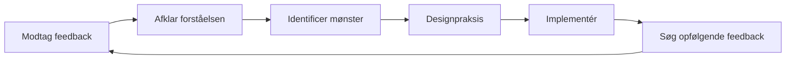

# Få og bruge feedback

Feedback er et af de mest effektive værktøjer til udvikling – og et af de mest underudnyttede. Denne side lærer dig, hvordan du aktivt søger feedback, modtager den konstruktivt og omsætter den til handlingsrettet forbedring.

---

## Hvorfor vi modsætter os feedback

Før du lærer at søge feedback, skal du forstå hvorfor det er svært:

### Egobeskyttelse

Din hjerne behandler kritik af din præstation som en trussel mod din identitet. Dette udløser defensive reaktioner:
- Afviser feedbacken
- At finde årsager til, hvorfor personen tager fejl
- Undgå lignende situationer i fremtiden

### Bekræftelsesbias

Vi søger naturligt information, der bekræfter det, vi allerede tror. Hvis du synes, du er en god pointer, vil du bemærke dine succesfulde pointer og bortforklare dine fejl.

### Ændringen i væksttankegang

::: tip Omformuler feedback
**Fastlåst tankegang:** &quot;Kritik betyder, at jeg har fejl&quot;
**Væksttankegang:** &quot;Feedback er information, der hjælper mig med at forbedre mig&quot;

Forskellen er ikke positivitet – det er nøjagtighed. Feedback er data, ikke vurdering.
:::

---

## Kilder til objektiv feedback

### 1. Kvantitative data

Tal lyver ikke eller blødgør sandheden:

| Metrisk | Hvad det afslører |
|--------|-----------------|
| **Pegningsprøjighed %** | Teknisk basislinje og tendenser |
| **Præcision i første vs. sent spil** | Trætheds-/trykeffekter |
| **Succesrate for skydning** | Efter afstand, måltype, kampsituation |
| **Carreau-procent** | Effektivitet i risikovillighed |

### 2. Holdkammerater

Dine holdkammerater ser dig i konkurrence – når din selvopfattelse er mindst præcis:

**Hvad skal man spørge om:**
- &quot;Hvordan fremstår jeg for dig, når vi er bagud?&quot;
- &quot;Hvad bemærker du ved min tilgang i tætte kampe?&quot;
- &quot;Hvad er én ting jeg kunne gøre for at blive en bedre holdkammerat?&quot;

### 3. Modstandere

Samtaler efter kampen med betroede modstandere kan være afslørende:

**Hvad skal man spørge om:**
- &quot;Hvad prøvede du at udnytte i mit spil?&quot;
- &quot;Var der noget, der overraskede dig ved, hvordan jeg spillede?&quot;

### 4. Trænere/Erfarne spillere

Ekstern ekspertise giver et perspektiv, du ikke selv kan generere:

**Hvad skal man spørge om:**
- &quot;Hvad er den største forskel mellem mit potentiale og min nuværende præstation?&quot;
- &quot;Hvilket mønster ser du i mine fejltagelser?&quot;
- &quot;Hvad ville du prioritere, hvis du skulle coache mig?&quot;

### 5. Videoanalyse

Det mest objektive spejl, der findes. Se [Videoanalyse](/da/uddannelse/selvbevidsthed/video) for detaljerede protokoller.

---

## Sådan beder du effektivt om feedback

### SEEK-rammen

**S - Specifik**
Spørg ikke: &quot;Hvordan spillede jeg?&quot;
Spørg: &quot;Hvordan så min præcision i tredje ende ud, da vi var bagud?&quot;

**E - Eksempler**
Spørg: &quot;Kan du give mig et konkret eksempel?&quot;
Dette fremtvinger konkret feedback i stedet for generaliseringer.

**E - Udforskende**
Tilgang med nysgerrighed, ikke forsvar.
&quot;Jeg prøver at forstå mine blinde vinkler. Hvad overser jeg måske?&quot;

**K - Venlig (mod dig selv)**
Husk: Det er modigt at søge feedback. Du arbejder hårdt.

### Timing betyder noget

| Når | Bedst til | Undgå |
|------|----------|-------|
| **Umiddelbart efter** | Specifikke tekniske observationer | Følelsesmæssig bearbejdning |
| **Næste dag** | Balanceret perspektiv, mønstre | Hvis detaljerne er falmet |
| **Videoanmeldelse** | Objektiv analyse | Hvis det forsinker handlingen for længe |

---

## Modtagelse af feedback uden forsvarsbevægelse

Når feedback modtages, vil din hjerne ønske at forsvare sig. Sådan tilsidesætter du det:

### 3-sekundersreglen

Når du modtager feedback, **vent 3 sekunder, før du svarer**. Dette giver din rationelle hjerne tid til at engagere sig, før din følelsesmæssige hjerne reagerer.

### &quot;Fortæl mig mere&quot;-teknikken

I stedet for at forsvare, så sig: &quot;Fortæl mig mere om det.&quot;

Denne:
- Køber behandlingstid
- Viser at du værdsætter inputtet
- Afslører ofte den grundlæggende indsigt

### Separat modtagelse fra evaluering

**Trin 1:** Modtag (bare lyt)
**Trin 2:** Forklar (sørg for at du forstår)
**Trin 3:** Tak (anerkend gaven)
**Trin 4:** Evaluer (beslut senere privat, hvad der skal handle på)

Du behøver ikke at give feedback med det samme. Du skal bare modtage den med åbenhed.

---

## Feedback-responsprotokollen

Brug dette, når du modtager feedback:

1. **&quot;Tak fordi du fortalte mig det.&quot;**
   - Ægte påskønnelse, selvom feedbacken svider

2. **&quot;Kan du give mig et specifikt eksempel?&quot;**
   - Går fra generelt til handlingsrettet

3. **&quot;Hvad vil du foreslå, at jeg prøver?&quot;**
   - Inviterer til partnerskab i forbedringsarbejdet

4. **&quot;Det vil jeg lige tænke over.&quot;**
   - Ærlig forpligtelse uden øjeblikkelig aftale

---

## Omsætning af feedback til handling

Feedback uden handling er bare en ubehagelig samtale.

### Feedback-til-handling-processen

### Handlingsskabelon

For hver handlingsrettet feedback:

| Element | Dit svar |
|---------|---------------|
| **Feedbacken** | (Hvad der blev sagt) |
| **Mønsteret** | (Hvilket tilbagevendende problem afslører dette?) |
| **Handlingen** | (Hvad specifikt vil du øve dig på?) |
| **Målet** | (Hvordan ved du, om du har forbedret dig?) |
| **Tidslinjen** | (Hvornår vil du revurdere?) |

---

## At skabe en feedbackkultur

### Med dit team

- **Normaliser det:** Regelmæssig feedback bliver forventet, ikke exceptionel
- **Tovejskørsel:** Giv feedback for at modtage den på en behagelig måde
- **Tidsaftaler:** &quot;Lad os debriefe efter kampene&quot; vs. uopfordret kritik
- **Fokuser på detaljerne:** &quot;Jeg bemærkede X&quot; er bedre end &quot;Du altid Y&quot;

### Med dig selv

- **Ugentlig selvevaluering:** Dedikeret tid til at evaluere din uge
- **Skriftlig refleksion:** Skrivning skaber klarhed
- **Mønstersporing:** Led efter tilbagevendende temaer på tværs af flere kilder

---

## Den feedback-resistente spiller

Hvis du genkender dig selv i nogen af disse, så prioritér dette arbejde:

::: warning Tegn på feedbackmodstand
- Du kan altid forklare, hvorfor feedbacken ikke gælder
- Du søger kun feedback fra folk, der er enige med dig
- Du føler dig angrebet, når du modtager konstruktiv input
- Du undgår folk, der udfordrer din selvopfattelse
- Du rationaliserer dårlige resultater som eksterne faktorer
:::

At bryde disse mønstre kræver en bevidst indsats – men resultatet er hurtigere forbedringer.

---

## Relateret indhold

- [Fordelen ved selvbevidsthed](/da/uddannelse/selvbevidsthed/) — Hvorfor selverkendelse er vigtig
- [Videoanalyse](/da/uddannelse/selvbevidsthed/video) — Objektiv selvobservation
- [Holddynamik](/da/uddannelse/holddynamik/) — Kommunikation med holdkammerater
- [Mental styrke](/da/uddannelse/mentalt-spil/mental-styrke/) — Håndtering af svære sandheder

