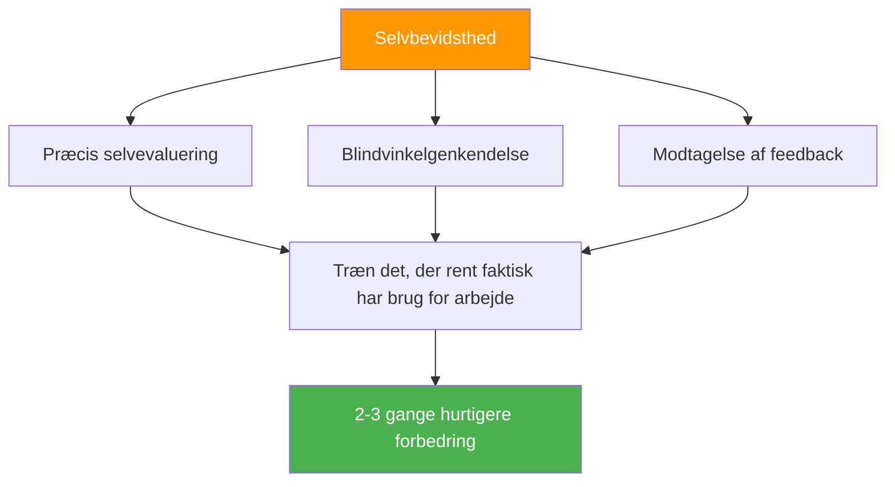

# Fordelen ved selvbevidsthed

::: tip Meta-færdigheden, der multiplicerer alt
**Vægt: 400 point** — Spillere med præcis selvopfattelse forbedrer sig 2-3 gange hurtigere, fordi de træner det, der rent faktisk kræver arbejde.
:::

## Hvorfor dette er din skjulte multiplikator

> &quot;Man kan ikke forbedre det, man ikke kan se.&quot;

De fleste spillere bruger timevis på at øve sig, men **øver de sig i de rigtige ting?** Selvbevidsthed er den metafærdighed, der sikrer, at din træningstid rent faktisk er effektiv.

### Forbedringsmultiplikatoreffekten



Uden selverkendelse kan du måske:
- Øv dig i det, du allerede er god til (føles godt, begrænset vækst)
- Gå glip af tekniske fejl, du ikke kan se
- Fejltilskriv tab til eksterne faktorer
- Modstå feedback, der kunne hjælpe dig

Med selvbevidsthed kan du:
- Identificer de faktiske svagheder præcist
- Accepter og integrer nyttig feedback
- Forstå hvordan pres påvirker dit specifikke spil
- Kend dine mønstre under forskellige forhold

---

## Selvbevidsthedsparadokset

::: danger Den ubehagelige sandhed
Forskning viser konsekvent: De, der har brug for mere selvbevidsthed, tror typisk, at de har fremragende selvkendskab. De med høj selvbevidsthed sætter konstant spørgsmålstegn ved sig selv og søger input udefra.

**Hvilken en er du?**
:::

Dette kaldes **Dunning-Kruger-effekten** anvendt på selvopfattelse. Netop den manglende bevidsthed, der holder dig tilbage, forhindrer dig også i at se, at du mangler bevidsthed.

### Løsningen: Udvendige spejle

Da vi ikke fuldt ud kan stole på vores indre opfattelse, har vi brug for ydre spejle:

| Spejl | Hvad det afslører |
|--------|-----------------|
| **Videoanalyse** | Teknisk virkelighed vs. hvad du tror du laver |
| **Ydelsesdata** | Mønstre, du måske ikke bemærker |
| **Feedback fra holdkammerater** | Hvordan du bliver opfattet under pres |
| **Trænerobservation** | Ekspert øje på dit spil |

---

## Johari-vinduet for petanquespillere

Johari-vinduet er en psykologisk model, der kortlægger, hvad du og andre ved om jeres spil:

```
                    Known to Self    Unknown to Self
                   ┌────────────────┬────────────────┐
 Known to Others   │     OPEN       │     BLIND      │
                   │  Arena         │  Spot          │
                   │                │                │
                   │ Your conscious │ What others    │
                   │ skills and     │ see but you    │
                   │ tendencies     │ don't          │
                   ├────────────────┼────────────────┤
 Unknown to Others │    HIDDEN      │   UNKNOWN      │
                   │    Facade      │   Potential    │
                   │                │                │
                   │ What you know  │ Undiscovered   │
                   │ but don't      │ capabilities   │
                   │ share          │                │
                   └────────────────┴────────────────┘
```

### Dit mål: Udvid det &quot;åbne&quot; område

**1. Reducer dine blinde vinkler**
- Søg videoanalyse
- Bed om specifik feedback
- Hold øje med mønstre i resultaterne

**2. Del mere (Reducer skjult)**
- Fortæl dine holdkammerater, når du har det svært
- Diskuter din tilgang åbent
- Bed om hjælp, når det er nødvendigt

**3. Opdag dit ukendte potentiale**
- Prøv nye tilgange
- Eksperiment i træning
- Skub dig ud af komfortzonen

---

## Selvbevidsthed vs. selvkritik

::: warning Kritisk skelnen
Selvbevidsthed er **neutral observation** af virkeligheden.
Selvkritik er **negativ dom** af dig selv.

De er IKKE det samme.
:::

| Selvbevidsthed | Selvkritik |
|----------------|----------------|
| &quot;Jeg gik glip af tre karreer i dag&quot; | &quot;Jeg er forfærdelig til carreaux&quot; |
| &quot;Jeg bliver anspændt i tætte kampe&quot; | &quot;Jeg kvæles altid under pres&quot; |
| &quot;Min pegeteknik er mindre præcis, når jeg er træt.&quot; | &quot;Jeg kan ikke klare lange turneringer&quot; |
| &quot;Jeg kommunikerer mindre, når jeg taber&quot; | &quot;Jeg er en dårlig holdkammerat, når jeg er stresset&quot; |

**Forskellen er vigtig fordi:**
- Selvbevidsthed fører til målrettet forbedring
- Selvkritik fører til skam og undgåelse
- Selvbevidsthed er faktuel og specifik
- Selvkritik er følelsesladet og generaliseret

---

## De tre niveauer af selvbevidsthed

### Niveau 1: Teknisk selvbevidsthed
*&quot;Hvordan klarer jeg mig egentlig?&quot;*

- Nøjagtighed under forskellige forhold
- Tekniske udførelsesmønstre
- Fysisk tilstands indflydelse på præstation

### Niveau 2: Psykologisk selvbevidsthed
*&quot;Hvordan reagerer jeg mentalt og følelsesmæssigt?&quot;*

- Stressreaktioner og udløsere
- Tillidsudsving
- Fokusmønstre og distraktorer

### Niveau 3: Social selvbevidsthed
*&quot;Hvordan påvirker jeg andre, og hvordan ser de mig?&quot;*

- Teamkommunikationsmønstre
- Lederskabsøjeblikke (eller huller)
- Hvordan dine følelser påvirker holdkammerater

---

## Selvevaluering: Din nuværende selvbevidsthed

Bedøm dig selv ærligt (1 = Aldrig, 5 = Altid):

| Spørgsmål | Score |
|----------|-------|
| Jeg kan præcist forudsige min præstation i forskellige situationer | /5 |
| Jeg ved, hvilke forhold der får mig til at underpræstere | /5 |
| Jeg forstår, hvordan holdkammerater opfatter mig under pres | /5 |
| Jeg modtager gerne kritisk feedback og integrerer den | /5 |
| Min selvvurdering stemmer overens med min træner/holdkammeraters vurdering | /5 |
| Jeg kan objektivt analysere min præstation uden følelsesmæssig reaktion | /5 |
| Jeg bemærker ændringer i min egen mentale tilstand under konkurrencen | /5 |

**Scoring:**
- **28-35:** Høj selvbevidsthed (men forbliv ydmyg – bliv ved med at søge input)
- **21-27:** Moderat selvbevidsthed (godt fundament at bygge videre på)
- **14-20:** Selvbevidsthedshul (dette modul er afgørende for dig)
- **Under 14:** Væsentlige blinde vinkler (prioriter dette arbejde)

---

## I dette modul

### [At få og bruge feedback](/da/uddannelse/selvbevidsthed/feedback)
- Kilder til objektiv feedback
- Sådan beder du effektivt om feedback
- Modtage feedback uden at være defensiv
- Omsætte feedback til handling

### [Videoanalyse til selvopdagelse](/da/uddannelse/selvbevidsthed/video)
- Hvad skal optages og hvornår
- Hvad skal du kigge efter i dine optagelser
- Sammenligning af selvopfattelse med videovirkelighed
- Protokoller for videoanalyse

---

## Hurtig sejr: De tre spørgsmål

Efter din næste træning eller kamp, så spørg dig selv:

1. **Hvad syntes jeg, jeg gjorde godt?** (Vær specifik)
2. **Hvad ville en objektiv observatør sige?** (Adskil opfattelse fra virkelighed)
3. **Hvad er én ting jeg undgår at se på?** (Find den blinde vinkel)

Skriv dine svar ned. Sammenlign dem over tid. Mønstre vil vise sig.

---

## Relaterede faktorer

- [Mentalt spil](/da/uddannelse/mentalt-spil/) — Selvbevidsthed understøtter mental træning
- [Teamdynamik](/da/uddannelse/teamdynamik/) — Forstå, hvordan andre opfatter dig
- [Motivation](/da/uddannelse/motivation/) — Kend dine virkelige drivkræfter
- [Teknik](/da/uddannelse/teknik/) — Videoanalyse afslører teknisk sandhed

