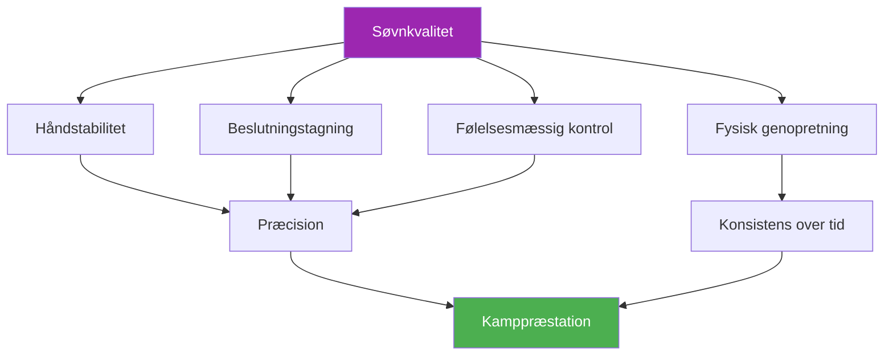

# Søvn og restitution

::: tip En kritisk præstationsfaktor
**Vægt: 400 point** — Søvn er den mest undervurderede faktor inden for præcisionssport. Dine hænder, beslutninger og følelser afhænger alle af god hvile.
:::

## Den skjulte præstationsfordel

> &quot;Den spiller, der sov bedre, vinder oftest.&quot;

I modsætning til udholdenhedssportsgrene, hvor atleter nogle gange kan &quot;holde sig igennem&quot; træthed, er **præcision ikke til forhandling**. Din evne til at placere en kugle inden for centimeter fra cochonnetten afhænger af systemer, der er yderst følsomme over for søvnmangel:

- Finmotorisk kontrol
- Beslutningstagning under pres
- Følelsesmæssig regulering
- Hukommelseskonsolidering

Dette modul afslører, hvorfor søvn kan være din største uudnyttede konkurrencefordel.

---

## Hvordan søvn påvirker dit spil

### Håndstabilitet og motorisk kontrol

Forskning viser, at finmotorik forringer **10-15% af den akkumulerede søvngæld pr. time**. For petanque-spillere manifesterer dette sig som:

- **Øgede mikrotremorer** — Umærkelige for dig, men påvirker frigivelsens konsistens
- **Reduceret proprioception** — Mindre bevidsthed om grebstryk og armposition
- **Langsommere fejlkorrektion** — Din krop kan ikke foretage de mikrojusteringer, der giver nøjagtighed

::: warning Hvorfor pegepinde lider først
At pege kræver den fineste motoriske kontrol af alle skud. Det er ofte den første færdighed, der forringes, når man sover for lidt – selv når man &quot;har det fint&quot;.
:::

### Beslutningstagning og taktik

Din præfrontale cortex – ansvarlig for planlægning, risikovurdering og strategisk tænkning – er yderst følsom over for søvnmangel:

- **Risikovurderingen forringes** — Du kan forsøge injektioner med en lavere procentdel
- **Taktisk fleksibilitet falder** — Sværere at tilpasse sig midt i spillet
- **Fænomenet &quot;2 om natten-beslutningen&quot;** — Valg, der virker fornuftige, når man er træt, ser tvivlsomme ud i bakspejlet.

### Følelsesmæssig regulering

Søvnmangel forårsager **hyperaktivitet i amygdala**, din hjernes følelsesmæssige center:

- Trykket føles mere intenst
- Frustrationen efter misser forstærkes
- Genopretning efter tilbageslag tager længere tid
- Holddynamikken kan lide under kortvarige temperamenter

### Hukommelseskonsolidering

Motorisk hukommelse konsolideres under søvn – især i dybe søvnfaser:

- **Øvelse uden søvn = begrænset hukommelse**
- **&quot;At sove på det&quot; virker faktisk** til teknikskift
- Formlen: **Kvalitetspraksis + Kvalitetssøvn = Permanent færdighed**

---

## Forbindelsen mellem søvn og ydeevne

---

## Søvngældens virkelighed

### Hvad er søvngæld?

Søvngæld er **kumulativ**. At gå glip af én times søvn påvirker ikke kun den dag – den akkumuleres:

| Dage | Timer korte | Samlet gæld | Ydelsespåvirkning |
|------|-------------|------------|-------------------|
| 1 | -1 time | 1 time | Minimal |
| 3 | -1 time/dag | 3 timer | Mærkbar |
| 7 | -1 time/dag | 7 timer | Betydelig |
| 14 | -1 time/dag | 14 timer | Alvorlig |

::: danger Weekendmyten
Du kan ikke helt &quot;indhente&quot; det forsømte i weekenderne. Selvom ekstra søvn hjælper, sletter det ikke ophobet gæld. Konsistens er vigtigere end lejlighedsvis lang søvn.
:::

### Hvor meget har du brug for?

&quot;8 timer for alle&quot; er en myte. Individuelle behov varierer:

- **De fleste voksne:** 7-9 timer
- **Nogle fungerer godt på:** 6-7 timer
- **Nogle kræver:** 9+ timer

**Find DIT optimale søvnbehov:**
1. Lad dig selv sove naturligt i 5-7 dage under en ferie (uden alarm)
2. Efter den indledende &quot;indhentningsfase&quot; skal du notere, hvor længe du sover
3. Det er sandsynligvis tæt på dit biologiske behov

---

## Videnskaben i korte træk

### Søvnfaser der betyder noget

| Scene | Fungere | Relevans for petanque |
|-------|----------|-------------------|
| **Dyb søvn (N3)** | Fysisk restitution, væksthormon | Muskelgendannelse, energigendannelse |
| **REM-søvn** | Følelsesmæssig bearbejdning, hukommelseskonsolidering | Bevarelse af motoriske færdigheder, følelsesmæssig robusthed |
| **Let søvn (N1-N2)** | Overgang, vedligeholdelse | Understøtter den overordnede arkitektur |

### Vigtige forskningsresultater

1. **Stanford Basketball Study** — Spillere, der forlængede deres søvn til 10 timer, forbedrede straffekastpræcisionen med 9 % (Mah et al., 2011)
2. **Nøjagtighed af tennisserve** — Søvnbegrænsning reducerede servnøjagtigheden med 53 % (Reyner &amp; Horne, 2013)
3. **Metaanalyse af reaktionstid** — Selv én nat med dårlig søvn forsinker reaktionstiden med 300 % (Lim &amp; Dinges, 2010)

---

## Selvvurdering: Din søvnrealitet

Bedøm dig selv ærligt (1-5):

| Spørgsmål | Score |
|----------|-------|
| Jeg får den samme mængde søvn de fleste nætter | /5 |
| Jeg falder i søvn inden for 15-20 minutter | /5 |
| Jeg vågner sjældent om natten | /5 |
| Jeg vågner op og føler mig frisk | /5 |
| Jeg holder energien oppe hele dagen | /5 |

**Scoring:**
- **20-25:** Fremragende søvnvaner
- **15-19:** God, men plads til forbedring
- **10-14:** Søvn påvirker sandsynligvis din præstation
- **Under 10:** Søvnforbedring bør prioriteres

---

## I dette modul

### [Søvnprotokoller til konkurrencer](/da/uddannelse/søvn/konkurrence)
- Ugen før konkurrencen
- Rejse- og tidszonestyring
- Protokoller for power napping
- Nødstrategier for &quot;Jeg kunne ikke sove&quot;

### [Søvnhygiejne for atleter](/da/uddannelse/søvn/vaner)
- De 10 grundprincipper for søvn
- Skabeloner til aftenrutiner
- 30-dages søvnudfordring
- Fejlfinding af almindelige problemer

---

## Hurtig gevinst: I aften

Hvis du ikke gør andet, så implementer disse to ændringer i aften:

1. **Indstil et ensartet vækketidspunkt** — Samme tidspunkt i morgen som i dag, inden for 30 minutter
2. **Ingen skærme 30 minutter før sengetid** — Læs, stræk dig ud eller forbered dig til i morgen i stedet

Disse to ændringer alene kan forbedre søvnkvaliteten inden for få dage.

---

## Relaterede faktorer

Søvn er forbundet med alt andet i din præstation:

- [Spændingshåndtering](/da/uddannelse/spænding/) — PMR og afslapningsteknikker hjælper med at sove
- [Ernæring](/da/uddannelse/ernæring/) — Måltidspunkter og blodsukker påvirker søvnkvaliteten
- [Mentalt spil](/da/uddannelse/mentalt-spil/) — Søvn understøtter kognitiv funktion og følelsesmæssig kontrol
- [Selvbevidsthed](/da/uddannelse/selvbevidsthed/) — At genkende, hvornår træthed påvirker dit spil

