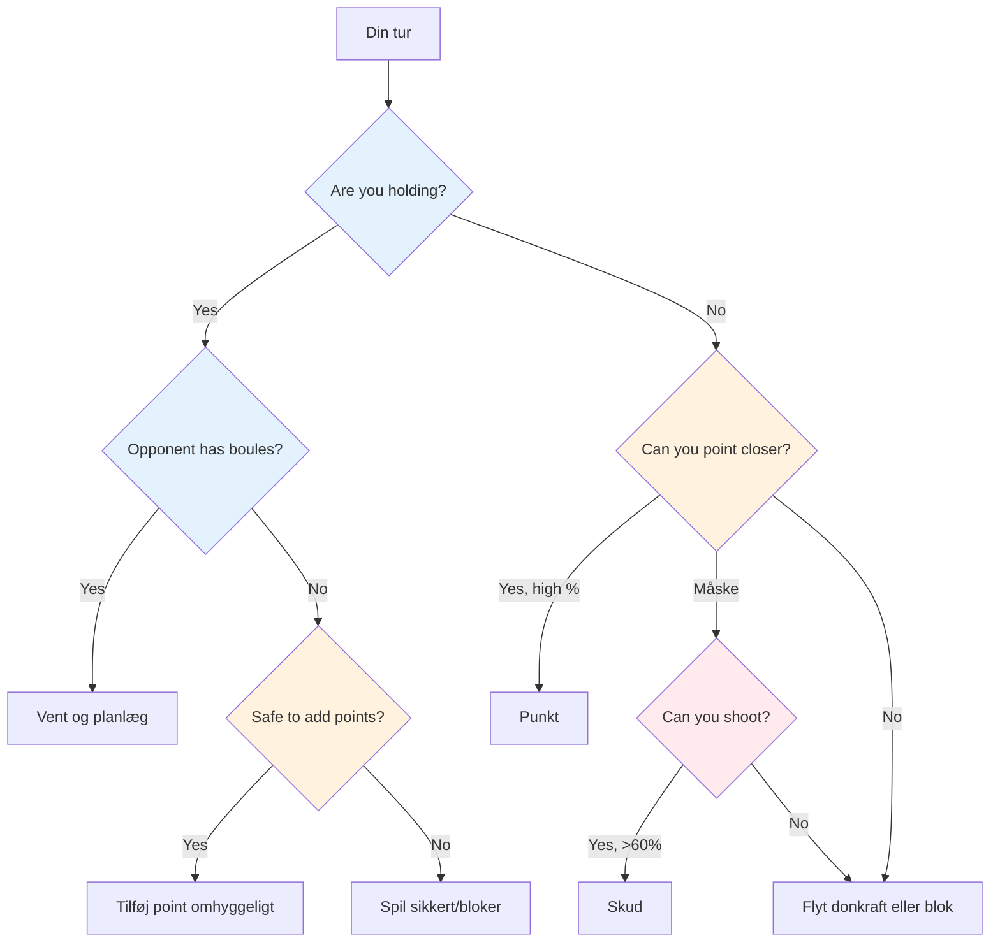
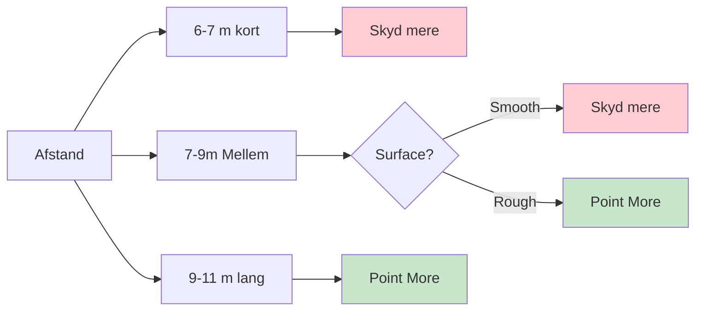

# Taktisk tænkning i petanque

På eliteniveau forudsættes teknisk færdighed. Det, der adskiller vindere fra resten, er taktisk intelligens - at vide, hvilket kast man skal forsøge, og hvornår. De bedste spillere læser spillet flere træk fremad og udnytter enhver fordel.

::: tip Kerneprincippet
**På eliteniveau er forskellen sjældent teknikken - det er beslutningstagningen.** Det hold, der laver færrest taktiske fejl, vinder.
:::

## Hurtig beslutningsramme

## Den taktiske tankegang

### Tænk i sandsynligheder

Hvert kast har en sandsynlighed for succes. God taktik betyder at vælge kast hvor:
- Sandsynligheden for succes er høj nok
- Belønningen retfærdiggør risikoen
- Fiasko gør ikke for ondt

**Eksempel på afgørelse:**
- Svært skud: 40% succes, får 3 point
- Sikkerhedspoint: 80% succes, opnår 1 point

Hvilken er bedst? Det afhænger af resultatet, situationen og din selvtillid.

### Overvej alle muligheder

Overvej følgende før hvert kast:
1. **Point:** Placer en kugle nær målkuglen
2. **Skyd:** Fjern en modstanders kugle
3. **Blokering:** Placer en kugle for at blokere
4. **Flyt donkraften:** Ramte donkraften med vilje
5. **Offer:** Accepter en dårlig position for at etablere dig senere

Vælg ikke det oplagte valg som standard. Tænk over alternativer.

### Læs situationen

Faktorer at overveje:
- Nuværende score (hvem er foran, med hvor meget)
- Tilbageværende boules (dine og deres)
- Position på terrænet
- Modstanderens tendenser
- Dit holds styrker

## Kernetaktiske principper

::: tip De 6 taktiske principper
1. **Kontroller donkraften** - Position er magt
2. **Afstands- og overfladestrategi** - Tilpas dig til forholdene
3. **Diktér spillestilen** - Tving dine styrker frem
4. **Håndtér risiko vs. belønning** - Match risiko med situation
5. **Brug boules klogt** - Giver nogle gange 1 bold væk for at undgå 3
6. **Tænk fremad** - Visualiser de næste 2-3 træk
:::

### Princip 1: Styr donkraften

Holdet, der kontrollerer donkraftens position, har en betydelig fordel.

**Måder at kontrollere:**
- Vind retten til at kaste målscoren
- Flyt donkraften til et gunstigt terræn
- Beskyt donkraften mod at blive flyttet

**Strategi for placering af knægte:**
- Kort jack: Foretrækker at skyde, lettere at ramme mål på tæt hold
- Langt stik: Foretrækker at pege, det bliver vanskeligere at skyde
- Nær forhindringer: Skaber udfordringer for modstandere

**Udnyt modstanderens svagheder:**
- Observer deres pegeteknik - bruger de altid den samme bue eller stil?
- Hvis de ikke kan tilpasse sig (f.eks. kun rulle, kun lobbe), så placer målgriben for at fremtvinge ubehagelige kast.
- Placer donkraften i afstande eller positioner, der afdækker dens begrænsninger
- Udnyt kun en svaghed, hvis du ikke deler den - overvej først dit eget teams styrker.

### Princip 2: Afstands- og overfladestrategi

Den optimale balance mellem at sigte og skyde afhænger i høj grad af afstand og terræn:

::: info Afstandsstrategi
**Kort (6-7m):** Foretrækker at skyde - lettere at ramme på tæt hold
**Mellem (7-9 m):** Overfladen er vigtigst
- Glat overflade → optag mere
- Ru overflade → peg mere

**Lang (9-11 m):** Foretrækker at pege - skudpræcisionen falder betydeligt
:::

**Din personlige skudprocent:**
- Hvis du skyder med en succesrate på 75%+, så skyd oftere
- Overvej at skyde for at reducere modstanderens point (selvom du ikke tager føringen)
- At skyde for at reducere modstanderens scoringskugler (fra 3 ned til 1) er værdifuld skadekontrol.

**Skydning som en langsigtet strategi:**
- Hvis du skyder med alle dine kugler, så overvej din samlede succesrate
- Beregn: Når du rammer alle slag, får du betydeligt flere point
- Selv at misse nogle skud kan reducere modstanderens point
- Eksempel: Bom 1-2 skud, men fjern stadig trusler, og vind så stort, når du rammer alle
- Dette er en kalkuleret risiko - accepter nogle tabte gevinster for større gevinster, når det virker

### Princip 3: Diktér spillestilen

På eliteniveau kan de fleste spillere både pege og skyde godt. Nøglen er at tvinge spillet ind i dit holds stærkeste stil.

**Hvis dit hold har stærke skytter:**
- Skyd så meget som muligt - udnyt din fordel
- Spild ikke din styrke ved at pege, når du kan dominere ved at skyde
- Styr spillet ved at fjerne trusler, før de ophobes
- Kort til mellemstort stik sikrer effektiv optagelse

**Mod lige så stærke skytter:**
- Negér dem som lette mål ved at skyde først
- Spil på lang afstand for at reducere alles skudprocent
- Det hold, der skyder først, styrer ofte slutningen

**Hvis modstandere skyder bedre end dig:**
- Spil konsekvent med long jack - selv eliteskytter taber procent ved 10m+
- Tving en pointkamp frem, hvor du kan konkurrere
- Få dem til at skyde fra vanskelige vinkler eller gennem forhindringer

### Princip 4: Håndter risiko vs. belønning

| Situation | Risikotolerance |
|-----------|---------------|
| Komfortabelt fremad | Lav - beskyt din ledning |
| Luk spillet | Mellemstore - beregnede risici |
| Bagud betydeligt | Høj - behov for at tage chancer |
| Endelig afslutning | Afhænger af scoreforskellen |

### Princip 5: Brug dine boules klogt

Boule-ledelse adskiller elitespillere:
- Når modstanderen løber tør for kugler, så vælg omhyggeligt: læg point til eller spil sikkert?
- Når du er bagud, så beregn om du realistisk set kan tage pointet tilbage
- Nogle gange er det bedre at give 1 point væk end at spilde kugler og give 3 væk
- Hold styr på resterende kugler - dine og deres - til enhver tid

### Princip 6: Tænk flere skridt fremad

Elitetankegang:
- Før du kaster, visualiser de næste 2-3 kugler fra begge hold
- Hvad er din modstanders bedste reaktion, hvis du lykkes? Hvis du fejler?
- Hvordan forbereder dette kast dig på dit næste?
- Overvej slutspillets scenarie fra den nuværende position

## Almindelige taktiske situationer

### Du holder, og modstanderen har kugler tilbage

Du skal vente - det er deres tur til at kaste. Brug denne tid til at:
- Analyser hvad de sandsynligvis vil gøre
- Planlæg din reaktion på deres mulige kast
- Forbliv fokuseret og klar

### Du holder, og modstanderen har ikke flere boules

Nu kan du spille dine resterende kugler. **Muligheder:**
- Tilføj flere point, hvis du kan gøre det sikkert
- Blok for at beskytte mod donkraftbevægelse
- Spil sikkert - risiker ikke at forvandle en 2-points sejr til et nederlag

**Vigtig beslutning:** Er risikoen ved at tilføje point værd at potentielt åbne spillet op for?

### Du holder ikke

Du skal kaste. **Muligheder:**
- Point tættere end deres bedste kugle
- Skyd deres bedste kugle
- Flyt målkuglen til dine kugler
- Bloker for at begrænse deres point (hvis du ikke kan tage pointet)

**Beslutningsfaktorer:** Din skudprocent, antal kugler tilbage (begge hold), nuværende score

### Sidste boule-situationer

Når du har den sidste kugle:
- Maksimalt tryk, men også maksimal kontrol
- Tag dig god tid - vurder alle muligheder
- Overvej: peg, skyd eller flyt donkraften?
- Udfør med fuldt engagement

Når modstanderen har den sidste kugle:
- Du har gjort hvad du kunne - accepter resultatet
- Hvis det er muligt, så skab en situation uden en nem løsning for dem
- Flere trusler er bedre end én

## At læse dine modstandere

På eliteniveau er scouting vigtig. Kend dine modstandere, før du spiller.

### Intelligens før kampen
- Hvad er deres foretrukne spillestil (skydende vs. pegende hold)?
- Hvem er deres stærkeste skytter? Pointer?
- Hvilke afstande foretrækker de?
- Hvordan klarer de sig under pres i finalerne?

### Observation under kampen
- Spor deres succesrater gennem hele kampen
- Læg mærke til om nogen har en fridag
- Identificér hvem der håndterer pres godt, og hvem der ikke gør det
- Juster din donkrafts placering baseret på, hvad du observerer

### Udnyt det, du finder
- Fokuser på de svagere spillere, når det er muligt
- Tving deres svage skytter til at skyde, eller deres svage pointer til at pege
- Hvis nogen har det svært, så hold presset på dem

## I dette afsnit

- **[Sandsynlighedsbaserede beslutninger](/da/uddannelse/taktik/sandsynlighed)** - Brug af matematik til at træffe bedre valg

## Resumé: Alle taktiske regler

::: tip Regel nr. 1: Sandsynlighedsreglen
**Vælg kast hvor sandsynligheden for succes retfærdiggør risikoen.**
Overvej: succesrate, belønning hvis succes, omkostninger hvis mislykkes
:::

::: tip Regel nr. 2: Jack-kontrolreglen
**Det hold, der kontrollerer donkraftens position, har fordelen.**
Brug knægtens placering til at udnytte modstanderens svagheder og favorisere dine styrker
:::

::: tip Regel nr. 3: Afstandsreglen
**Kort afstand favoriserer skud, lang afstand favoriserer pegning.**
Mellemdistance: Underlagets kvalitet bestemmer balancen
:::

::: tip Regel nr. 4: Stilreglen
**Tving spillet ind i dit holds stærkeste stil.**
Hvis I er dygtige skytter, så skyd mere. Spild ikke jeres fordel.
:::

::: tip Regel nr. 5: Reglen for boulehåndtering
**Nogle gange er det bedre at give 1 point ind end at risikere 3.**
Vid, hvornår du skal begrænse dine tab, og gem dine kugler til næste omgang
:::

::: tip Regel nr. 6: Reglen om at tænke fremad
**Visualiser de næste 2-3 træk fra begge hold.**
Hvad er deres bedste svar? Hvordan forbereder dette dit næste kast?
:::

::: tip Regel nr. 7: Spejderreglen
**Kend dine modstandere, før du spiller.**
Spor deres præferencer, succesrater og presreaktioner
:::

## Vigtig konklusion

> På eliteniveau er forskellen sjældent teknikken – det er beslutningstagningen. Det hold, der laver færrest taktiske fejl, vinder.

Læs spillet. Kend dine styrker. Udnyt deres svagheder. Udfør med selvtillid.

