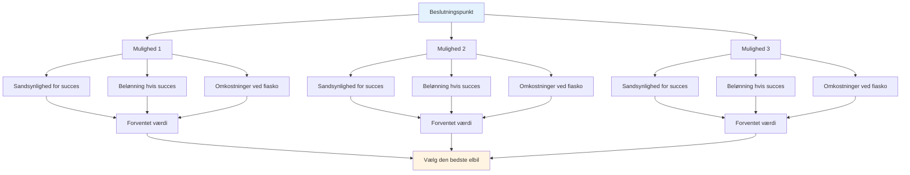

# Sandsynlighedsbaseret beslutningstagning

Elite taktisk tænkning bruger sandsynlighed til at træffe bedre beslutninger. I stedet for at gætte eller følge mavefornemmelsen, tænker du systematisk over dine muligheder.

::: tip Den store idé
**Tænk i sandsynligheder, ikke i sikkerheder.** Den bedste beslutning er ikke altid den mest aggressive eller sikreste - det er den, der giver dig den bedste forventede værdi i forhold til mange lignende situationer.
:::

## Den grundlæggende ramme

Hvert kast har tre komponenter:

| Komponent | Spørgsmål | Eksempel |
|-----------|----------|---------|
| **Sandsynlighed for succes** | Hvor sandsynligt er det, at jeg gennemfører dette? | 70% succesrate på denne distance |
| **Belønning hvis succesfuld** | Hvad får jeg ud af det? | Vind pointet, få positionen |
| **Omkostninger ved mislykket behandling** | Hvad mister jeg? | Giv modstanderen et let point |

::: info Formlen
**Forventet værdi = (Sandsynlighed × Belønning) - ((1 - Sandsynlighed) × Omkostninger)**

Gode beslutninger maksimerer forventet værdi over tid.
:::

## Tænkning i sandsynligheder

Når du skal vælge mellem muligheder, skal du overveje:
- Hvad er min realistiske succesrate for hver mulighed?
- Hvad får jeg ud af det, hvis det virker?
- Hvad koster det, hvis det mislykkes?
- Hvordan påvirker spilsituationen mit valg?

Den bedste løsning er ikke altid den mest aggressive eller sikreste - det er den, der giver dig det bedste resultat i mange lignende situationer.

## Kend dine tal

For at bruge sandsynlighedstænkning skal du kende dine faktiske succesrater:

| Kastetype | Afstand | Din succesrate |
|------------|----------|-------------------|
| Punkt (tæt) | 6-7 måneder | ___% |
| Punkt (mellem) | 8-9 måneder | ___% |
| Punkt (lang) | 10+ måneder | ___% |
| Skyd (tæt på) | 6-7 måneder | ___% |
| Skyd (medium) | 8-9 måneder | ___% |
| Skyd (langt) | 10+ måneder | ___% |

Følg disse i træning. Vær ærlig - de fleste spillere overvurderer deres succesrater.

## Justering for forhold

Dine basissatser ændres baseret på:

| Faktor | Effekt på succesrate |
|--------|----------------------|
| Ukendt terræn | -10 til -20% |
| Pressituation | -5 til -15% |
| Træthed | -5 til -10% |
| Tillid (høj) | +5 til +10% |
| Nylig succes | +5% |
| Nylig fejl | -5 til -10% |

Vær realistisk omkring disse justeringer.

## Boule-fordelprincippet

Når du har flere kugler tilbage end din modstander:

**Prioritet 1: Sikring af punktet**
- Først skal du sørge for at holde mindst ét point
- Bliv ikke grådig, før du har sikret dig det grundlæggende

**Prioritet 2: Maksimer point med kalkuleret risiko**
- Når du holder, vurder om du kan tilføje flere point
- Hvert ekstra kast er en risiko/belønningsbeslutning
- Vend ikke en sikker 2-pointssejr til et nederlag ved at overanstrenge dig

**Færre kugler tilbage:** Du skal sørge for, at hvert kast tæller. Sikre spil er måske ikke nok - overvej muligheder med højere belønning for at komme tilbage til sidst.

## &quot;Une Boule Devant&quot;-princippet

En kugle foran målskulen (mellem målskulen og modstanderen) er yderst værdifuld:
- Den blokerer direkte pegelinjer
- Det tvinger modstandere til at gå rundt eller over
- Den kan afbøje indkommende kugler
- Det er en &quot;pengekugle&quot; - værd at beskytte

**Taktisk implikation:** Nogle gange er det bedre at placere en blokerende kugle end at forsøge at komme tættest på.

## Risikotolerance efter spilstat

### Med tidsbegrænsning

Når man spiller med en tidsbegrænsning, spiller pointforskellen en rolle:

| Scoringssituation | Risikotilgang |
|-----------------|---------------|
| Fører med 4+ | Meget konservativ - beskyt bly, kør uret |
| Fører med 1-3 | Konservativ - giv ikke point væk |
| Bundet | Balancerede - kalkulerede risici |
| Bagud med 1-3 | Aggressiv - behov for at vinde terræn |
| Bagud med 4+ | Meget aggressiv - må tage chancer, tiden er ved at løbe ud |

### Uden tidsbegrænsning

Når der ikke er tidspres:
- Hold dig til din kampplan - skift ikke strategi bare på grund af resultatet
- Scoren vil svinge - stol på din tilgang
- Overvej kun at ændre din kampplan, hvis det tydeligvis ikke virker mod denne modstander.
- Panikændringer, når man er bagud, gør ofte tingene værre

### Justeringer ved spillets afslutning

**Hvis man vinder denne ende, vinder man spillet:**
- Vær mere konservativ
- Risiker ikke at give flere point væk
- Et enkelt punkt kan være nok

**Hvis du taber denne ende, taber du spillet:**
- Tag større risici
- Skal score flere point
- Sikkert spil redder dig ikke

## Almindelige sandsynlighedsfejl

### 1. Overdreven selvtillid
&quot;Jeg kan klare det skud&quot; - men kan du klare det 7 ud af 10 gange? Vær ærlig.

### 2. Ignorering af basisrenter
Din skudprocent ændrer sig ikke, fordi øjeblikket er vigtigt.

### 3. Fejlslutning om irreversible omkostninger
&quot;Jeg har allerede misset to gange, jeg burde blive ved med at skyde&quot; - hvert kast er uafhængigt.

### 4. Resultatbias
Et risikabelt skud, der virkede, var stadig risikabelt. Et sikkert spil, der mislykkedes, var stadig korrekt.

### 5. Ignorer modstanderens muligheder
Overvej hvad de vil gøre efter dit kast, uanset om det er vellykket eller ej.

## Praktisk anvendelse

### Før hvert kast

1. **Identificér muligheder** (peg, skyd, bloker osv.)
2. **Estimer sandsynligheden for succes** for hver
3. **Overvej resultater** (succes og fiasko)
4. **Faktor i spillets tilstand** (score, kugler tilbage)
5. **Vælg** muligheden med den bedste forventede værdi
6. **Forpligt dig fuldt ud** - ingen tvivl under udførelsen

### Opbygning af intuition

Med tiden bliver sandsynlighedstænkning intuitiv:
- Spor dine resultater ærligt
- Gennemgå beslutninger efter kampene
- Læg mærke til mønstre i dine succesrater
- Justér din mentale model

## Vigtig konklusion

> Gode beslutninger fører ikke altid til gode resultater. Men gode beslutninger fører over tid til bedre resultater.

Tænk i sandsynligheder. Kend dine tal. Lav det smarte spil, ikke det håbefulde.

