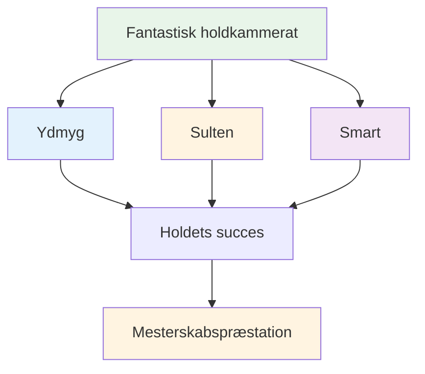

# At være en god holdspiller

Pétanque spilles ofte i hold - double (dublettes) eller triples (triplettes). Individuelle færdigheder betyder noget, men holddynamik kan være afgørende for resultaterne. De bedste hold er ikke altid de dygtigste - det er dem, der arbejder bedst sammen.

::: tip Den store idé
**De bedste hold er ikke altid de dygtigste - det er dem, der fungerer bedst sammen.** At være ydmyg, sulten og følelsesmæssigt intelligent gør dig til en god holdkammerat.
:::

## Hvad gør en god holdkammerat?

Forskning og erfaring peger på tre nøglekvaliteter:

### 1. Ydmyg
- Prioriterer holdets succes frem for personlig ære
- Anerkender andres bidrag
- Indrømmer fejl uden undskyldninger
- Åben for feedback og læring
- Behøver ikke at være stjernen

### 2. Sulten
- Selvmotiveret og drevet
- Gør arbejdet uden at blive bedt om det
- Altid på udkig efter forbedring
- Bringer energi til holdet
- Løfter sig ikke på talent

### 3. Smart (følelsesmæssigt)
- Læser situationer og personer godt
- Ved hvornår man skal tale og hvornår man skal lytte
- Håndterer sine egne følelser
- Støtter holdkammeraterne passende
- Håndterer konflikter konstruktivt

## Grundlaget for teamets succes

### Fælles mål og vision

Stærke hold har:
- Klare, aftalte mål
- Individuelle mål i overensstemmelse med holdets mål
- Fælles forståelse af, hvad succes ser ud
- Forpligtelse til den kollektive mission

**Spørgsmål til diskussion med dit team:**
- Hvad prøver vi at opnå sammen?
- Hvordan ser succes ud for os?
- Hvordan understøtter vores individuelle mål holdet?

### Effektiv kommunikation

Kommunikation er livsnerven i et teams præstation.

**God teamkommunikation:**
- Åben og ærlig
- Respektfuld, selv i uenighed
- Klar og specifik
- Tovejs (tale OG lytte)
- Rettidig (rigtig information på rette tidspunkt)

**Under kampene:**
- Diskuter strategi før hver omgang
- Del observationer om terræn, modstandere
- Koordinér hvem der kaster hvornår
- Støt hinanden efter kast (gode eller dårlige)

### Tillid og respekt

Uden tillid falder hold fra hinanden under pres.

**Opbygning af tillid:**
- Vær pålidelig (gør hvad du siger)
- Vær kompetent (udfør dit arbejde godt)
- Vær ærlig (selv når det er svært)
- Vis sårbarhed (indrøm dine udfordringer)
- Støt andre konsekvent

**Viser respekt:**
- Værdsæt hver enkelt persons bidrag
- Lyt til forskellige perspektiver
- Anerkend indsatsen, ikke kun resultaterne
- Betragt alles rolle som vigtig

### Klare roller

Alle burde forstå:
- Deres primære ansvarsområder
- Hvordan de bidrager til holdet
- Hvad andre regner med dem for
- Hvornår skal man træde frem, og hvornår skal man træde tilbage

**I tredobbelte:**
| Rolle | Primært fokus | Nøglekvaliteter |
|------|--------------|---------------|
| Peger | Placer boules nær målkuglen | Præcision, konsistens |
| Midt | Tilpas dig til situationen | Alsidighed, læsespil |
| Skytte | Fjern modstanderens kugler | Præcision under pres |

Roller kan være fleksible, men klarhed hjælper.

## Holddynamik under konkurrencen

### Før kampen
- Kom sammen, varm op sammen
- Diskuter den generelle strategi
- Sæt tonen (positiv, fokuseret)
- Tjek hvordan alle har det

### Under spillet
- Kommuniker mellem enderne
- Forbliv positiv uanset score
- Støt hinanden efter fejltagelser
- Fejr succeser sammen (kort)
- Hold fokus på processen, ikke resultatet

### Efter fejl
Hvad man IKKE skal gøre:
- Vis synligt frustration
- Kritisere eller bebrejde
- Træk dig tilbage eller bliv tavs
- Dvæl ved, hvad der skete

Hvad SKAL MAN GØRE:
- Hurtig bekræftelse (&quot;intet problem&quot;)
- Flyt fokus til næste kast
- Bevar et positivt kropssprog
- Stol på din holdkammerat til at komme sig

### Efter kampen
- Fælles debriefing (hvad virkede, hvad virkede ikke)
- Anerkend individuelle bidrag
- Diskuter forbedringer til næste gang
- Bevar relationer uanset resultat

## Kommunikationsmønstre

### Konstruktiv feedback
**Dårlig:** &quot;Du bliver ved med at misse de skud&quot;
**Bedre:** &quot;Jeg bemærkede, at slagene går til venstre - vil du prøve at justere din holdning?&quot;

### Støttende reaktion på fejl
**Dårlig:** *Tavshed eller synlig frustration*
**Bedre:** &quot;Svært spørgsmål. Du har den næste.&quot;

### Strategisk diskussion
**Dårlig:** &quot;Bare skyd den&quot;
**Bedre:** &quot;Hvad synes du - at pointte for at blokere eller forsøge at skyde? Jeg ser fordele og ulemper ved begge dele.&quot;

## Opbygning af teamkultur

Gode teams udvikler sig delt:
- **Værdier:** Hvad vi står for
- **Normer:** Hvordan vi opfører os
- **Sprog:** Hvordan vi kommunikerer
- **Ritualer:** Hvad vi gør sammen

**Eksempler:**
- Giv altid hånden før og efter
- Specifikke opmuntrende sætninger
- Fælles rutine før kampen
- Måltid eller drikkevare efter kampen

## I dette afsnit

- **[Teamkommunikation](/da/uddannelse/teamdynamik/kommunikation)** - Detaljeret guide til effektiv kommunikation

## Vigtig konklusion

> Dit hold er kun så stærkt som dets svageste forhold, ikke dets svageste spiller.

Investér i dine holdkammerater. Opbyg tillid. Kommunikér godt. Vind sammen.

