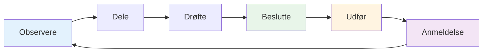

# Teamkommunikation
<AdBanner />

Effektiv kommunikation er det, der forvandler en gruppe individer til et hold. I petanque, hvor strategien konstant ændrer sig, og presset er højt, kan måden, du kommunikerer på, afgøre resultatet.

::: tip Den store idé
**Kommunikation er det, der forvandler individer til et team.** Klar, specifik og støttende kommunikation under pres adskiller gode teams fra fantastiske teams.
:::

## Kommunikationscyklussen

God teamkommunikation følger en cyklus:

| Trin | Handling | Eksempel |
|------|--------|---------|
| **Observere** | Læg mærke til hvad der sker | Terræn, positioner, modstandere |
| **Dele** | Fortæl dine holdkammerater, hvad du ser | &quot;Jorden skråner derfra&quot; |
| **Drøfte** | Udvekslingsperspektiver | &quot;Skal jeg blokere eller gå efter point?&quot; |
| **Beslutte** | Enig om fremgangsmåde | &quot;Lad os prøve den høje lob&quot; |
| **Udfør** | Gør det med engagement | Fuld fokus på kastet |
| **Anmeldelse** | Lær af resultatet | &quot;Det virkede godt&quot; eller &quot;Næste gang...&quot; |

## Hvornår skal man kommunikere

### Før hver ende
- Vurder terrænet sammen
- Diskuter den generelle tilgang
- Afklar hvem der kaster hvornår
- Sæt tonen (rolig, fokuseret)

### Under slutningen
- Del observationer (&quot;Jorden hælder derfra&quot;)
- Koordinatstrategi (&quot;Skal jeg forsøge at blokere eller gå efter pointen?&quot;)
- Tilbyd støtte (&quot;Tag dig god tid, du klarer det&quot;)
- Juster planer efterhånden som situationen ændrer sig

### Mellem enderne
- Kort opsummering (hvad virkede, hvad virkede ikke)
- Nulstil mentalt
- Gør dig klar til næste ende
- Hold kontakten som et team

### Efter kampen
- Fuld debriefing (hvis relevant)
- Anerkend bidrag
- Identificer læring
- Oprethold forholdet

## Sådan kommunikerer du

### Vær klar og specifik

**Vag:** &quot;Prøv at komme tæt på&quot;
**Fjern:** &quot;Sig mod venstre side af donkraften, ca. 20 cm ude&quot;

**Vag:** &quot;Godt forsøg&quot;
**Tydelig:** &quot;God vægt, lige lidt til venstre for linjen&quot;

### Vær konstruktiv

Fokuser på løsninger, ikke problemer:

**Problemfokuseret:** &quot;Du bliver ved med at bomme til højre&quot;
**Løsningsfokuseret:** &quot;Måske prøve at sigte lidt mere til venstre for at kompensere?&quot;

### Vær støttende

Din tone er lige så vigtig som dine ord:
- Bevar roen, selv når du er frustreret
- Brug opmuntrende kropssprog
- Anerkend indsatsen, ikke kun resultaterne
- Byg op, riv ikke ned

### Lyt aktivt

Kommunikation er tovejs:
- Vær fuld opmærksomhed, når holdkammerater taler
- Stil afklarende spørgsmål
- Anerkend hvad du har hørt
- Afbryd eller afvis ikke

<AdInArticle />

## Kommunikationsudfordringer

### Uenighed om strategi

**Dårlig tilgang:**
- Insister på din vej
- Vær defensiv
- Giv efter vredt
- Diskussion under spillet

**Bedre fremgangsmåde:**
1. Del dit perspektiv tydeligt
2. Lyt fuldt ud til deres
3. Diskuter kort fordele og ulemper
4. Beslut sammen (eller overlad det til den udpegede leder)
5. Forpligt dig fuldt ud til beslutningen
6. Gennemgang efter kampen

### Efter en holdkammerats fejl

**Hvad de har brug for:**
- Hurtig bekræftelse
- Tilladelse til at gå videre
- Tillid til, at du stadig har tillid til dem
- Fokuser på det næste kast

**Hvad skal man sige:**
- &quot;Intet problem, den næste&quot;
- &quot;Hård pause, du har den næste&quot;
- &quot;Vi er stadig i gang med det her&quot;
- *Nogle gange er et nik eller klap nok*

**Hvad man IKKE skal sige:**
- Intet (stilhed føles som dom)
- &quot;Det er okay&quot; (kan lyde afvisende)
- Alt om hvad der gik galt (ikke nu)
- Synlig frustration (kropssprog tæller)

### Når du laver en fejl

**Hvad skal man gøre:**
- Kort takkeord (&quot;Min fejl&quot;)
- Undskyld ikke for meget
- Lav ikke undskyldninger
- Nulstil og fokuser på næste kast
- Stol på dine holdkammerater til at støtte dig

### Spænding i holdet

Hvis spændingen opbygges under et spil:
1. Anerkend at det sker
2. Tag en indånding før du svarer
3. Fokuser på spillet, ikke konflikten
4. Tag det ordentligt op efter kampen
5. Lad det ikke påvirke dit spil

## Nonverbal kommunikation

Meget af teamkommunikationen er nonverbal:

### Positive signaler
- Øjenkontakt
- Nikker
- Tommelfingeren op
- Afslappet kropsholdning
- Bevæger sig mod holdkammerater
- Smilende (når det er passende)

### Negative signaler (undgå disse)
- Øjenrullende
- Vender sig væk
- Krydsede arme
- Sukkende
- Ryster på hovedet
- Anspændt kropssprog

**Husk:** Dine holdkammerater ser alt. Dit kropssprog påvirker deres selvtillid og præstation.

## Opbygning af kommunikationsvaner

### Praksiskommunikation

Vent ikke på, at konkurrenterne kommunikerer:
- Øv strategiske diskussioner i træning
- Giv hinanden feedback regelmæssigt
- Udvikl dit teamsprog
- Skab tryghed med ærlig samtale

### Udvikle teamsignaler

Nogle hold udvikler forkortelser:
- Håndsignaler til strategi
- Kodeord for situationer
- Hurtige sætninger med fælles betydning

### Regelmæssige indtjekninger

Uden for spil:
- Hvordan arbejder vi sammen?
- Hvad går godt?
- Hvad kunne være bedre?
- Er der nogen problemer, der skal løses?

## Kaptajnens rolle

Hvis dit team har en udpeget leder:

**Kaptajnens ansvar:**
- Endelig beslutning, når holdet er uenigt
- Sætter tonen og energien
- Håndtering af teamdynamik
- Holder fokus under pres

**Alle andre:**
- Del dit perspektiv
- Støt beslutningen, når den er truffet
- Hjælp med at bevare teamets energi
- Tag ansvar for din rolle

## Vigtig konklusion

> Gode teams taler med hinanden, ikke om hinanden. De kommunikerer med ærlighed, respekt og et fælles engagement i succes.

Øv kommunikation, ligesom du øver dig i at kaste. Det er en færdighed, der forbedres med opmærksomhed.

<AdBanner />
