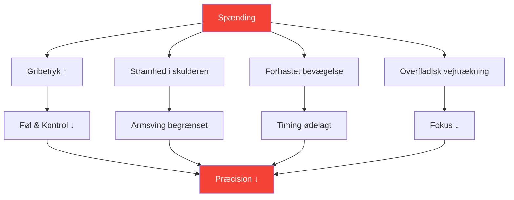

# Forståelse af spændinger i præcisionssport

::: tip Spænding er præcisionens fjende
**Vægt: 300 point** — Du kan ikke være både anspændt og præcis. At lære at håndtere spændinger er afgørende for ensartet præstation.
:::

## Præcisionsparadokset

> &quot;Jo hårdere du prøver, jo værre går det.&quot;

Det er ikke svaghed – det er fysik og fysiologi. Petanque kræver afslappede, flydende bevægelser. Spænding ødelægger de egenskaber, der skaber præcise kast.

### Hvordan spænding ødelægger præcision



---

## Fysisk vs. mental spænding

Spænding findes i to forbundne former:

### Fysisk spænding

Muskelspændinger, der direkte påvirker dit kast:

| Areal | Effekt på kast |
|------|-----------------|
| **Greb** | Tab af følelse, inkonsekvent frigivelse |
| **Underarm** | Begrænset håndledsbevægelse |
| **Skulder** | Forkortet, hakkende armsving |
| **Hals** | Begrænset hovedstilling, syn |
| **Kæbe** | Forbundet med den generelle kropsspænding |
| **Kerne** | Problemer med balance og vægtoverførsel |

### Mental spænding

Psykisk stress, der skaber fysiske symptomer:

- Tanker om kapløb
- Bekymring om resultaterne
- Frygt for fiasko
- Trykbevidsthed
- Gentagelse af tidligere fejl

::: warning Spændingsløkken
Mental spænding → Fysisk spænding → Dårlig præstation → Mere mental spænding

At bryde denne løkke er afgørende for et konsekvent spil.
:::

---

## Yerkes-Dodson-loven

Forholdet mellem arousal (aktiveringsniveau) og præstation følger en omvendt U-kurve:

```
Performance
    ↑
    │         ★ Optimal Zone
    │        /\
    │       /  \
    │      /    \
    │     /      \
    │    /        \
    │   /          \
    └──┴────────────┴──→ Arousal
     Low           High

   "Flat"   "Alert"   "Tense"
   Unfocused Relaxed  Anxious
```

### For lav (underophidset)
- Flad, ufokuseret
- Uforsigtige fejl
- Mangel på intensitet
- At gå gennem bevægelserne

### For høj (overophidset)
- Anspændt, forhastet
- Overtænkning
- Fast greb, begrænset bevægelse
- Kan ikke komme sig over fejl

### Optimal zone
- Årvågen men afslappet
- Fokuseret, men flydende
- Passende intensitet
- Hurtig bedring

---

## Find DIN optimale zone

Hver spiller har et forskelligt optimalt ophidselsesniveau:

### Selvevalueringsprocessen

1. **Husk dine bedste præstationer**
   - Hvordan havde du det fysisk?
   - Hvad var dit energiniveau?
   - Hvordan ville du vurdere din ophidselse (1-10)?

2. **Husk dine værste præstationer**
   - Var du for flad eller for anspændt?
   - Hvilke fysiske symptomer bemærkede du?
   - Hvad udløste den suboptimale tilstand?

3. **Identificer dit mønster**
   - Har du tendens til over-arousal eller under-arousal?
   - Hvilke situationer udløser dit mønster?
   - Hvad hjælper dig med at vende tilbage til optimal tilstand?

### Fælles spillerprofiler

| Profil | Tendens | Risikosituationer | Strategi |
|---------|----------|-----------------|----------|
| **Bekymringsmanden** | Overophidselse | Høje indsatser, tætte kampe | Afslapningsteknikker |
| **Flatlineren** | Under-arousal | Lave indsatser, tidlige runder | Aktiveringsteknikker |
| **Reaktoren** | Variabel | Efter misser skifter momentum | Følelsesmæssig regulering |
| **Jægeren** | Overophidselse når man er bagud | Comebacks, tidspres | Acceptteknikker |

---

## Genkendelse af spændingssignaler

### Fysiske advarselstegn

Lær at bemærke disse, før de påvirker dit kast:

| Signal | Beliggenhed | Handling |
|--------|----------|--------|
| **Stærkt greb** | Hånd | Blødgør før hvert kast |
| **Løftede skuldre** | Øvre ryg | Drop og rul |
| **Spændt kæbe** | Ansigt | Åbn munden let |
| **Overfladisk åndedræt** | Bryst | Dyb maveånding |
| **Forhastet bevægelse** | Hele kroppen | Sæt farten bevidst ned |
| **Rastløs uro** | Generel | Jord dig selv |

### Mentale advarselstegn

- Tanker om kapløb
- Negativ selvsnak stiger
- Fokuser på resultat, ikke proces
- Bevidsthed om indsatser/score
- Tænker over tidligere fejltagelser

---

## Selvtjekket af spænding og ydeevne

Brug denne hurtige vurdering mellem kast eller i pauser:

**Fysisk scanning (5 sekunder):**
1. Greb → Blødt?
2. Skuldre → Ned?
3. Kæbe → Løsnet?
4. Vejrtrækning → Langsom og dyb?

**Mental scanning (5 sekunder):**
1. Tanker → Fokuseret på nutiden?
2. Energi → Optimal rækkevidde?
3. Næste handling → Ryd?

::: tip Gør det til en vane
De bedste spillere gør dette automatisk. Du kan træne dig selv til at gøre det samme gennem gentagelse.
:::

---

## I dette modul

### [Teknikker til frigørelse af spændinger](/da/uddannelse/spænding/teknikker)
- Progressiv muskelafslapning (PMR)
- Hurtigudløsningsteknikker til konkurrence
- Vejrtrækningsprotokoller
- Nulstilling af spænding før kast

### [Håndtering af spændinger i konkurrence](/da/uddannelse/spænding/konkurrence)
- Forberedelse før kampen
- Protokoller under kampene
- Nød &quot;for anspændt&quot; genopretning
- Genopretning efter fejl

---

## Hurtig gevinst: 10-sekunders nulstilling

Brug denne hurtige protokol før dit næste kast:

1. **Skuldre** — Sænk dem bevidst
2. **Grip** — Gør det lettere med 20%
3. **Kæbe** — Løft knæk, tungen væk fra ganen
4. **Åndedræt** — En langsom, fuld udånding

Dette tager 10 sekunder og kan straks forbedre dit næste kast.

---

## Relaterede faktorer

- [Mental styrke](/da/uddannelse/mentalt-spil/mental-styrke/) — Håndtering af pres
- [Søvn og restitution](/da/uddannelse/søvn/) — Hvile reducerer grundspændingen
- [Mindfulness](/da/uddannelse/mentalt-spil/mindfulness/) — Bevidsthed i nuet
- [Zonen](/da/uddannelse/mentalt-spil/zonen/) — Optimal præstationstilstand

