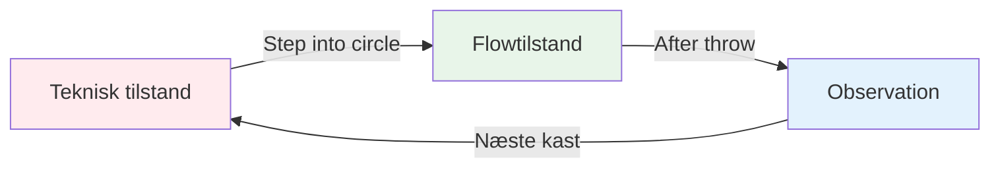
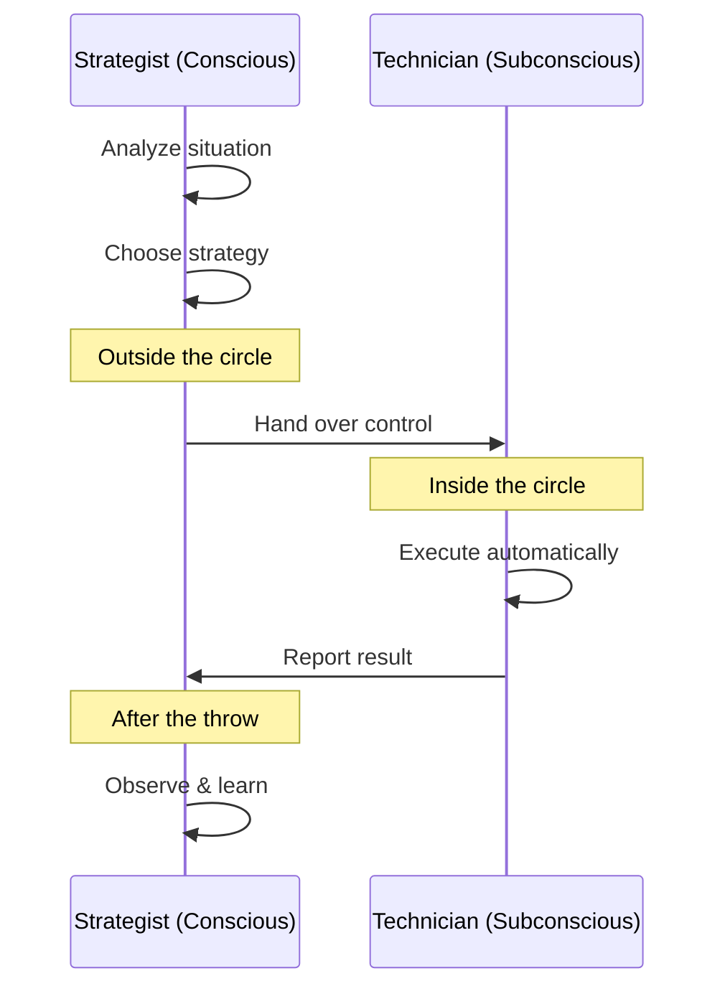

# Zonen: Forståelse af flowtilstand

Har du nogensinde haft et spil, hvor alt bare faldt på plads? Hvor du ikke tænkte over din teknik, og hver kugle landede præcis, hvor du ville? Det er &quot;zonen&quot; - og det at lære at spille den konsekvent er det, der adskiller elitespillere fra resten.

::: tip Den store idé
**Flowtilstanden er, når din analytiske hjerne falder til ro, og dine trænede instinkter tager over.** Du kan ikke tænke dig ind i zonen – du er nødt til at give slip.
:::

## Hvad er Zonen?

Zonen, også kaldet &quot;flowtilstand&quot;, er en mental tilstand, hvor du bliver fuldstændig opslugt af det, du laver. Tiden synes at gå langsommere. Dine bevægelser føles ubesværede. Du tænker ikke på teknik - du *gør* bare.

Forskere kalder denne tilstand **forbigående hypofrontalitet**. Kort sagt, den analytiske del af din hjerne (den præfrontale cortex) falder til ro, hvilket giver dine trænede instinkter mulighed for at tage over.

### De to hjernetilstande

**Teknisk tilstand (planlægning):**
- Analyser situationen
- Vælg din strategi
- Beslut hvilket kast du skal lave

**Flowtilstand (udførelse):**
- Stol på din træning
- Fokuser kun på målet
- Lad din krop udføre arbejdet automatisk

**Observation (Læring):**
- Læg mærke til resultatet uden at dømme
- Lær af det, der skete
- Nulstil til næste kast

## Petanques paradoks

Her er udfordringen: petanque giver dig masser af tid til at tænke mellem kastene. I modsætning til hurtige sportsgrene, hvor du reagerer øjeblikkeligt, har du tid til at gå til cirklen, vurdere situationen og forberede dit kast.

Denne &quot;tid til at tænke&quot; er både en gave og en forbandelse:
- **Gave:** Du kan planlægge strategi og træffe smarte beslutninger
- **Forbandelse:** Du kan overtænke og forstyrre din naturlige evne

Elitespilleren lærer at bruge denne tid klogt - tænke under planlægningen og derefter &quot;slukke&quot; under udførelsen.

## To spillemåder

Din hjerne fungerer i to forskellige tilstande:

| Funktion | Teknisk tilstand | Flowtilstand |
|---------|---------------|-----------|
| **Hvornår skal det bruges** | Træning, læring af nye færdigheder | Konkurrence, udførelse |
| **Hjerneaktivitet** | Høj analytisk tænkning | Stille, automatisk |
| **Fokus** | Intern (kropsmekanik) | Ekstern (mål) |
| **Følelse** | Anstrengende, bevidst | Ubesværet, naturlig |

Den vigtigste færdighed er at lære at **skifte** mellem disse tilstande på det rigtige tidspunkt.

## &quot;Skift&quot;-øjeblikket

::: warning Skiftereglen
**Før cirklen:** Analyser, strategiser, beslut hvilket kast der skal laves
**I cirklen:** Slip analysen, stol på din træning, fokuser kun på målet
**Efter kastet:** Observer resultatet uden at dømme
:::

Overgangen sker, når du træder ind i cirklen. Dette er den vigtigste færdighed i elite petanque.

Tænk på det sådan her: din bevidsthed er **strategen**, der laver planen, og din underbevidsthed er **teknikeren**, der udfører den. Strategen skal træde tilbage og lade teknikeren arbejde.

## Hvorfor overtænkning dræber præstation

Når du bevidst overvåger dine bevægelser under udførelse, forstyrrer du de automatiske processer, du har trænet. Dette kaldes &quot;kvælning&quot; - og det sker for alle.

::: danger Tegn på, at du overtænker
- ❌ Tænk over armposition midt i kastet
- ❌ Bekymring om resultatet, før du giver slip
- ❌ Følelse af anspændthed eller mekanisk
- ❌ At sætte spørgsmålstegn ved sig selv i cirklen
:::

::: tip Løsningen
Løsningen er ikke at tænke *mindre* - det er at tænke på de **rigtige ting** på det **rigtige tidspunkt**.

✅ **Rigtig tankegang:** &quot;Jeg ser målet tydeligt&quot;
❌ **Forkert tankegang:** &quot;Hold min albue lige&quot;
:::

## I dette afsnit

Lær at mestre zonen:

- **[Teknisk vs. Flowtræning](/da/uddannelse/zonen/teknisk-vs.-flow)** - Forståelse af, hvornår man skal fokusere på teknik, og hvornår man skal give slip
- **[Indtræden i zonen](/da/uddannelse/zonen/indtræden-i-zonen)** - Praktiske teknikker til at opnå adgang til flowtilstand

## Resumé: Zonereglerne

::: tip Regel nr. 1: Skiftereglen
**Analyser før cirklen, udfør i cirklen, observer bagefter.**
Din bevidsthed planlægger, din underbevidsthed udfører.
:::

::: tip Regel nr. 2: Inversionsreglen
**Efterhånden som færdighederne øges, bliver mental træning vigtigere end teknisk træning.**
Begyndere: 90% teknisk / 10% mental
Eksperter: 20% teknisk / 80% mental
:::

::: tip Regel nr. 3: Tillidsreglen
Du kan ikke tænke dig frem til perfekt udførelse.
Stol på din træning. Fokuser på målet, ikke din teknik.
:::

## Vigtig konklusion

> Der findes ingen teknikker, der altid producerer en perfekt kugle. Men der er en mental tilstand, hvor perfekte kugler bliver naturlige.

Din teknik er fundamentet. Zonen er, hvor fundamentet bliver til kunst.

