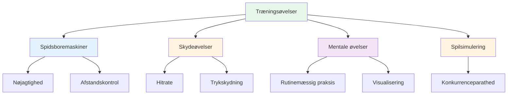

# Træningsøvelser
<AdBanner />

Her er gennemprøvede øvelser, der bruges af elitespillere. Hver øvelse har et specifikt formål - vælg ud fra, hvad du har brug for at udvikle.

::: tip Den store idé
**Hver øvelse har et specifikt formål.** Kast ikke bare tilfældigt med kugler - vælg øvelser, der er rettet mod dine svagheder og understøtter dine mål. Spor dine fremskridt for at se forbedringer.
:::

## Spidsboremaskiner

### Gyden
**Formål:** Isolering af udløsningsvinkel og linjekonsistens

**Opsætning:**
- Placer to markører 30-40 cm fra hinanden, cirka 1 meter fra cirklen
- Målet er 7-9 meter væk

**Bore:**
- Kast gennem &quot;gyden&quot; (mellem markørerne)
- Ethvert kast, der rammer en markør, er &quot;dødt&quot;
- Fokuser på et ensartet udløsningspunkt

**Progression:**
- Indsnævre gyden, efterhånden som du forbedrer dig
- Varier målafstanden
- Tilføj en specifik landingszone

### Præcisionszoner
**Formål:** Udvikle præcision inden for specifikke områder

**Opsætning:**
- Marker zoner omkring et mål (f.eks. cirkler ved 20 cm, 40 cm, 60 cm)
- Eller brug naturlige markører i terrænet

**Scoring:**
- Indenfor 20 cm: 3 point
- Indenfor 40 cm: 2 point
- Indenfor 60 cm: 1 point
- Udenfor: 0 point

**Bore:**
- Kast 10 kugler, og hold styr på din score
- Mål: Konsekvent forbedring i løbet af sessionerne

### Afstandsvariation
**Formål:** Udvikle dybdekontrol

**Opsætning:**
- Placer mål på 6m, 7m, 8m, 9m, 10m

**Bore:**
- Kast til hver afstand i tilfældig rækkefølge
- Partneren råber afstanden
- Fokuser på at justere vægten, ikke teknikken

**Variation:**
- Tilføj &quot;korte&quot; og &quot;lange&quot; opkald, når du har sluppet
- Skal justeres midt i flyvningen (udvikler følelse)

## Skydeøvelser

### Skydestigen
**Formål:** Opbyg nøjagtighed under progressivt pres

**Opsætning:**
- Placer en målkugle på 6 meters afstand
- Marker afstande ved 7m, 8m, 9m, 10m

**Bore:**
- Start ved 6 meter
- Hit = gå en meter tilbage
- Misser = gå en meter frem (eller genstart)
- Mål: Nå 10 meter

**Variationer:**
- Streng version: Enhver misser vender tilbage til 6m
- Tidsbestemt version: Hvor langt kan du komme på 10 minutter?
- Holdversion: Skift med partner

<AdInArticle />

### Barrieren (Blox)
**Formål:** Tving høj bueoptagelse

**Opsætning:**
- Placer en barriere (pind, snor eller forhindring) mellem dig og målet
- Barrieren skal være høj nok til at kræve en lob

**Bore:**
- Skal rydde barrieren for at ramme målet
- Ethvert kast, der rammer barrieren, er &quot;dødt&quot;
- Udvikler et højt frigivelsespunkt

**Hvorfor det er vigtigt:**
- Konkurrence kræver ofte skydning over forhindringer
- Skaber alsidighed i din skydning

### Forhindringsbane
**Formål:** Udvikle skydning fra forskellige vinkler

**Opsætning:**
- Placer målkuglen i midten
- Tilføj forhindringer (andre kugler, markører) omkring den

**Bore:**
- Skyd fra forskellige positioner rundt om cirklen
- Skal finde den vinkel, der fungerer
- Udvikler læsning af skydelinjer

## Mentale træningsøvelser

### Rutinemæssig gentagelse
**Formål:** Gør din rutine før indtagelse automatisk

**Bore:**
- Øv din fulde rutine uden at kaste
- Gå bevidst igennem hvert trin
- Lav 10-20 gentagelser
- Tilføj derefter kastet

**Fokus:**
- Konsekvent timing
- Klar overgang fra tænkning til udførelse
- Samme rutine hver gang

### Trykpunkter
**Formål:** Øv dig i at præstere under pres

**Opsætning:**
- Skab et &quot;must make&quot;-scenarie
- Sæt konsekvenser for manglende adgang

**Eksempler:**
- &quot;Lav 3 i træk eller start forfra&quot;
- &quot;Gå glip af og lav 10 armbøjninger&quot;
- &quot;Annoncer dit mål før du kaster&quot;

**Nøgle:**
- Presset skal føles reelt
- Øv din mentale reaktion på pres
- Brug din rutine præcis som i konkurrencen

### Genopretningspraksis
**Formål:** Skab en vane med hurtig mental nulstilling

**Bore:**
- Kastede med vilje en dårlig kugle
- Øv dig straks i SOAS (Stop, Observer, Accepter, Slip)
- Kast den næste kugle med fuld dedikation

**Fokus:**
- Dvæl ikke ved missen
- Nulstil helt før næste kast
- Bevar et positivt kropssprog

## Spilsimuleringsøvelser

### Millieus glæde
**Formål:** Bryd rytmelåsen, opbyg alsidighed

**Bore:**
- Skift mellem at pege og skyde ved hvert kast
- Ingen to på hinanden følgende kast af samme type
- Udvikler evnen til at skifte tilstand

### Scenarieafspilning
**Formål:** Øvelse i taktisk beslutningstagning

**Opsætning:**
- Opret realistiske spilsituationer
- Tildel point og kugletællinger

**Eksempler:**
- &quot;Du er bagud 10-8, modstanderen har 2 point, du har 2 kugler&quot;
- &quot;Uafgjort 6-6, I har den sidste kugle, de har 1 point&quot;

**Bore:**
- Beslut hvad du skal gøre
- Udfør med fuldt engagement
- Gennemgå beslutningen bagefter

### Matchspil med regler
**Formål:** Konkurrencesimulering

**Variationer:**
- Spil til 13 (hele kampen)
- Spil til 7 (kortere, flere spil)
- &quot;Trykpunkter&quot; - visse ender er dobbelt værd
- &quot;Pludselig død&quot; - den første til at tabe en ende taber spillet

## Sporing af dine øvelser

Hold en logbog for hver øvelse:

| Dato | Bore | Score/Resultat | Noter |
|------|-------|--------------|-------|
| | | | |

**Spor over tid:**
- Er du ved at forbedre dig?
- Hvilke øvelser hjælper mest?
- Hvor kæmper du?

## Opbygning af en øvelsessession

### Opvarmning (10 min)
- Nemme kast til at løsne op
- Intet pres, bare føl

### Teknisk fokus (20-30 min)
- En eller to øvelser rettet mod specifikke færdigheder
- Blokeret øvelse for nye færdigheder
- Tilfældig øvelse for etablerede færdigheder

### Pres/spilsimulering (20-30 min)
- Tilføj konsekvenser
- Skab realistiske scenarier
- Øv mentale færdigheder

### Nedkøling (10 min)
- Nemme kast
- Reflekter over sessionen
- Bemærk hvad du skal arbejde med bagefter

## Vigtig konklusion

> Boremaskiner er værktøjer. Vælg det rigtige værktøj til det, du skal bygge.

Kast ikke bare boules. Træn med et formål.

<AdBanner />
