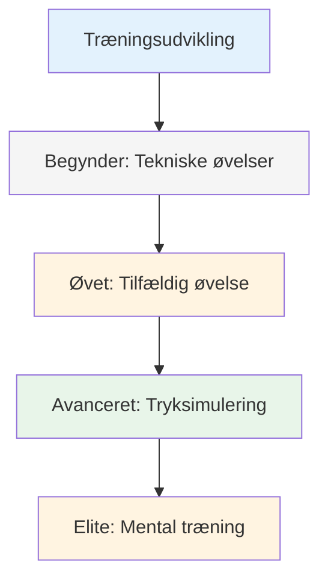
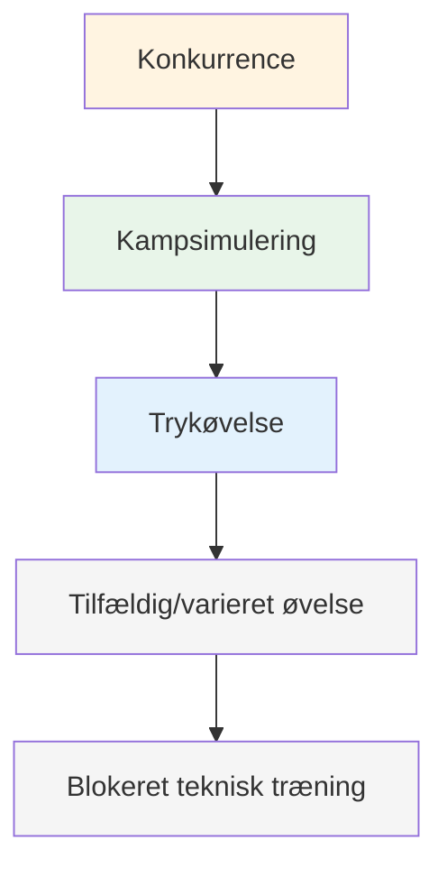

# Træningsmetoder
<AdBanner />

Når din teknik er solid, hvad øver du dig så på? Det er her, mange spillere stagner - de fortsætter med at øve teknikken, når den virkelige vækst ligger et andet sted.

::: tip Den store idé
**De fleste spillere stagner, fordi de beholder deres træningsteknik, når den virkelige vækst ligger et andet sted.** Elitespillere træner tilpasningsevne, beslutningstagning og mental styrke - ikke kun mekanik.
:::

## Ud over teknisk gentagelse

De fleste spillere træner ved at gentage kast. Det er vigtigt for begyndere, men øvede spillere har brug for mere:

| Træningstype | Hvad det udvikler | Hvornår skal man bruge |
|--------------|------------------|-------------|
| Tekniske øvelser | Mekanik, form | Lære nye færdigheder, løse problemer |
| Tilfældig øvelse | Tilpasningsevne, beslutningstagning | Konkurrenceforberedelse |
| Tryksimulering | Mental styrke | Før vigtige begivenheder |
| Mental træning | Fokus, genopretning, selvtillid | Løbende, ofte forsømt |

## Træningspyramiden

::: warning Almindelig fejl
**De fleste spillere bruger for meget tid i bunden.** Elitespillere arbejder på alle niveauer i pyramiden, med vægt på de øverste niveauer, efterhånden som de avancerer.
:::

## Blokeret vs. tilfældig øvelse

### Blokeret praksis
Gentag det samme kast mange gange:
- 20 point fra 7 meter
- 20 skud på samme mål
- Samme afstand, samme kast

**God til:** Indledende læring, opbygning af selvtillid, opvarmning
**Begrænsning:** Overføres ikke godt til konkurrence

### Tilfældig øvelse
Variér alt:
- Forskellige afstande pr. kast
- Skift mellem at pege og skyde
- Skift mål konstant

**God til:** Konkurrenceforberedelse, opbygning af tilpasningsevne
**Følelser:** Hårdere, flere fejl, mindre &quot;produktiv&quot;
**Realitet:** Bedre langsigtet fastholdelse og overførsel

### Forskningen

Studier viser konsekvent:
- Blokeret træning føles bedre (hurtig forbedring synlig)
- Tilfældig træning giver bedre konkurrencepræstation
- Det er i den tilfældige praksiss &quot;kamp&quot; at lære.

<AdInArticle />

## Tryksimulering

Du kan ikke håndtere konkurrencepres, hvis du aldrig oplever det til træning.

### Skaber træningspres

**Konsekvenser:**
- Armstrækninger for misser
- Taber køber kaffe
- Point tæller med i noget

**Scenarier:**
- &quot;Skal laves&quot;-situationer
- Bagud 12-10, skal score
- Sidste kugle i spillet

**Publikum:**
- Øv dig med at observere mennesker
- Optag dig selv på video
- Annoncer, hvad du prøver at gøre

**Træthed:**
- Øv dig når du er træt
- Slut på lang session
- Efter fysisk træning

### Skydestigen

En klassisk trykboremaskine:
1. Start ved 6 meter
2. Ram målet = gå en meter tilbage
3. Misser = gå en meter frem (eller starte forfra)
4. Mål: Nå 10 meter

Dette skaber et naturligt pres, efterhånden som du udvikler dig.

## Mentale træningssessioner

Dediker specifikt tid til mentale færdigheder:

### Visualiseringssession (15-20 min)
1. Find et roligt sted
2. Luk dine øjne
3. Visualiser dig selv til en konkurrence
4. Se detaljerede resultater af vellykkede kast
5. Mærk selvtilliden og flowet
6. Øv dig i håndtering af presmomenter

### Rutinemæssig træning før indtagelse
- Øv din rutine uden at kaste
- Fokus på de mentale overgange
- Skab en vane med konsekvent forberedelse

### Genopretningspraksis
- Begår bevidst fejl i praksis
- Øv dit SOAS-svar
- Skab en vane med hurtig mental nulstilling

## Strukturering af din træningsuge

### Eksempel: Seriøs amatør (6 timer/uge)

| Dag | Varighed | Fokus |
|-----|----------|-------|
| mandag | 1,5 time | Teknisk: Spidsbor |
| onsdag | 1,5 time | Teknisk: Skydeøvelser |
| fredag | 1 time | Mental: Visualisering, rutineøvelse |
| lørdag | 2 timer | Kampspil med preselementer |

### Eksempel: Konkurrencespiller (10 timer/uge)

| Dag | Varighed | Fokus |
|-----|----------|-------|
| mandag | 2 timer | Teknisk: Pegning (blokeret → tilfældig) |
| tirsdag | 1 time | Mental træning + visualisering |
| onsdag | 2 timer | Teknisk: Skydning (blokeret → tilfældig) |
| torsdag | 1 time | Videoanmeldelse + mentalt arbejde |
| fredag | 2 timer | Tryksimulering, spilscenarier |
| lørdag | 2 timer | Konkurrence eller kampspil |

## Træningsprincipper

### 1. Kvalitet frem for kvantitet
- 30 fokuserede minutter slår 2 timers tankeløs gentagelse
- Stop når fokus falder
- Bedre at slutte tidligt end at øve sig i dårlige vaner

### 2. Bevidst praksis
- Hav et specifikt mål for hver session
- Arbejd på kanten af din evne
- Få feedback (video, partner, resultater)
- Justér baseret på, hvad du lærer

### 3. Genopretningsspørgsmål
- Hviledage er en del af træningen
- Søvn påvirker præstationen betydeligt
- Mental træthed er reel - respekter det

### 4. Spor alt
- Hold en træningslogbog
- Bemærk hvad der virker, og hvad der ikke virker
- Gennemgå regelmæssigt
- Juster din plan baseret på data

## I dette afsnit

- **[Træningsøvelser](/da/uddannelse/træning/øvelser)** - Specifikke øvelser til forskellige færdigheder

## Vigtig konklusion

> Måden du træner på bestemmer, hvordan du præsterer. Træn, som du har lyst til at spille.

Bland din træning. Inkluder mentalt arbejde. Skab pres. Følg dine fremskridt.

<AdBanner />
