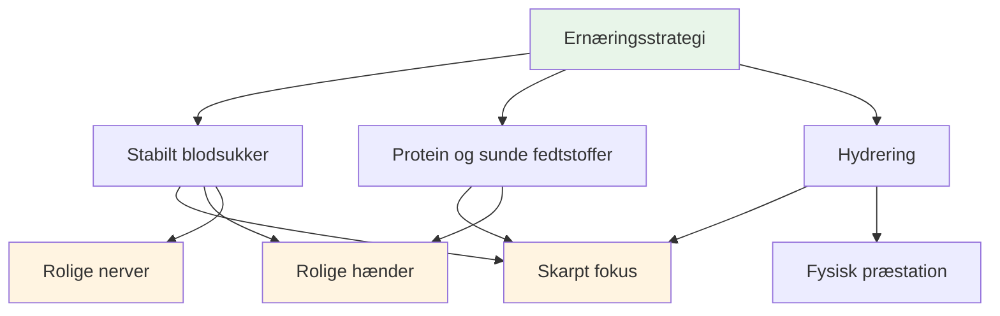
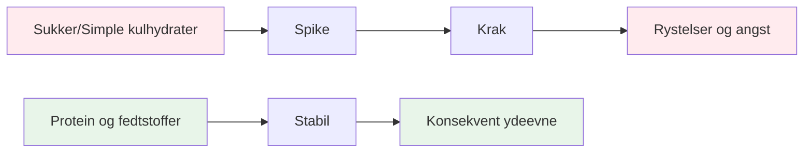
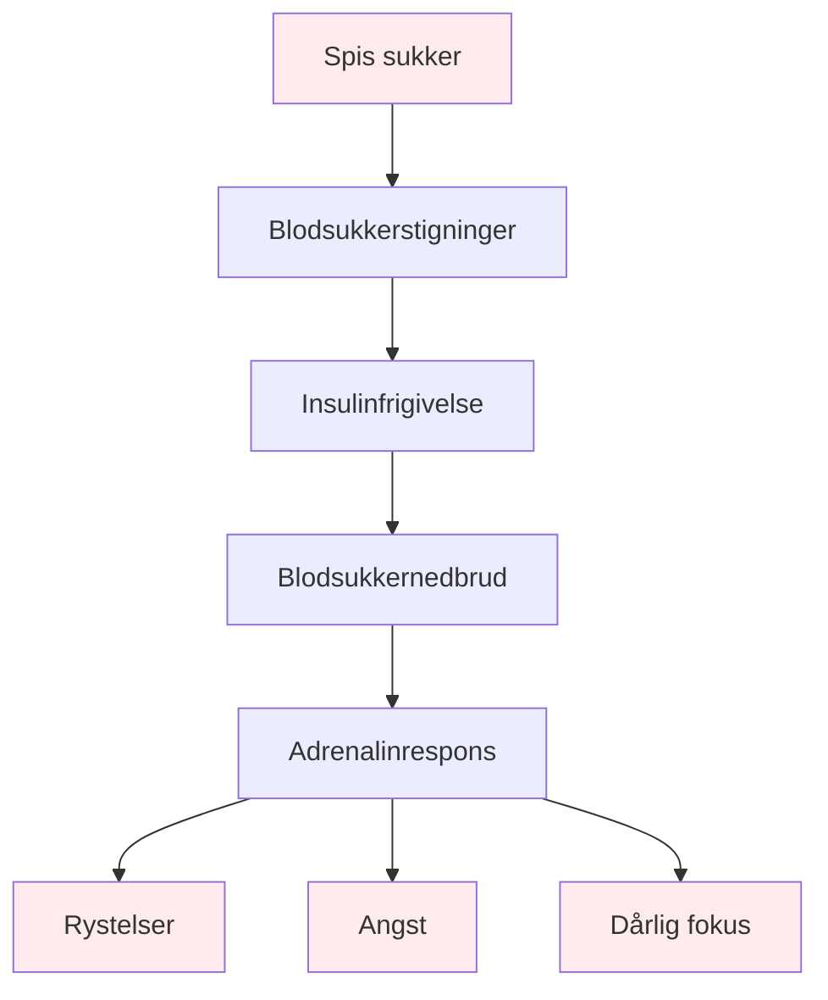

# Mad og ernæring

## Brændstof til præcisionsydelse

Pétanque er en præcisionssport. Din hjerne er dit vigtigste værktøj - giv den stabil brændstof, ikke rutsjebaneenergi.

::: tip Kerneprincippet
**Stabilt blodsukker = Skarpt fokus + Rolige hænder**

Undgå sukkerstigninger. Prioritér protein og sunde fedtstoffer. Hold dig hydreret.
:::

## Nøgleprincipper

### Stabilt blodsukker er alt

::: warning Blodsukkernedbrudspåvirkning
Sukker og simple kulhydrater forårsager blodsukkerstigninger og -fald, som direkte påvirker:
- ❌ Mental fokus og klarhed
- ❌ Rolige hænder (rysten fra blodsukkerfald)
- ❌ Beslutningskvalitet
- ❌ Følelsesmæssig stabilitet og ro
:::

### Prioriter protein og sunde fedtstoffer

::: tip De bedste fødevarer til præcision
Fedt og protein giver vedvarende energi uden nedbrud:
- ✅ Nødder, avocado, olivenolie, æg, ost
- ✅ Langsom fordøjelse = ensartet energi hele dagen
- ✅ Ingen eftermiddagssløvhed under lange turneringer
:::

### Undgå sukkerfælden

::: danger Fødevarer, der skal undgås
Vær særligt forsigtig med:
- ❌ &quot;Energi&quot;-barer og -drikke (ofte sukkerrige)
- ❌ Frugtjuice og smoothies (koncentreret sukker)
- ❌ Hvidt brød, kager, snacks fra automater
:::

## Hurtigguide til konkurrencedagen

| Timing | Hvad skal man spise | Hvorfor |
|--------|-------------|-----|
| **2-3 timer før** | Balanceret måltid: protein, fedt, grøntsager | Stabil energi uden døsighed |
| **Under konkurrencen** | Vand + små proteinsnacks (nødder, ost, tørret chokolade) | Bevar fokus og rolige hænder |
| **Undgå hele dagen** | Sukkerholdige snacks og drikkevarer | Forebyg styrt og rystelser |

::: tip Hurtige konkurrencesnacks
**Medbring disse:**
- Blandede nødder (usaltede)
- Hårdkogte æg
- Osteterninger
- Tørret oksekød eller kalkun
- Grøntsager med hummus

**Lad disse blive hjemme:**
- Slik og chokolade
- Energidrikke
- Bagværk
- Frugtjuice
:::

## Videnskaben

::: info Hvorfor dette er vigtigt for petanque
I modsætning til udholdenhedssport kræver petanque:
- **Præcision** - Rolige hænder, ingen rystelser
- **Mental klarhed** - Skarp beslutningstagning hele dagen
- **Rolige nerver** - Lav angst under pres

Sukkerbaseret energi virker mod alle disse.
:::

## Lær mere

For detaljerede ernæringsstrategier, protokoller til konkurrencedagen og videnskaben bag stabil energi:

::: tip Komplet ernæringsguide
→ **[Ernæring for præcisionspræstation](./education/nutrition/)** - Komplet guide i vores uddannelsessektion

Inkluderer:
- Detaljeret måltidsplanlægning
- Protokoller på konkurrencedagen
- Lavkulhydratmuligheden for præcisionsatleter
- Hydreringsstrategier
- Madvarer der hjælper vs. madvarer der skader
:::

