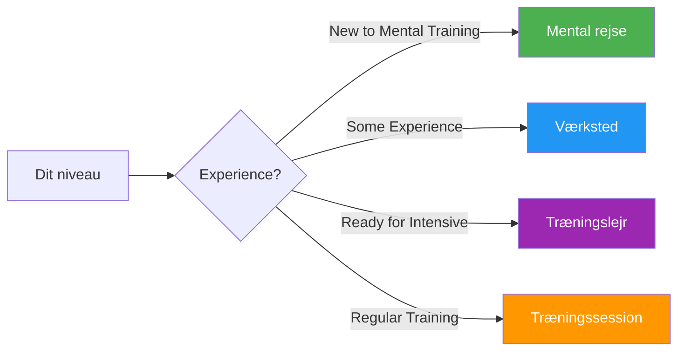

# Guider og værktøjer

Praktiske ressourcer til spillere, trænere og klubber til implementering af strukturerede mentale træningsprogrammer.

## Vælg dit format

## Guideformater

### 🌱 [Mental Rejse](/da/guider/mental-rejse/)
**For begyndere** — 2-3 timers introduktion

Perfekt til spillere, der er nye inden for mental træning. En blid introduktion til kernebegreberne med praktiske øvelser.

- Varighed: 2-3 timer
- Gruppestørrelse: 4-12 spillere
- Materialer: Medfølger
- [Se guide →](/da/guider/mental-rejse/)

---

### 🎯 [Værksted](/da/guider/værksted/)
**For let øvede** — 3-4 timers dybdegående introduktion

Struktureret workshopformat for klubber og hold, der ønsker at udforske mental træning mere seriøst.

- Varighed: 3-4 timer
- Gruppestørrelse: 6-8 spillere
- Indeholder: Koordinatorvejledning + materialer til download
- [Se guide →](/da/guider/værksted/)

---

### 🏕️ [Træningslejr](/da/guider/træningslejr/)
**For engagerede hold** — Weekendintensivt kursus

Helt weekendprogram, der blander teori, praksis og konkurrence. Ideelt for hold, der forbereder sig til vigtige turneringer.

- Varighed: 2-3 dage
- Gruppestørrelse: 10-20 spillere
- Inkluderer: Fuldt program + arrangørmaterialer
- [Se guide →](/da/guider/træningslejr/)

---

### 🔄 [Træningssession](/da/guider/træningssession/)
**Til regelmæssig træning** — 2-4 timers strukturerede sessioner

Ramme for regelmæssige træningssessioner, der inkorporerer mentale færdigheder sideløbende med teknisk praksis.

- Varighed: 2-4 timer
- Gruppestørrelse: 4 spillere (et hold)
- Fokus: Konkurrencesimulering med refleksion
- [Se guide →](/da/guider/træningssession/)

---

## Skabeloner og værktøjer

Downloadbare skabeloner til at understøtte din udvikling:

### 📋 [Målskabelon](/da/guider/skabeloner/målskabelon)
Struktureret arbejdsark til at sætte og spore dine petanque-mål ved hjælp af SMART-rammeværket.

### 📓 [Skabelon til dagbog](/da/guider/skabeloner/dagbogskabelon)
Skabelon til trænings- og konkurrencedagbog til sporing af fremskridt, indsigt og forbedringsområder.

---

## Hvilket format er det rigtige for dig?

| Format | Bedst til | Tidsforpligtelse | Dybde |
|--------|----------|-----------------|-------|
| **Mental rejse** | Første introduktion | 2-3 timer | ⭐ |
| **Værksted** | Klubbens træningsdage | 3-4 timer | ⭐⭐ |
| **Træningslejr** | Holdforberedelse | Weekend | ⭐⭐⭐ |
| **Træningssession** | Løbende udvikling | Regelmæssig 2-4 timer | ⭐⭐ |

::: tip For trænere og klubledere
Hver vejledning indeholder materialer til både deltagere OG facilitatorer/arrangører. Se afsnittene &quot;Til koordinatorer&quot; med PDF-filer og præsentationsslides, der kan downloades.
:::

## Relaterede ressourcer

- [🎯 Vurdering](/da/vurdering/) — Evaluer dine 8 faktorer og find prioriteter
- [📚 Education Hub](/da/uddannelse/) — Dyk ned i de 8 præstationsfaktorer
- [📝 Artikler](/da/artikler/) — Research og indsigt

